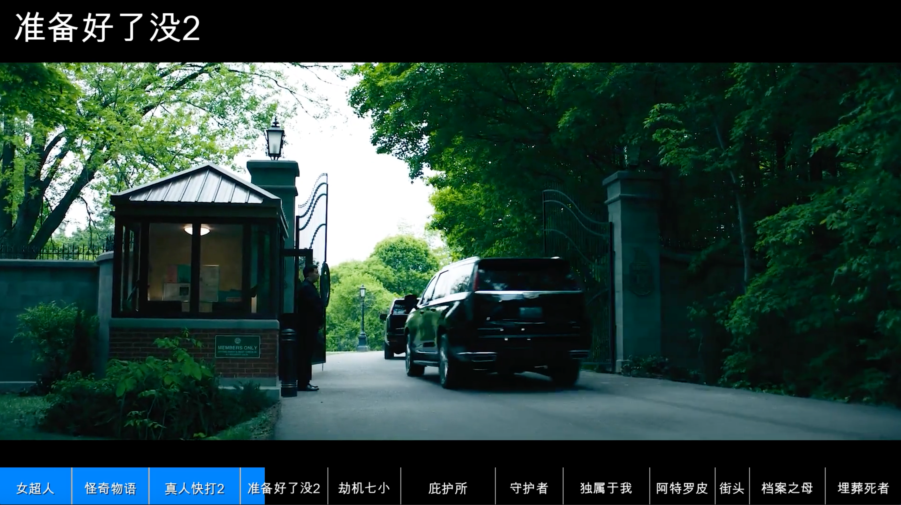

# Video Processing

视频处理工具库，提供视频加工相关的工具方法。

## 项目概述

本项目是一个视频处理工具库，前期专注于视频加工相关的工具方法开发，未来将集成系统性的任务目标。

## 功能介绍
### 核心功能特性

- **动态流动进度条 (Immersive Dynamic Flow)**：
  - **实时同步**：进度条填充宽度随播放时间 $t$ 实时变化，计算公式为 $w = iw \times (t / duration)$，确保视觉反馈与内容完全同步。
  - **丝滑视觉**：采用 FFmpeg `overlay` 滤镜配合动态位移逻辑，实现平滑的“生长式”填充效果，而非简单的静态覆盖。
- **多章节智能切割 (Smart Chapter Segmenting)**：
  - **可视化段落**：支持通过时间戳（如 `01:20`）在进度条上自动绘制垂直 **分割线 (Dividers)**，清晰展示视频结构。
  - **底部章节标题**：每个段落中心自动标注章节名称，并配合 **文字阴影 (Shadow)** 算法，确保文字在任何背景色下均清晰可见。
- **智能信息分离设计 (Dual-Layer Info Display)**：
  - **全局导航**：底部进度条负责展示视频整体进度与章节刻度。
  - **沉浸式标题**：左上角实时显示当前章节全称，支持 **淡入淡出 (Fade In/Out)** 动画与半透明背景框，增强观看体验。
- **全方位样式定制 (Full Customization)**：
  - **专业配色方案**：内置 `tech_glow` (科技青)、`cinema_gold` (电影金)、`minimal_white` (极简白) 等 10+ 种高对比度配色方案。
  - **灵活布局**：标题支持四个角落（`top_left`, `top_right`, `bottom_left`, `bottom_right`）自由配置，避开视频关键画面。
- **高性能渲染架构**：
  - **FFmpeg 集成**：利用 `filter_complex` 复杂滤镜图实现单次渲染，避免多次转码导致的画质损耗。
  - **硬件加速支持**：兼容 `VideoToolbox` (macOS) 与 `NVIDIA CUDA` 加速，大幅缩短长视频的处理时间。

------

### 🔍 SEO 关键词优化 (Keywords)

为了让您的 GitHub 仓库或项目页面更容易被搜索到，建议在文档中使用以下标签和描述：

- **核心关键词**：视频进度条制作、FFmpeg 动态进度条、Python 视频处理脚本、视频章节标记工具、自动添加视频时间轴。
- **技术关键词**：`ffmpeg-python`、`video-automation`、`dynamic-progressbar`、`overlay-filter`、`video-metadata-extraction`。
- **应用场景**：教程类视频后期、自媒体视频批量加工、教育课件视频增强、Vlog 进度条插件。

## 工具特性

- 模块化设计，易于扩展
- 支持作为Python库导入使用
- 提供命令行工具（CLI）
- 清晰的架构分层

### 已实现功能

- **添加进度条**：为视频添加动态进度条和章节分割线
  - 支持简单模式：只添加时间点分割线
  - 支持高级模式：添加章节标题（支持中文显示）
  - 支持自定义样式：颜色、字体、大小等
  - **实时进度反馈**：显示处理进度和预计剩余时间
  - **性能优化**：针对大文件优化内存占用和处理速度

- **智能双语字幕 (Smart Captioning)**：
  - **自动语音转文字**：使用 Whisper 模型进行高精度识别
  - **自动翻译**：支持中英互译
  - **多风格字幕**：提供多种预设样式（电影感、科技风、霓虹等）
  - **智能排版**：自动双语分行，防止遮挡关键画面

## 项目结构

```
Video-precessing/
├── draft-code/              # 需求代码/伪代码存放目录
├── src/                     # 源代码目录
│   ├── video_processing/   # 核心视频处理模块
│   ├── cli/                # 命令行接口
│   └── config/             # 配置管理
├── tests/                   # 测试目录
├── docs/                    # 文档目录
├── examples/                # 示例代码
└── scripts/                 # 辅助脚本
```

## 安装

### 前置要求

- Python 3.8+
- FFmpeg（需要安装并配置在系统 PATH 中）

### 安装步骤

```bash
# 安装依赖
pip install -r requirements.txt

# 或者以开发模式安装
pip install -e .
```

### 验证 FFmpeg 安装

```bash
ffmpeg -version
ffprobe -version
```

## 使用方式

### 作为库使用

```python
from pathlib import Path
from video_processing.processors.progress_bar import ProgressBarProcessor

# 为视频添加进度条
processor = ProgressBarProcessor(
    input_path=Path("input.mp4"),
    chapters=[30, 75, 120],  # 章节时间点（秒）
    bar_color="red",
    bar_height=15
)
output_path = processor.process()
print(f"处理完成: {output_path}")
```

### 作为CLI工具使用

**方式一：使用 Python 模块运行（推荐）**

```bash
# 查看帮助
python -m cli.main --help

# 简单模式：只添加时间点分割线
python -m cli.main add-progressbar input.mp4 -c 30 -c 75 -c 120

# 高级模式：添加章节标题（支持中文，使用默认字体）
python -m cli.main add-progressbar input.mp4 \\
    -c 00:00 -t "教程介绍" \\
    -c 00:30 -t "章节一" \\
    -c 01:20 -t "章节二"

# 使用自定义字体
python -m cli.main add-progressbar input.mp4 \\
    -c 00:00 -t "教程介绍" \\
    -c 00:30 -t "章节一" \\
    --font-path /System/Library/Fonts/PingFang.ttc

# 自定义样式
python -m cli.main add-progressbar input.mp4 \\
    -c 00:00 -t "开始" -c 01:00 -t "结束" \\
    --font-path /System/Library/Fonts/PingFang.ttc \\
    --bar-color "#FF0000@0.5" --bg-color "#000000@0.6" \\
    --bar-height 100 --font-size 30

# 性能优化选项（大文件处理）
python -m cli.main add-progressbar input.mp4 \\
    -c 00:00 -t "开始" -c 01:00 -t "结束" \\
    --preset fast --threads 4 --enable-hwaccel
```

**方式二：使用便捷脚本**

```bash
# 使用项目中的脚本
./scripts/video-process --help

# 简单模式
./scripts/video-process add-progressbar input.mp4 -c 30 -c 75 -c 120

# 高级模式（带标题）
./scripts/video-process add-progressbar input.mp4 \\
    -c 00:00 -t "教程介绍" \\
    -c 00:30 -t "章节一" \\
    --font-path /Library/Fonts/Arial.ttf
```

**方式三：安装后使用（如果 entry_points 正常工作）**

```bash
# 安装后可以直接使用
video-process --help
video-process add-progressbar input.mp4 -c 30 -c 75 -c 120
```


## 应用案例1，进度条
```
<!-- 例1 -->
python -m cli.main add-progressbar ~/Downloads/4Video-processing/input.mp4 \
    -c 00:00 -t "Supergirl" \
    -c 01:57 -t "怪奇物语-第五季"\
    -c 04:00 -t "Mortal Kombat 2" \
    -c 06:25 -t "Ready Or Not Here I Come" \
    -c 08:45 -t "Hijack Season2" \
--title-position top_right --title-bg-color 'gray@1.0'

<!-- 例2 -->
 python -m cli.main add-progressbar ~/Downloads/4Video-processing/NEW_MOVIE_TRAILERS_2026.mp4 \
    -c 00:00 -t "Supergirl" \
    -c 01:57 -t "怪奇物语-第五季"\
    -c 04:00 -t "Mortal Kombat 2" \
    -c 06:25 -t "Ready Or Not Here I Come" \
    -c 08:45 -t "Hijack Season2" \
    -c 10:41 -t "Shelter" \
    -c 13:12 -t "Protector" \
    -c 15:00 -t "Solo Mio" \
    -c 17:18 -t "Atropia" \
    -c 19:02 -t "Street Fighter" \
    -c 19:57 -t "Mother of Files"\
    -c 21:58 -t "We Burry The Dead" \
    --color-scheme tech_dark
```

## 应用案例2，转字幕
```
  # 请确保使用 python (对应 venv/conda 环境) 而非 python3 (可能指向系统python)
  # 基本使用 (默认样式)
  python scripts/video-process auto-caption ~/Videos/Test.mp4 --src-lang en --target-lang zh-CN

  # 指定样式 (推荐)
  # 可选样式: default (白字黑底), movie_yellow (电影黄), tech_blue (科技蓝), cyberpunk (赛博朋克), soft_pink (柔和粉)
  python scripts/video-process auto-caption ~/Videos/Test.mp4 --style movie_yellow

  # 使用 GPU 加速 (如果可用)
  python scripts/video-process auto-caption ~/Videos/Test.mp4 --style tech_blue --device cuda
```
或者
```
python -m src.cli.main auto-caption ~/Downloads/4Video-processing/TestVideo.mp4 --src-lang en --target-lang zh-CN --device mps
# 注意：这需要确保 src 在 PYTHONPATH 中，比较麻烦。推荐使用上面的 scripts/video-process 方法。
```
## 应用案例3，转字幕+TTS合成语音

```
python src/cli/main.py auto-caption ~/Downloads/帝王蝶.mp4 --vertical --title "科学家为何给蝴蝶做脑手术？解密帝王蝶“导航系统”" --style tech_blue --tts 
```


## 开发

### 运行测试

```bash
.venv/bin/python scripts/run_isolated_tests.py -- -q tests/unit --ignore=tests/unit/test_dashboard_interactions.py
.venv/bin/python scripts/run_isolated_tests.py -- --collect-only -q
.venv/bin/python scripts/run_isolated_tests.py --browser -- -q tests/unit/test_dashboard_interactions.py tests/browser
```

测试在一次性源码副本和 macOS 沙盒中执行，收集前拒绝加载正式配置及数据库。每次运行打印源码 SHA 清单、日志和退出收据所在目录。第三条命令使用已安装 Chromium 的临时副本验证页面和浏览器边界，并保存截图；缺少依赖明确失败。媒体集成仍需独立验收。详见 [测试隔离说明](docs/testing-isolation.md)。

### 效果图
#### Captioned subtitle


#### progressbar  


### 代码规范

项目遵循PEP 8代码规范。

## 许可证

MIT License

## 贡献

欢迎提交Issue和Pull Request。
