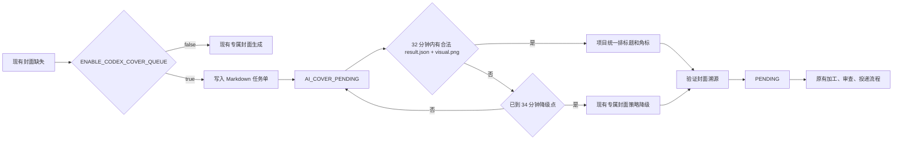

# ACQ-001 Codex 专属 AI 封面底图队列与 40 分钟降级保障

## 1. 背景

视频封面必须是与内容贴合的专属设计图，不能截取视频画面、视频截图或 YouTube 缩略图。此前封面生产同时承担“生成视觉”和“排标题、角标”的职责，外部 AI 图像能力无法被可靠接入，也无法在外部执行器失效时保证发布链路继续前进。

本工单建立项目与 Codex 的文件协议：项目只在需要新封面时写出一张 Markdown 任务单；Codex 只生成无文字底图；项目继续统一绘制标题、品牌元素和普通话译制角标，并在超时后使用现有专属封面策略降级。此边界避免 AI 生成文字不完整、右上角标被遮挡或变形，也确保任何一张最终封面都能验证来源。

## 2. 目标

1. `Video-precessing` 能为每条待处理视频产生一份可解析、可追溯的 AI 封面底图需求。
2. Codex 能按固定频率读取任务单，生成不含文字的专属竖版底图，并原子写入约定完成目录。
3. 项目只能接受满足时间、尺寸、哈希及“非视频帧”证明的完成物。
4. 从任务创建起，未获得有效 AI 底图时，最迟约 37.5 分钟完成本地专属封面降级，不跨越 40 分钟硬上限。
5. 无论正常路径还是降级路径，最终封面都必须有 `dedicated_generated_image` 溯源记录，且 `uses_video_frame=false`。
6. 本机制不自动发布视频，不改变发布窗口，也不把本地结果当作平台侧发布成功。

## 3. 非目标与硬边界

| 不做什么 | 约束 |
| --- | --- |
| Codex 不负责最终文字排版 | Codex 只产出无文字底图；标题、栏目标签、普通话译制角标由项目内 `cover_generator.py` 统一渲染。 |
| 不接受视频画面作为任何封面来源 | 禁止视频帧、视频截图、YouTube 缩略图，以及从这些素材裁切、放大或二次处理得到的图。 |
| 不因外部生成器卡住而无限等待 | 到达本地降级时间即停止等待该任务的外部结果，转现有专属封面生成策略。 |
| 不让队列绕过审查或发布门禁 | 任务完成后只回到 `PENDING`，仍须经过原有流水线检查与平台投递流程。 |
| 不允许 AI 生成中文标题或角标 | AI 图像中文字难以稳定校验；普通话版本右上角必须由项目绘制完整的 `普通话译制` 彩带包裹角标。 |

## 4. 已实现范围与上线阻塞

| 项目项 | 状态 | 说明 |
| --- | --- | --- |
| Markdown 队列、完成物校验和超时判定 | 已实现 | `src/video_processing/ai_cover_queue.py`。 |
| 管理器创建任务并进入 `AI_COVER_PENDING` | 已实现 | 仅在 `ENABLE_CODEX_COVER_QUEUE=true` 且现有封面缺失时执行。 |
| 两分钟本地协调器 | 已实现并已挂本机 cron | `scripts/reconcile_ai_cover_queue.py`；功能开关关闭时无副作用。 |
| 合法 AI 底图合成最终封面 | 已实现 | 使用现有 `scripts/cover_generator.py` 绘制标题与角标。 |
| 34 分钟后确定性降级 | 已实现 | 同一协调器生成并验证本地专属封面。 |
| Codex 每三分钟自动巡查 | 已注册并验证 | `scripts/install_ai_cover_doer_schedule.sh` 已迁移为用户 LaunchAgent `com.videopipeline.ai-cover-doer`；由 Home 下 launcher 调用 `scripts/run_ai_cover_doer.sh`，避免 cron/外置盘沙箱权限抖动。 |
| 真实端到端演练 | 部分完成 | 已完成隔离影子任务的有效 AI 底图路径和超时降级路径；仍需一条人工选定、未复用旧封面的真实测试视频验证管理器状态迁移与平台编辑器预览。 |

**当前结论：** 项目侧协议、降级代码和 Codex 三分钟巡查已具备；2026-08-02 起 AI 底图巡查由用户 LaunchAgent 执行，空队列巡查会继续写入 `output/ai_cover_codex_runs.log`。`ENABLE_CODEX_COVER_QUEUE=true` 后必须继续用 `resolution.json` 区分 `codex_ai_visual` 与 `deterministic_fallback`，不能把本地降级封面说成 AI 底图成功。

## 5. 任务协议

### 5.1 输入目录与任务单

项目根目录下的运行时目录：

```text
ai-cover-queue/<task_id>.md
ai-cover-finish/<task_id>/
```

二者均为运行时产物，已被 Git 忽略。任务单是 Markdown 文档，机器可读负载置于不可变注释块 `AI_COVER_TASK_JSON` 中。每个任务至少包含：

| 字段 | 含义 |
| --- | --- |
| `task_id` | 基于视频前缀、封面负载和视觉需求的确定性 ID。 |
| `created_at` | UTC 创建时间。 |
| `generation_deadline_at` | 外部 AI 完成截止，默认创建后 32 分钟。 |
| `fallback_after_at` | 本地降级开始时间，默认创建后 34 分钟。 |
| `finish_dir` | 该任务唯一完成目录的绝对路径。 |
| `cover_payload` | 最终项目渲染所需的标题、分类、标签及其他封面元数据。 |
| `visual_brief` | 内容语义、视觉方向、关键词和构图要求。 |
| `rules` | `generate_text=false`、`uses_video_frame=false`、最小尺寸 720x960、左上标题安全区等硬约束。 |

任务 Markdown 一经创建不得被 Codex 改写；重试、修改需求或更新文案必须建立新任务，而不是修改已发出的协议。

### 5.2 Codex 完成物

Codex 必须在任务的 `finish_dir` 以原子方式写入：

```text
visual.png
result.json
```

`visual.png` 必须是可解码的无文字竖版底图，至少 720x960。`result.json` 必须包含：

```json
{
  "task_id": "<与任务一致>",
  "generated_by": "codex_imagegen",
  "completed_at": "<UTC ISO-8601>",
  "visual_filename": "visual.png",
  "sha256": "<visual.png 的 SHA-256>",
  "uses_video_frame": false
}
```

图像生成器不得把标题、栏目名称、普通话译制字样、Logo 或水印烧录进底图。视觉主体必须避开左上标题安全区；人物、物体和地平线不得被无意义裁切。

### 5.3 接受与拒绝规则

项目仅在同时满足以下条件时接受完成物：

1. `task_id`、`generated_by` 和输出目录均与任务匹配。
2. `completed_at` 不晚于 `generation_deadline_at`。
3. `uses_video_frame` 严格为布尔值 `false`。
4. 图像文件存在、可解码、尺寸不少于 720x960。
5. `sha256` 与实际 `visual.png` 一致。

任一条件不满足即视为“无有效 AI 底图”，不会使用该文件，也不会延长降级时限。截止后才完成的底图同样不再消费，防止迟到任务覆盖已经完成的封面。

## 6. 流程与状态机



`AI_COVER_PENDING` 只代表等待封面底图，不代表已上传、审核中或已发布。协调器成功生成并验证最终封面后，将视频状态恢复为 `PENDING`，由后续正常工作轮次领取。

## 7. 封面视觉与排版契约

本节是生产要求，不是审美建议。违反任一条时，最终封面不得进入自动发布 checkpoint。

### 7.1 底图生成逻辑

项目从标题、分类、内容提示和语义分析中构建 `visual_brief`。底图提示词应描述“要表达的内容关系”和“适合放文字的构图”，而不是要求模型复制视频中的某一帧。例如，讨论“成功由自己定义”可要求奖杯与城市道路、开放地平线的对照构图，但不得要求抽取演讲者在视频中的画面。

生成策略应按内容选择隐喻、对象、场景、人物关系或信息图式构图，并保留显著留白。对于新闻、财经、人物观点、科技演示和生活方式内容，应维护各自的视觉模板与禁用元素，而不是只换一句大标题。

如果已经存在可追溯的 `visual.png`，且当前问题只是标题、字幕、描边、字号或位置错误，必须复用该底图重新排版，不得重新生成底图。只有底图本身缺失、损坏、非专属、非可追溯或用户明确要求重生成时，才可进入 AI 图像生成路径。若“重新生成底图”和“本地重排文字”之间存在明显资源消耗差距，必须先向人工确认。

### 7.2 最终项目排版

项目渲染最终 `*_cover.jpg` 时负责：

1. 标题置于左上安全区，字号优先保证移动端首屏可读；标题过长应通过分行和动态字号处理，不能压住主体。
2. 不得在专属底图上覆盖大面积暗色蒙版、玻璃卡片或文字说明框；文字可读性必须通过局部描边、阴影、字重、分行和位置解决。
3. 普通话译制版本的右上角使用彩带包裹形式，文字必须为完整、清晰、未裁切的 `普通话译制`。这是一个由项目绘制的角标，不是底图内的 AI 文字。
4. 标题、角标和底图主体互不遮挡；最终导出前检查边界、可读性和人物/物体完整性。
5. 写入 provenance：`cover_kind=dedicated_generated_image`、`uses_video_frame=false`、输出文件名、SHA-256、`layout_policy.policy_version` 和移动端可读性策略必须匹配。

### 7.3 手工替换边界

手工封面替换只交付文件。默认交付位置为 `output/manual_cover_replacements/YYYY-MM-DD/<youtube_id>/`，并复制一份到用户 `Downloads`。除非用户另行明确授权，不得因为生成了手工替换封面而修改 DB、触发平台上传、重发视频或替换已发布平台内容。

## 8. 时间预算与调度要求

40 分钟限制用于“任务创建到可用最终封面”的可用性保障，不包括后续视频渲染、审查或平台上传时间。

| 环节 | 设计值 | 依据 |
| --- | ---: | --- |
| Codex 自动化巡查周期 | 3 分钟 | 最坏等待一个完整巡查间隔。 |
| AI 生成接受截止 | 32 分钟 | 留出生成、写入完成物和本地验收空间。 |
| 本地降级起点 | 34 分钟 | 在外部截止后留 2 分钟供协调器发现结果。 |
| 本地协调器频率 | 2 分钟 | 最坏在 36 分钟发现需要降级。 |
| 本地封面生成超时 | 90 秒 | `cover_generator.py` 子进程硬超时。 |
| 最坏最终封面可用时间 | 约 37.5 分钟 | `34 + 2 + 1.5` 分钟，距 40 分钟上限至少保留约 2.5 分钟。 |

推导前提：本地协调器可运行、AI doer LaunchAgent 可运行、磁盘可写、既有本地封面生成器在 90 秒内完成。若调度、磁盘或本地生成器故障，不能宣称满足 40 分钟 SLA，必须由监控报警并按故障处理。

## 9. 配置、运行与可观测性

| 配置/产物 | 当前值 | 作用 |
| --- | --- | --- |
| `ENABLE_CODEX_COVER_QUEUE` | `true` | 总开关；开启后仍需用完成物证据区分 AI 底图与确定性降级。 |
| `AI_COVER_QUEUE_DIR` | `ai-cover-queue` | 输入任务目录。 |
| `AI_COVER_FINISH_DIR` | `ai-cover-finish` | Codex 完成物目录。 |
| `AI_COVER_GENERATION_DEADLINE_MINUTES` | `32` | 合法 AI 完成物的截止。 |
| `AI_COVER_FALLBACK_AFTER_MINUTES` | `34` | 本地降级起点。 |
| `scripts/reconcile_ai_cover_queue.py` | 每 2 分钟 | 消费有效完成物或执行降级；开关关闭时直接退出。 |
| `com.videopipeline.ai-cover-doer` | 每 180 秒 | 用户 LaunchAgent，触发 Home 下 launcher，再调用项目 `scripts/run_ai_cover_doer.sh`。 |
| `ai-cover-finish/<task_id>/resolution.json` | 每次完成 | 记录实际采用 `codex_ai_visual`、`antigravity_ai_visual` 或 `deterministic_fallback`。 |

### 9.1 Anti-gravity 兜底接入（人工视觉验收）

已验证本机 Antigravity 图形界面可以调用 `generate_image`，产物位于：
`~/.gemini/antigravity/brain/<conversation_id>/`，通常是 JPG。当前 `agy --print` 只验证了 CLI 会话可启动，未验证它能在非交互模式稳定返回图像文件，因此不把它直接挂进三分钟定时器，避免“命令成功但队列没有底图”。

当 Codex 底图不可用且任务尚未到 `generation_deadline_at` 时，人工在 Antigravity 中生成无文字底图并视觉确认后，用适配器接入：

```bash
.venv/bin/python scripts/import_antigravity_cover.py \
  --task-id '<task_id>' \
  --source "$HOME/.gemini/antigravity/brain/<conversation_id>/<artifact>.jpg" \
  --reviewed-no-text
```

适配器只接受人工明确确认的无文字、无 logo、无水印、非视频帧产物；将 JPG/PNG 转成队列要求的 `visual.png`，校验至少 `720x960`、生成时间不晚于 deadline，并原子写入 `result.json`。`reconcile_ai_cover_queue.py` 会继续走同一封面排版、provenance、数据库状态和发布门禁，`resolution.json.source` 记录为 `antigravity_ai_visual`。未通过人工验收、尺寸校验或 deadline 的文件不会写入完成物，随后仍由确定性 fallback 接管。

这条路径是“外部图像生成器的人工确认兜底”，不是自动上传或绕过审核；若后续要全自动化，应先取得 Antigravity 官方稳定的图像生成 API/CLI 文件输出契约，再增加独立 provider adapter 和端到端影子任务验证。

上线前还必须补充运行监控：任务创建数、接受数、拒绝原因、超时降级数、协调器最近成功运行时间和最老 `AI_COVER_PENDING` 等待时长。告警应报告事实，不得把“进程存在”误报为“封面已完成”。

## 10. 验收标准

1. 开关关闭时，项目行为与现有封面链路完全一致，不创建队列任务，也不改变发布调度。
2. 开关开启且封面缺失时，项目创建一份结构正确的 Markdown 任务单，并将对应记录置为 `AI_COVER_PENDING`；重复轮次不得反复领取或改写同一任务。
3. 合法完成物在 32 分钟内到达时，项目能够合成最终封面、生成可校验 provenance 和 `resolution.json`，并恢复为 `PENDING`。
4. 任意哈希不匹配、尺寸不足、非 PNG、错误任务 ID、`uses_video_frame!=false` 或迟到结果均被拒绝。
5. 没有有效完成物时，最迟约 37.5 分钟生成经过同一专属封面验证的降级结果；不得继续无限等待。
6. 正常和降级结果均不使用视频帧或截图；provenance 证明与最终 JPEG 内容一致，并带有当前 `layout_policy`。
7. 普通话译制版的最终封面右上角存在完整可读的 `普通话译制` 彩带包裹角标，且其文字不由 AI 底图生成。
8. 队列完成不触发上传、不绕过审查，也不将本地状态当作视频号平台可见成功。
9. Codex 自动化必须有真实的定时任务配置和至少一次成功执行记录，才能将该功能开关设为 `true`。
10. 对已有底图的文字排版修复必须走本地重排路径；不得为了省事消耗 AI 图像生成资源。

## 11. 测试与上线计划

### 11.1 已完成验证

项目侧已运行以下定向测试：

```bash
.venv/bin/python -m pytest \
  tests/unit/test_ai_cover_queue.py \
  tests/unit/test_cover_v2.py \
  tests/unit/test_cover_video_backed.py \
  tests/unit/test_publication_window_runner.py \
  tests/unit/test_database_slices.py -q
```

结果：`30 passed`。此外，协调器在开关关闭时已验证安全退出。

### 11.2 上线前工单拆分

| 子工单 | 优先级 | 状态 | 交付物 |
| --- | --- | --- | --- |
| ACQ-001A 注册 Codex 自动化 | P0 | 已完成 | `scripts/install_ai_cover_doer_schedule.sh` 安装每 3 分钟用户 LaunchAgent；`output/ai_cover_codex_runs.log` 记录真实空队列巡查。 |
| ACQ-001B 项目队列协议与降级 | P0 | 已完成 | 队列模块、状态机接入、协调器、配置和单测。 |
| ACQ-001C 本机协调器调度 | P0 | 已完成 | 每 2 分钟 cron；功能开关关闭时保持惰性。 |
| ACQ-001D 端到端影子演练 | P0 | 部分完成 | 隔离任务 `acqshadow-e25001cffc25` 验证 AI 底图、哈希、最终封面和 `codex_ai_visual` resolution；`acqfallback-8f92410d6cdb` 验证超时降级。仍需人工选定真实视频。 |
| ACQ-001E 可观测性与告警 | P1 | 基础完成 | 运行日志 `output/ai_cover_codex_runs.log`、最后消息 `output/ai_cover_codex_last_run.txt`、互斥锁和 `skipped_no_eligible_task` 回执已实现；仪表盘指标和外部告警仍待补齐。 |

### 11.3 放量顺序

1. 已完成：受管 LaunchAgent 每三分钟运行 `/ai-cover-doer`，限定工作目录和技能边界，不含发布或平台操作；空队列先由项目协议预检，避免无任务唤起模型。
2. 已完成：LaunchAgent 已检查队列并写入 `skipped_no_eligible_task` 运行证据。
3. 仅挑选一条真实测试视频，将 `ENABLE_CODEX_COVER_QUEUE=true` 后执行影子演练；检查任务单、`visual.png`、`result.json`、`resolution.json`、最终 JPEG 和 provenance。
4. 验证一次“有效 AI 底图”路径与一次“无结果/错误结果”降级路径，确认均在时间预算内完成。
5. 通过视觉审查后，在视频号编辑器中检查最终封面预览，确认不是视频截图，普通话角标完整可见；平台侧预览证据单独留存。
6. 连续观察 24 小时的队列指标后，才允许将功能用于有限的正常候选；发布成功仍须按平台侧作品管理页另行确认。

## 12. Definition of Done

- ACQ-001A 已提供可审计的 LaunchAgent 配置和真实运行记录，证明每三分钟巡查不是口头约定。
- ACQ-001D 的隔离成功与降级路径已有任务、完成物、解析结果、最终封面及时间戳证据；真实测试视频的管理器状态迁移与编辑器预览仍未验收。
- 端到端结果符合所有封面视觉硬约束，尤其是“专属设计图、绝不使用视频内部截图”和普通话译制右上角完整彩带。
- 队列开关、发布状态、平台投递和平台可见确认之间的边界保持清晰；无任何路径因封面完成而自动发布。
- ACQ-001E 的基础监控可识别超过预算、协调器中断和完成物被拒绝，且告警能定位任务 ID 与原因。
