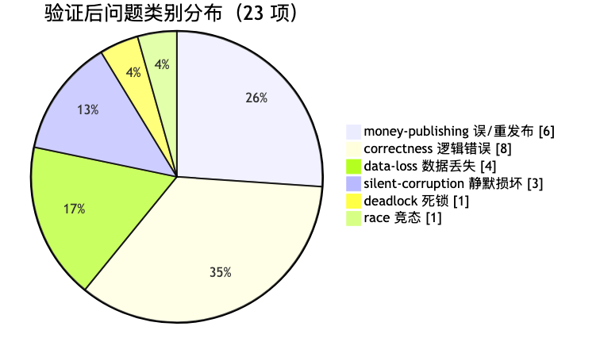
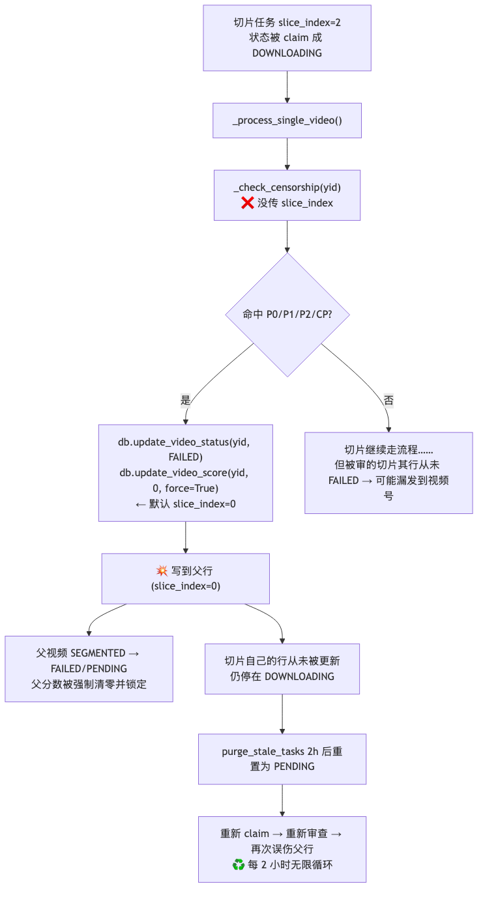
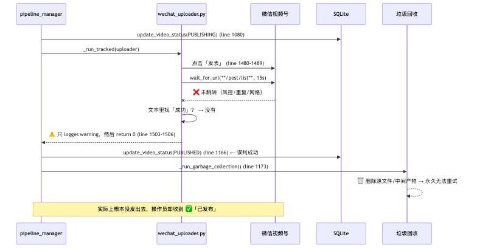
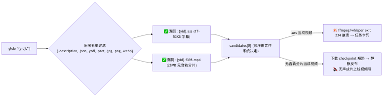
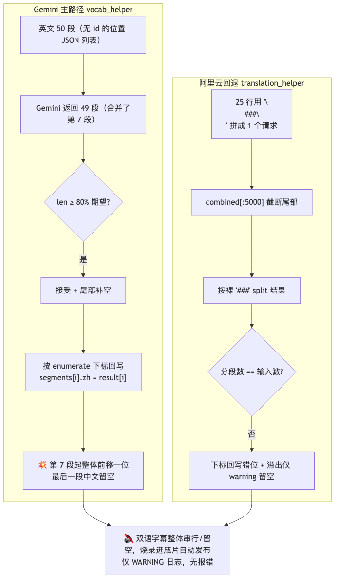
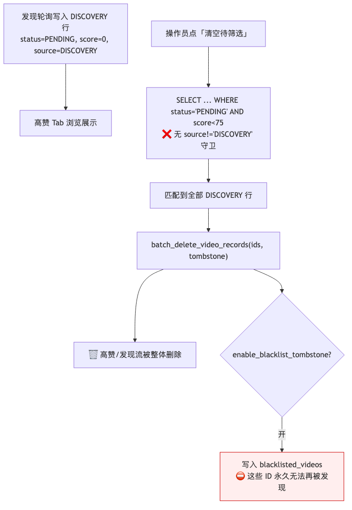
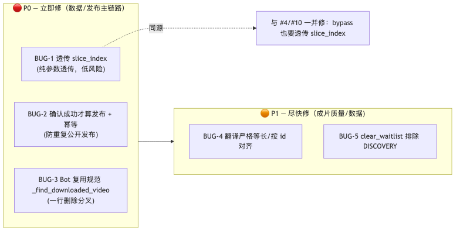

# 🐞 严重 Bug 审计与改进建议（2026-06-15）

> **本文档为只读审计产物，未改动任何源码。** 由 11 个并行 finder 按子系统扫描，
> 共发现 51 个候选；每个去重后候选交由 3 个对抗性视角（正确性 / 可达性 / 严重度）独立复核，
> 仅保留 ≥2 票判定为真且 ≥1 票判定可达的结论，最终 **23 项**通过验证。
> 下面是按「严重度 × 置信度」排名后、合并同源 facet 得到的 **5 个最严重根因**。

---

## 📊 总览

### 验证后问题分布（23 项）

```text
严重度                                       类别
█████████████  critical  4                  money-publishing  ██████ 6
██████████████████████████  high   8        correctness       ████████ 8
████████████████████████████████ medium 11  data-loss         ████ 4
                                            silent-corruption ███ 3
                                            deadlock          █ 1
                                            race              █ 1
```



<sub>图1 验证后问题类别分布（若你的查看器不支持图片，下方/相邻仍保留 ASCII 图与文字说明）</sub>

### 🎯 Top 5 最严重根因

| # | 严重度 | 类别 | 一句话 | 核心位置 | 默认配置可达 |
|---|--------|------|--------|----------|:---:|
| **1** | 🔴 critical | 数据损坏 + 误发布 | 审查未透传 `slice_index`，切片审查结果写到**父行**，污染父状态、卡死切片、并让被审切片漏发 | `pipeline_manager.py:492-598` | ✅ |
| **2** | 🔴 critical | 误发布 / 数据丢失 | 上传器**确认失败仍 `return 0`**，管线误标 `PUBLISHED` 并 GC 删源；崩溃窗口还会**重复发布** | `scripts/wechat_uploader.py:1491-1506` | ✅ |
| **3** | 🔴 critical | 静默损坏 / 崩溃 | Bot 私有的 `_find_downloaded_video` 仍用**旧黑名单**，把 `.ass` 字幕 / 无音轨分片喂给 ffmpeg | `src/bot/pipeline_agent.py:623-629` | ✅ |
| **4** | 🟠 high | 静默损坏 | 批量翻译**按下标回写**，Gemini 少返 1 条 / 阿里云分隔符错位即整体串行、尾部留空 | `vocab_helper.py:259` · `translation_helper.py:100-119` | ✅ |
| **5** | 🟠 high | 数据丢失 | `clear_waitlist` 删除并**拉黑** DISCOVERY 高赞视频，击穿 DISCOVERY 防火墙 | `src/web/app.py:1262-1289` | ✅ |

> 其余 18 项已验证问题见 [附录](#-附录其余-18-项已验证问题)。

---

## 🔴 BUG-1 — 审查未透传 `slice_index`，切片审查写到父行

| | |
|---|---|
| **严重度** | 🔴 critical（验证 3/3 真实、3/3 可达，置信 0.91） |
| **类别** | data-loss + silent-corruption + money-publishing（一个根因，三处恶果） |
| **位置** | `src/video_processing/pipeline_manager.py` — `_check_censorship`（def@492，调用点 643 / 836 / 979）；DB 默认参数 `database.py` is_censorship_bypassed@526、update_video_status@421、update_video_score@468、update_video_censor_status@850 |
| **触发** | `.env` 已开启 `ENABLE_CENSORSHIP_ENGINE=true` + `ENABLE_CHANNEL_POLICY_FILTER=true`，且某**切片**（`slice_index>0`）的标题/短标题/文案/简介命中 P0/P1/P2/CP 词 |
| **合并 facet** | 排名 #1（父状态损坏）、#4（被审切片漏发）、#10（释放父视频即静默放行全部切片审查） |

### 机理

`_check_censorship(self, yid, title, description="", zh_title="")` **没有 `slice_index` 形参**，而它内部所有 DB 写入都用方法默认 `slice_index=0`（即父行）。但切片任务也会流经 `_process_single_video`（`slice_index>0`），并在 643/836/979 三处调用审查。于是切片命中违禁词时：



<sub>图2 BUG-1 切片审查写错行的因果链（若你的查看器不支持图片，下方/相邻仍保留 ASCII 图与文字说明）</sub>

三处恶果（同一根因）：

1. **父状态损坏（#1）**：切片命中 → `update_video_status(yid, "FAILED")` / P2 的 `PENDING` 写到父行，**抹掉父视频的 `SEGMENTED`**；`update_video_score(yid, 0, force=True)` 把**无关父视频**的分数强制清零并人工锁定。
2. **切片卡死 + 2h 重放（#1）**：切片自己的行（非终态 `DOWNLOADING`）从未更新；`purge_stale_tasks(stale_hours=2)` 会把它重置回 `PENDING`，再被选中重审、再误伤父行——**每 2 小时一轮的无限循环**。
3. **被审切片漏发 / 释放即全放行（#4/#10）**：被审切片自己的行没被置 `FAILED`，可能继续被发布；而 `is_censorship_bypassed(yid)` / `set_bypass_censorship(yid, True)` 同样默认 `slice_index=0`——操作员在父视频上点「🔓 复核放行」会**静默关闭该视频全部切片的审查**（P0/P1/P2/CP 全失效）。

### 证据（实际代码）

```python
# src/video_processing/pipeline_manager.py
492  def _check_censorship(self, yid: str, title: str, description: str = "", zh_title: str = "") -> bool:
510      if self.db.is_censorship_bypassed(yid):                     # ← 读父行 bypass
535          self.db.update_video_censor_status(yid, result.tag, result.score)   # ← 写父行
539          self.db.update_video_status(yid, "FAILED", error_msg=...)           # ← 写父行
559          self.db.update_video_score(yid, 0, force=True)                      # ← 强制清零+锁定父行
560          self.db.update_video_status(yid, "PENDING", error_msg=...)          # ← P2 抹掉父 SEGMENTED
582          self.db.update_video_censor_status(yid, cp_result.tag, score=0)     # ← 写父行
583          self.db.update_video_status(yid, "FAILED", error_msg=...)           # ← 写父行
```

> **强佐证**：`_process_single_video` 中**其它每一处** `db.update_video_status` 都正确传了
> `slice_index=slice_index`（635/662/679/682/854/857/919/938/1077/1080/1156/1166/1177/1183/1189）——
> 唯独这三处审查调用漏传，是一处孤立的遗漏，而非设计意图。

### ✅ 修复建议

```python
# 1) 给 _check_censorship 增加 slice_index 形参并透传到每个 db.* 调用
def _check_censorship(self, yid, title, description="", zh_title="", slice_index: int = 0) -> bool:
    if self.db.is_censorship_bypassed(yid, slice_index=slice_index):
        ...
    self.db.update_video_status(yid, "FAILED", error_msg=..., slice_index=slice_index)
    self.db.update_video_score(yid, 0, force=True, slice_index=slice_index)
    self.db.update_video_censor_status(yid, result.tag, result.score, slice_index=slice_index)

# 2) 三处调用点（643 / 836 / 979）改为：
self._check_censorship(yid, title, ..., slice_index=slice_index)
```

并明确「释放」的粒度语义：父视频放行是否应连带放行切片——若不应，则 bypass 须按 `(youtube_id, slice_index)` 存取，UI 要求逐切片确认。

---

## 🔴 BUG-2 — 上传器「假成功」：确认失败仍 `return 0`，误标 PUBLISHED + GC 删源 + 崩溃重发

| | |
|---|---|
| **严重度** | 🔴 critical（验证 3/3 真实、3/3 可达，置信 0.88） |
| **类别** | money-publishing（资金/发布主链路） |
| **位置** | `scripts/wechat_uploader.py:1491-1506`（确认窗口）；`pipeline_manager.py:1146-1173`（PUBLISHED + GC）；`database.py:449-466`（purge 重排队） |
| **触发** | 发表后 20s 内未跳转 `/post/list` 且页面文本无「成功」——风控横幅 / 原创声明被拒 / 重复内容 toast / 点击落空 / 上传未真正完成 / 网络抖动。**无头生产模式下尤为常见** |
| **合并 facet** | 排名 #3、#7（确认失败仍 return 0）、#11（崩溃窗口重复发布） |

### 机理



<sub>图3 BUG-2 上传“假成功”导致误标 PUBLISHED + GC 删源（若你的查看器不支持图片，下方/相邻仍保留 ASCII 图与文字说明）</sub>

`run_uploader()` 末尾是**无条件 `return 0`**。确认块两条路径（URL 跳转 / 文本含「成功」）都失败时，仅打一条 `warning` 就 `browser.close(); return 0`。调用方把 `exit==0` 当作「确定成功」→ 置 `PUBLISHED` + 发 Telegram「✅ 已发布」+ GC 删源。**两个叠加缺陷**：
- 文本判定 `"成功" in content` 过宽——会被「保存草稿成功」误命中，也无法排除含「不成功」的报错文案。
- 上传完成等待在 5 分钟超时后打印「Proceeding anyway」继续点发表（line 601-602），上传没传完也照发照 `return 0`。

**崩溃窗口重复发布（#11）**：`PUBLISHING` 在上传子进程**之前**就置位，`PUBLISHED` 在其**之后**才置位。若在「微信已接收发表」到「Python 写 PUBLISHED」之间被 SIGTERM/OOM/休眠打断，行卡在 `PUBLISHING`；`purge_stale_tasks` 2h 后把它重置为 `PENDING` 再次入选——**上传器无任何幂等/去重**，于是同一视频**二次公开发布**，触发微信重复/垃圾风控。

### 证据

```python
# scripts/wechat_uploader.py
1492  page.wait_for_timeout(5000)
1494  page.wait_for_url("**/post/list**", timeout=15000)        # 失败走 except
1500  if "成功" in content or "发表成功" in content or "保存成功" in content:
1503  logger.warning("Could not confirm success ... Please double check manually.")
1505  browser.close()
1506  return 0                                                   # 💥 不论是否确认都返回成功
```

### ✅ 修复建议

```python
confirmed = False
try:
    page.wait_for_url("**/post/list**", timeout=15000); confirmed = True
except Exception:
    if any(k in content for k in ("发表成功",)) and "不成功" not in content:
        confirmed = True
browser.close()
return 0 if confirmed else 3      # 3 = UNCONFIRMED
```

- 管线侧：仅 `exit==0` 才置 `PUBLISHED`；`exit==3` 视为 `FAILED`/待人工复核，**确认成功前绝不 GC**。
- 幂等：发表点击前按 `youtube_id(+slice)` 落「已尝试发布」标记，或上传前查视频号列表是否已存在同短标题/同封面，命中则拒绝重发；并把 `PUBLISHING` 从 `purge_stale_tasks` 的自动重排队中排除，改路由到人工复核态。

---

## 🔴 BUG-3 — Bot 私有 `_find_downloaded_video` 用旧黑名单，把 `.ass`/无音轨分片喂给 ffmpeg

| | |
|---|---|
| **严重度** | 🔴 critical（验证 3/3 真实、3/3 可达，置信 0.90） |
| **类别** | silent-corruption + crash |
| **位置** | `src/bot/pipeline_agent.py:623-629`（与 `pipeline_manager._find_downloaded_video` 同名但已分叉） |
| **触发** | 管理员自由文本触发 agent 的 `download_video`/`transcribe_and_caption_video`/`/process`，而 `output/` 已存在 >50KB 的 `{yid}.ass`（**当前磁盘已有 42 个**）或未合流的 `{yid}.f398.mp4` 视频-only DASH 分片。agent 是无条件 `filters.TEXT` 兜底处理器，**无 flag 拦截** |

### 机理

规范实现 `PipelineManager._find_downloaded_video` 被加固过两次：v3.2.0 加 `if f.stem != yid: continue`（拒绝 `{yid}.f398.mp4`/`{yid}_vertical.mp4`），v3.12.0 从**黑名单**改为**视频扩展名白名单**（专门挡住 `.ass`/`.srt` 被喂进 ffmpeg，即历史 exit-234 崩溃）。但 **Bot 的私有副本没跟上**——仍用旧黑名单 `_NON_VIDEO_SUFFIXES`（不含 `.ass`/`.srt`），也没有 `f.stem == yid` 校验。



<sub>图4 BUG-3 glob 选错文件喂给 ffmpeg（若你的查看器不支持图片，下方/相邻仍保留 ASCII 图与文字说明）</sub>

> 对照规范白名单（高内聚的唯一真相源）：
> ```
> 规范: _VIDEO_SUFFIXES = {'.mp4','.webm','.mkv','.mov','.m4v','.avi','.flv','.ts'} + f.stem==yid + >50KB + 回落 original_video/
> Bot : 旧黑名单 + 无 stem 校验 + 无冷归档回落   ← 分叉
> ```

### 证据

```python
# src/bot/pipeline_agent.py  ← 已分叉的私有副本
623  def _find_downloaded_video(self, yid: str) -> Optional[str]:
624      _NON_VIDEO_SUFFIXES = {'.description','.json','.ytdl','.part','.jpg','.png','.webp'}
625      candidates = [
626          f for f in self.output_dir.glob(f"{yid}.*")
627          if f.suffix not in _NON_VIDEO_SUFFIXES and f.stat().st_size > 50_000   # .ass(53KB) 漏过
628      ]
629      return str(candidates[0]) if candidates else None   # glob 顺序任意 → 可能选错
```

### ✅ 修复建议

删掉私有副本，**复用规范实现**（单一真相源）；或精确复制：视频扩展名白名单 + `f.stem == yid` + `>50KB` + 回落 `output/original_video/`。agent 在 `delete_video_from_db` 里已 import `PipelineManager`，直接调用即可。

---

## 🟠 BUG-4 — 批量翻译按下标回写：少返 1 条 / 分隔符错位即整体串行、尾部留空

| | |
|---|---|
| **严重度** | 🟠 high（两项均验证 3/3，置信 0.79–0.83） |
| **类别** | silent-corruption（成片质量，客户可见） |
| **位置** | `src/video_processing/utils/vocab_helper.py:256-266`（Gemini 主路径）；`src/video_processing/utils/translation_helper.py:99-117`（阿里云回退） |
| **触发** | **默认配置即可达**。Gemini 对 50 段批次少返 1 段（合并短句/空行是 LLM 常见行为）；或阿里云返回的 `###` 分段数对不上 / 拼接超 5000 字截断。长视频几乎必现 |
| **合并 facet** | 排名 #9（Gemini 80% 容忍 + 补空）、#12（阿里云 join/split 分隔符 + 截断） |

### 机理

两个翻译器都把结果**按位置下标回写**，无 id 重对齐：



<sub>图5 BUG-4 批量翻译按下标回写的错位级联（若你的查看器不支持图片，下方/相邻仍保留 ASCII 图与文字说明）</sub>

`extract_vocab_batch` 是**首选**翻译器（`caption_processor._translate_segments` 先调它）。`_parse_response` 在 `len(result) >= expected*0.8` 时就接受并补空（line 259），调用方 `for i,res in enumerate(...): segments[i]['zh_text']=...` 纯按下标映射——Gemini 少返一段，**该段之后全部错位一位**，尾部中文空白。阿里云回退用 `\n###\n` 拼接、按裸 `###` split，且 `combined[:5000]` 会**截掉尾部行**，机器翻译不保证原样保留 `###` 标记 → 分段数对不上即整体错位。

### 证据

```python
# vocab_helper.py
259  elif len(result) >= int(expected_count * 0.8):       # 💥 容忍 20% 缺失
264      while len(result) < expected_count:
265          result.append({"translation": "", "vocab": {}})   # 补空，但前面已错位
# translation_helper.py
99   combined = _SEP.join(non_empty_texts)                # _SEP = "\n###\n"
105  source_text=combined[:5000],                         # 💥 截断尾部
112  parts = [p.strip() for p in result_text.split("###")]
114  translated[batch_start + abs_idx] = parts[local_idx] # 💥 数目不等即错位
```

### ✅ 修复建议

- **严格等长**：`len(result) == expected_count` 才接受；不等则该批回退到逐条翻译或下一引擎，**绝不按位置补空**。
- **带 id 对齐**：prompt 中给每段加整数 id 并要求回显，按 id 重对齐而非位置。
- 阿里云：先按 5000 字**切批再拼接**（不丢行），用不易被 MT 改动的唯一 sentinel 分隔符，split 后断言数目。

---

## 🟠 BUG-5 — `clear_waitlist` 删除并拉黑 DISCOVERY 高赞视频，击穿 DISCOVERY 防火墙

| | |
|---|---|
| **严重度** | 🟠 high（验证 3/3 真实、3/3 可达，置信 0.89） |
| **类别** | data-loss |
| **位置** | `src/web/app.py:1262-1289`（含在业务层直写 SQL，违反 DAL 约定） |
| **触发** | 操作员点「清空待筛选列表」（`DELETE /api/videos/waitlist/all`）时，只要存在 DISCOVERY 高赞视频（发现轮询后的常态）。开启 `enable_blacklist_tombstone` 时还会**永久拉黑** |

### 机理

`clear_waitlist()` 选 `status='PENDING' AND score < 75` 的**全部**行交给 `batch_delete_video_records`。而 DISCOVERY 视频由 `monitor_channels.discover_high_like_videos()` 以 `source='DISCOVERY'`、硬编码 `status='PENDING'`、`score=0` 插入——**完全落入该过滤条件**，且筛选缺少 `source != 'DISCOVERY'` 守卫。



<sub>图6 BUG-5 clear_waitlist 击穿 DISCOVERY 防火墙（若你的查看器不支持图片，下方/相邻仍保留 ASCII 图与文字说明）</sub>

API 层处处为 DISCOVERY 加了「防火墙」（`process_video_now`、`update_video_priority` 都拒绝对 `source=='DISCOVERY'` 操作），唯独这个清空按钮把它们**整体删除**，开了 tombstone 还**永久封禁再发现**（`add_video` 对被拉黑的非 MANUAL 源直接 `return False`）。

### 证据

```python
# src/web/app.py
1269  with db.get_connection() as conn:                    # ← 业务层直开连接 + 裸 SQL（违反 DAL 约定）
1271      "SELECT youtube_id FROM processed_videos WHERE status = 'PENDING' AND score < 75"
1279  deleted_count, failed_ids = db.batch_delete_video_records(all_ids, tombstone=tombstone)
```

### ✅ 修复建议

```sql
SELECT youtube_id FROM processed_videos
WHERE status='PENDING' AND score < 75 AND source != 'DISCOVERY';
```

更好：把这段 SQL 收进 `PipelineDB` 专用方法（遵守 DAL 约定），与 `get_paginated_videos` 的 waitlist 条件**共用同一谓词**，避免两处定义漂移。

---

## 🗺️ 修复优先级路线图



<sub>图7 修复优先级路线图（若你的查看器不支持图片，下方/相邻仍保留 ASCII 图与文字说明）</sub>

**建议顺序**：BUG-3（改动最小、消除已知崩溃）→ BUG-1（参数透传、低风险、止住父行损坏与 2h 重放）→ BUG-2（防止重复/虚假公开发布，外发不可逆，需联调验证）→ BUG-5（一行 SQL 守卫）→ BUG-4（需引擎对齐改造，影响每条成片质量）。

---

## 📎 附录：其余 18 项已验证问题

> 均通过 ≥2/3 视角验证；按严重度排列。`默认可达=否` 多为受 OFF 默认 flag 或特定状态约束，但仍是真实缺陷。

| # | 严重度 | 类别 | 位置 | 问题 | 默认可达 |
|---|--------|------|------|------|:---:|
| 6 | high | 发布 | `pipeline_manager.py:390-415` | `_run_tracked` 在默认配置（`enable_sigterm_kill=False`）下**丢弃注入的子进程 env**，上传器拿不到 Telegram 凭据，扫码登录推送静默失败 | ✅ |
| 8 | high | 死锁 | `pipeline_agent.py:304,351,406,464,518` | agent 的 `subprocess.run` 全部**无 timeout**，yt-dlp/Playwright 卡住即永久锁死工作线程与会话 | ✅ |
| 13 | medium | 正确性 | `pipeline_manager.py:648-650,…` | SIGTERM checkpoint 逻辑在管线子进程中是**死代码**，handler 只在 FastAPI 进程注册 | ✅ |
| 14 | medium | 正确性 | `censor_engine.py:456-497` | `scan_all_matches` 的 CP 共现**过度上报**：国名 + 任意无关冲突词同段即全标；与 `check_channel_policy` 对「共现」定义不一致 | ❌ |
| 15 | medium | 正确性 | `web/app.py:890-901` | 关键词云 `_is_flagged` 用**双向子串包含**，短命中词几乎把云里每个词都标红 | ✅ |
| 16 | medium | 正确性 | `censor_engine.py:383,459,532` | 中文频道词用**裸子串匹配**（无词边界），P0/P1/CP 在无辜文本上过度命中 → 误 REJECT/SIGTERM/拉黑 | ❌ |
| 17 | medium | 数据丢失 | `database.py:64-168` | 迁移把手动 `conn.commit()` 与连接上下文自动提交交错，**破坏破坏性 rename/copy/drop 的回滚兜底** | ✅ |
| 18 | medium | 正确性 | `web/app.py:945-960` | `bypass_censor` 对 **P2 降权视频（状态 PENDING 而非 FAILED）不可达**，操作员无法放行 | ❌ |
| 19 | medium | 竞态 | `pipeline_manager.py:402-403,1202-1203` | `killpg` 用**陈旧 PGID**（整条视频完成后才清），可能 SIGKILL 一个被回收复用的无关进程组 | ✅ |
| 20 | medium | 正确性 | `processors/slicer.py:33-41` | `-ss/-to` 置于 `-i` 前的 stream-copy 切片按关键帧对齐，产生**冻结/黑屏开头与不准切点** | ✅ |
| 21 | medium | 数据丢失 | `pipeline_manager.py:417-490,732-742` | GC 在 PUBLISHED 时无条件删热源 `.mp4`，切片父重处理与冷归档 3 天 TTL **竞态**，切片 resume 断裂 | ✅ |
| 22 | medium | 正确性 | `web/app.py:1400-1418,…` | stop/delete/respec 的 `killpg` 复用陈旧 PGID，2s 窗口后可能误伤无关进程 | ❌ |
| 23 | medium | 正确性 | `wechat_uploader.py:1451-1465` | `_select_collection` 失败被静默忽略，可能留下遮挡发表按钮的弹窗/遮罩 | ✅ |

> 注：附录 #7/#10/#11 等已合并进 BUG-2/BUG-1，未在此重复。

---

## 🛠 审计方法论与验证说明


<sub>图8 审计方法论流水线（若你的查看器不支持图片，下方/相邻仍保留 ASCII 图与文字说明）</sub>

- **finder 维度**：pipeline-fsm、database、web-app、censor、bot、processors、scripts、config-conventions、concurrency-resources、data-integrity-money、completeness-critic。
- **可达性判定**：审计已核对实际 `.env`——`ENABLE_CENSORSHIP_ENGINE=true`、`ENABLE_CHANNEL_POLICY_FILTER=true`，故 BUG-1 等审查相关路径在**当前运行配置下真实可达**（非仅理论）。
- **规模**：152 个子智能体、约 160 万 tool 调用 token、约 32 分钟。少数 `app.py`/`pipeline_manager.py`/`wechat_uploader.py`/`tts_engine.py` 的复核 agent 触及会话额度上限而失败——**只会导致未拿到法定票数的候选被丢弃（更保守），不影响已入选 23 项的结论**；这意味着真实问题数可能 ≥23。
- **本审计全程只读，未改动任何源码。** 修复建议供后续实施参考。
