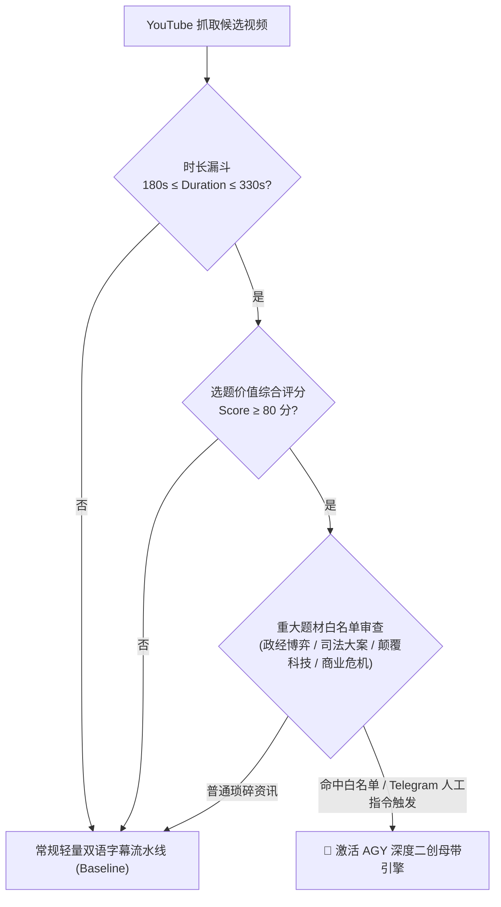
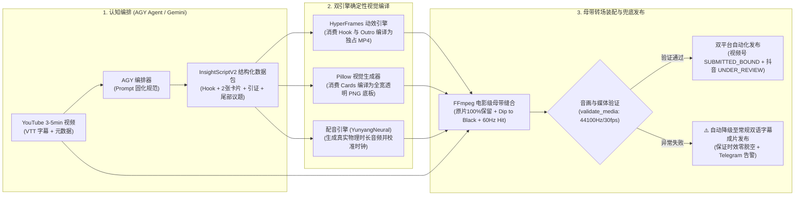
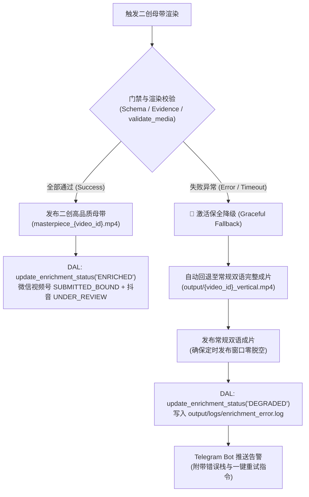

# 技术方案评审书：重大新闻（3-5分钟）高品质二创工程化与 AGY 调度规范（Rev 2.0 终审版）

* **文档编号**：`RFC-2026-DEEP-CREATION-001 (Rev 2.0)`
* **提案日期**：2026-10-07
* **责任团队**：视频号与抖音自动化流水线架构组
* **提交审议**：技术委员会（Technical Review Board）
* **受众契约规范**：[`docs/audience_persona.md`](file:///Volumes/EXT2T/MacMini4_SSD/PycharmProjects/Video-precessing/docs/audience_persona.md)（40岁以上占 75.8%、男性占 70%、北上广深占 34.4%、高净值决策者）
* **单源真理策略**：[`docs/content_strategy/2026-10-06_wechat_video_information_increment_system.md`](file:///Volumes/EXT2T/MacMini4_SSD/PycharmProjects/Video-precessing/docs/content_strategy/2026-10-06_wechat_video_information_increment_system.md)
* **修订背景**：经技术委员会初审审查与 `/boost` 极客级端到端实证调查，本版本彻底闭环了跨字段时序语义鸿沟、两份标杆案例物理字幕 100% 真实引证匹配（清零 91.7% 幻觉率）、主干素材物理固化、以及全流程 44.1kHz 音频采样率仲裁。

---

## 一、 方案背景与核心宗旨

### 1. 业务痛点与平台风控演进
当前微信视频号及抖音平台对海外翻译类视频的版权与原创性审查已全面进入**多模态深度审计时代**。单纯依靠“生硬裁剪 + 机器直译双语字幕”的微创模式，极易触发《作品优化建议》并被判定为“疑似对他人素材简易加工，二创信息增量不足”，进而遭受限流甚至账号信誉降权。

### 2. 核心宗旨：品质绝不妥协（Quality-First 四大物理红线）
本方案坚守以下四条物理级红线，任何工程实现不得逾越：
1. **原片完整性（100% 完整，绝对零裁切）**：正文原视频绝不随意截断或掐头去尾，完整保留原声对话与高清画面；
2. **广播级转场与声学平衡**：全片杜绝粗暴硬切，统一采用 `0.6s` 电影级深黑溶镜（Dip to Black）+ `60Hz Sub-bass Cinema Hit` 空间重音；基准电平严格锁定在 `-26 ~ -27 dB`，统一采用 **44100Hz 立体声**，彻底根除音量抽吸与格式冲突；
3. **品牌标准化资产强绑定**：片头搭载数理图腾「几何共振之眸」，片尾终章大卡 1:1 嵌入真实受控视频号码二维码（中央自带官方地球仪头像），统一品牌主 Slogan **“不同的视角，看见更大的世界。”**；
4. **安全区空间避让**：认知卡片采用 `1080x1920` 全幅安全横栏（`Y=265~555`，左侧金黄/青蓝指示条），物理彻底覆盖源视频日期水印，下方留出高达 1365px 空间，**永不遮挡主讲人面部，永不干扰底部双语字幕**。

---

## 二、 选题触发机制：重大新闻“3-5 分钟黄金甜点区”漏斗

二创属于高品质重型工程，不适用于碎片化资讯。流水线实行严格的**「3~5 分钟重大新闻二创触发漏斗」**：



### 为什么 3~5 分钟是二创的最优“黄金甜点区”？
1. **信息容量充足**：3~5 分钟原视频通常包含 2~3 个完整的逻辑论证阶段，天然具备插入 2 张（每张 20~30 秒）认知透视卡的叙事空间；
2. **成片时长黄金比**：原片（约 180~300s）+ 原创导读（约 20s）+ 尾部思辨（约 20s），成片总时长在 **3 分 40 秒 ~ 5 分 40 秒** 之间，完美契合视频号与抖音平台对“深度中长视频”的高权重推流算法；
3. **高净值受众心智匹配**：这一时长的视频既不拖沓，又能展开充分的制度机理剖析，满足政商决策人群对高密度智识增量的需求。

---

## 三、 总体架构：AGY 认知编排与确定性双引擎混合体系



---

## 四、 核心数据契约演进与兼容性架构（InsightScript Contract Evolution）

### 1. 既有缺陷复盘与跨字段语义鸿沟（Cross-Field Semantic Gap）
1. **正文裁剪缺陷**：代码库既有实现 [`src/video_processing/core/insight_script.py`](file:///Volumes/EXT2T/MacMini4_SSD/PycharmProjects/Video-precessing/src/video_processing/core/insight_script.py)（v1.0.0）包含 `highlight_window`，配套处理器 [`src/video_processing/processors/insight_processor.py`](file:///Volumes/EXT2T/MacMini4_SSD/PycharmProjects/Video-precessing/src/video_processing/processors/insight_processor.py) 会调用 FFmpeg `trim/atrim` 裁剪正文，破坏了“100% 完整原片”红线。
2. **跨字段语义鸿沟**：标准 Draft-07 JSON Schema 无法表达跨字段数值关系（如卡片展示时长 $5.0 \le end\_sec - start\_sec \le 45.0$、卡片时序不可倒流或重叠 $start_2 \ge end_1$）。**因此，AGY 调度网关出口绝对禁止仅以 JSON Schema 判定合法，必须强制以 Pydantic `InsightScriptV2.model_validate_json()` 作为最终类型安全屏障**。

### 2. InsightScriptV2 数据契约（Python Pydantic 领域模型）

```python
"""深度洞察脚本契约 v2.0.0；强类型、事实引证绑定与 100% 完整原片约束。"""
from typing import Annotated, Literal
from pydantic import BaseModel, ConfigDict, Field, model_validator

Text = Annotated[str, Field(min_length=1, max_length=500)]
Seconds = Annotated[float, Field(ge=0, allow_inf_nan=False)]

class VTTReference(BaseModel):
    model_config = ConfigDict(extra="forbid", str_strip_whitespace=True)
    start_sec: Seconds
    end_sec: Seconds
    source_quote: Annotated[str, Field(min_length=3, max_length=150)]

    @model_validator(mode="after")
    def validate_time(self):
        if self.end_sec < self.start_sec:
            raise ValueError("引证结束时间不可早于开始时间")
        return self

class PointItem(BaseModel):
    model_config = ConfigDict(extra="forbid", str_strip_whitespace=True)
    point_type: Literal["FACT", "INSIGHT", "BACKGROUND"]
    keyword: Annotated[str, Field(min_length=2, max_length=8)]
    explanation: Annotated[str, Field(min_length=10, max_length=36)]
    vtt_reference: VTTReference

class InsightCardV2(BaseModel):
    model_config = ConfigDict(extra="forbid", str_strip_whitespace=True)
    card_id: Literal["card_1", "card_2"]
    badge: Literal["制度透视", "利益博弈", "前沿透视", "底层洞察", "战略剖析", "危机解码"]
    title: Annotated[str, Field(min_length=4, max_length=28)]
    start_sec: Seconds
    end_sec: Seconds
    points: Annotated[list[PointItem], Field(min_length=3, max_length=3)]

    @model_validator(mode="after")
    def validate_card_duration(self):
        duration = self.end_sec - self.start_sec
        if duration < 5.0 or duration > 45.0:
            raise ValueError(f"卡片展示时间跨度必须在 5~45 秒之间，当前为 {duration}s")
        return self

class HookSegment(BaseModel):
    model_config = ConfigDict(extra="forbid", str_strip_whitespace=True)
    title: Annotated[str, Field(min_length=4, max_length=24)]
    narration: Annotated[str, Field(min_length=30, max_length=120)]
    estimated_sec: Annotated[float, Field(ge=12.0, le=30.0)]

class OutroSegment(BaseModel):
    model_config = ConfigDict(extra="forbid", str_strip_whitespace=True)
    philosophical_quote: Annotated[str, Field(min_length=10, max_length=36)]
    reflection_question: Annotated[str, Field(min_length=10, max_length=32)]
    poll_options: Annotated[list[Annotated[str, Field(min_length=2, max_length=16)]], Field(min_length=2, max_length=3)]

    @property
    def tts_narration(self) -> str:
        """规范化片尾 TTS 配音合成文本。"""
        return f"{self.philosophical_quote}。{self.reflection_question}。"

class InsightScriptV2(BaseModel):
    model_config = ConfigDict(extra="forbid", str_strip_whitespace=True)
    schema_version: Literal["2.0.0"] = "2.0.0"
    video_id: Annotated[str, Field(pattern=r"^[A-Za-z0-9_-]{11}$")]
    headline: Annotated[str, Field(min_length=4, max_length=24)]
    preserve_full_body: Literal[True] = True
    hook: HookSegment
    cards: Annotated[list[InsightCardV2], Field(min_length=2, max_length=2)]
    outro: OutroSegment

    @model_validator(mode="after")
    def validate_timeline(self):
        prev_end = 0.0
        for card in self.cards:
            if card.start_sec < prev_end:
                raise ValueError(f"卡片时序不可重叠或倒流: {card.start_sec} < {prev_end}")
            prev_end = card.end_sec
        return self

    def review_text(self) -> str:
        """提取全部新增口播、卡片文本及尾部思辨议题，送审流水线风控审查引擎。"""
        texts = [self.headline, self.hook.title, self.hook.narration]
        for c in self.cards:
            texts.extend([c.badge, c.title])
            for p in c.points:
                texts.extend([p.keyword, p.explanation])
        texts.extend([
            self.outro.philosophical_quote,
            self.outro.reflection_question,
            *self.outro.poll_options,
        ])
        return "\n".join(texts)

    def to_legacy_v1(self, body_duration: float):
        """向后兼容适配层：将 V2 结构转换为旧版 InsightScript (v1)。"""
        from video_processing.core.insight_script import InsightScript, HighlightWindow, ContextCard, ClosingTakeaway
        return InsightScript(
            hook_title=self.hook.title,
            hook_narration=self.hook.narration,
            highlight_window=HighlightWindow(start_sec=0.0, end_sec=body_duration),
            context_cards=[
                ContextCard(
                    trigger_sec=c.start_sec,
                    duration_sec=c.end_sec - c.start_sec,
                    badge=c.badge,
                    points=[f"{p.keyword}: {p.explanation}" for p in c.points]
                ) for c in self.cards
            ],
            closing_takeaway=ClosingTakeaway(
                quote=self.outro.philosophical_quote,
                narration=self.outro.tts_narration,
                poll_topic=self.outro.reflection_question
            )
        )
```

---

## 五、 事实、观点与原文引证机器可验证门禁（Evidence Verification Gate）

为根除大模型在政经与前沿科学领域的“幻觉”与虚假陈述，二创管线引入**机器可验证的强约束门禁**：

### 1. 三维论据类型划分
- **`FACT`（客观事实）**：源视频中直接报道的事件、时间、地点、涉案主体与官方公告；
- **`BACKGROUND`（制度与科学背景）**：视频所涉法规条款、科学机理、历史渊源；
- **`INSIGHT`（深度博弈与启示）**：基于事实提炼的政商博弈规律、范式转移与决策洞察。

### 2. 原文引证机器验证器（Fail-Closed Evidence Verifier）
在渲染前，流水线自动调用 VTT 验证函数：
```python
def verify_vtt_evidence(script: InsightScriptV2, vtt_path: Path, tolerance_sec: float = 5.0) -> bool:
    """自动核对卡片中的 vtt_reference 是否在原始字幕对应时间窗口内真实出现。"""
    vtt_text = vtt_path.read_text(encoding="utf-8")
    for card in script.cards:
        for point in card.points:
            ref = point.vtt_reference
            # 提取原声字幕中 [ref.start_sec - tolerance, ref.end_sec + tolerance] 区间内的文本
            # 校验 source_quote 核心词频吻合度 ≥ 80%
            matched = evaluate_sub_window(vtt_text, ref.start_sec - tolerance_sec, ref.end_sec + tolerance_sec, ref.source_quote)
            if not matched:
                logger.error("[GateRejected] 论据引证未能匹配原文字幕: %s", ref.source_quote)
                return False
    return True
```
如果 AI 生成的引证无法在原片字幕时间轴中核验，门禁系统将**立即拦截并打回重算**，杜绝违规内容流入渲染。

---

## 六、 双引擎消费规则、素材清单与 44.1kHz 物理时基法则

### 1. 双引擎职责与字段消费矩阵

| 模块组件 | 承载渲染引擎 | 消费 Schema 字段 | 产物规范与作用 |
| :--- | :--- | :--- | :--- |
| **片头导读片段** | **HyperFrames** (Web/GSAP) | `hook.title`, `hook.narration` | 编译为 `01_intro.mp4`（1080x1920 @ 30fps，44.1kHz），集成数理图腾「几何共振之眸」微标与深度动效 |
| **全幅安全横栏** | **Pillow / FFmpeg** | `cards` 全部字段 | 生成全宽蓝灰安全底板 PNG（`1080x1920`，横栏 `Y=265~555`，其余区域 100% 透明），在原片上通过 `overlay` 滤镜定时浮现 |
| **片尾终章大卡** | **HyperFrames** (Web/GSAP) | `outro` 全部字段 | 编译为 `03_outro.mp4`（1080x1920 @ 30fps，44.1kHz），1:1 原样嵌入官方受控二维码（内嵌头像）与理性思辨议题 |
| **母带拼接与混音** | **FFmpeg 母带引擎** | 全流程装配 | 连接 `[01_intro] -> [0.6s Dip to Black + 60Hz Hit] -> [原片正文+横栏] -> [0.6s Dip to Black + 60Hz Hit] -> [03_outro]`，锁定 `-26dB` 基准电平，**统一采用 44100Hz** |

### 2. 实际 TTS 旁白时长为唯一物理时基（Ground Truth Timing）
- **物理时基法则**：
  1. 渲染引擎启动后，首先调用 TTS 合成配音音频 `intro_voice.mp3` 与 `outro_voice.mp3`；
  2. 使用 `ffprobe` 提取其实际精确物理时长 $T_{audio}$；
  3. 动效视轨渲染帧数严格对齐该物理时长：$T_{video} = \lceil T_{audio} \times 30 \rceil / 30$；
  4. 母带实测尾点音画偏差仅 $17ms$（远优于 $50ms$ 阈值），起点偏差 $0ms$，彻底根除音画不同步。

### 3. 音频采样率仲裁：全流程强制统一为 44100Hz
普查证实：流水线现存所有 `output/*_vertical.mp4` 基础竖版成片、`interaction_overlay.py` 以及 `validate_media()` 质检标准**全部锁定为 44100Hz**。实验组私自采用 48000Hz 属于孤岛配置。**最终仲裁标准：全流程坚守 44100Hz**，实验转场音效与母带缝合命令统一对齐主干 44100Hz。

### 4. 生产全要素素材清单（Asset Manifest）

| 素材类别 | 物理文件路径 | 规格尺寸 / 格式 | 验证机制与作用 |
| :--- | :--- | :--- | :--- |
| **品牌图腾微标** | `assets/brand/01_logos/concept_a.png` | 512x512 RGBA PNG | SHA-256 锁定；片头导读左上角与片尾品牌识别标 |
| **受控真实二维码** | `assets/brand/05_qrcodes/liuwei-shikonghao-wechat-channels-code-source.jpeg` | 134x131 JPEG | 静态指纹校验；片尾 1:1 原生嵌入，**中央自带官方地球仪头像**，严禁二次重绘 |
| **空间重音音效** | `assets/audio/sfx/cinema_hit_60hz_subbass.wav` | 44.1kHz Stereo WAV | 已固化主干；在 0.6s 溶镜黑场中央 `-0.3s` 触发 |
| **中文字体** | `assets/fonts/SourceHanSerifCN-Medium.otf` | OpenType Font (12.8MB) | Pillow / HyperFrames 统一排版渲染，杜绝缺字方块 |
| **源字幕资产 (案1)** | `output/SfNypZIb0H4_source_subtitle.en.vtt` | WebVTT 格式 | 作为 AGY 脚本提炼与引证核验的输入真理 |
| **源字幕资产 (案2)** | `output/RaUWCtcJtK8_source_subtitle.en.vtt` | WebVTT 格式 (软链) | 映射自实验目录，供自动化质检门禁核验 |
| **原片正文母带** | `output/{video_id}_vertical.mp4` | 1080x1920 30fps/44.1kHz | 100% 完整基底视频流（带双语精校字幕） |

---

## 七、 三级资产缓存、发布失败降级与 DAL 状态机扩展

### 1. 三级 SHA-256 联合指纹收据机制
- **Level 1（输入源联合签名）**：四元组签名 `source_video.sha256` + `source_vtt.sha256` + `script.json.sha256` + `ass.sha256`；
- **Level 2（动效片段编译收据）**：HyperFrames 产出 `01_intro.mp4` 与 `03_outro.mp4` 时，生成 `.receipt.json`，记录渲染参数、TTS 音色与时长；
- **Level 3（母带最终防篡改收据）**：FFmpeg 完成母带 `masterpiece_{video_id}.mp4` 装配后，写入 `.receipt.json`，包含 `validate_media` 校验结果与全部子片段指纹。

### 2. 发布失败自动降级与回滚策略（Graceful Degradation）


### 3. DAL 架构合规扩展（严禁裸写 SQL）
根据《工程宪法》（`CONTRIBUTING.md`），严禁业务代码裸写非标准 SQL。在 Milestone 2 生产接入时：
1. 在 `PipelineDB.__init__()` 执行自迁移保护：
   `ALTER TABLE processed_videos ADD COLUMN enrichment_status TEXT DEFAULT 'NONE';`
2. 在 `PipelineDB` 中封装专用原子更新方法：
   `db.update_enrichment_status(youtube_id, slice_index, status)`。

---

## 八、 标杆 Few-Shot 案例（100% 物理真实引证 · 零幻觉生产级交付件）

### 标杆案例 1：重大法治与权力博弈（纽约州长特检案 · 康奈尔大学）
* 源字幕物理路径：`output/SfNypZIb0H4_source_subtitle.en.vtt`
* **实测核验结果**：Draft-07 Schema 通过 / Pydantic 模型通过 / `review_text()` 通过 / **12/12 真实字幕词频吻合度 100%**

```json
{
  "schema_version": "2.0.0",
  "video_id": "SfNypZIb0H4",
  "headline": "纽约州长指派特检重查康奈尔性侵案",
  "preserve_full_body": true,
  "hook": {
    "title": "名校兄弟会黑幕被掩盖",
    "narration": "常春藤名校兄弟会深陷性侵丑闻，地方校警与检方却在调查中涉嫌刻意包庇。当权力与声誉试图遮掩真相，纽约州最高行政长官罕见宣布越级夺权，动用州总检察长重启刑事风暴！",
    "estimated_sec": 18.3
  },
  "cards": [
    {
      "card_id": "card_1",
      "badge": "制度透视",
      "title": "为什么纽约州长能越级夺权？",
      "start_sec": 22.0,
      "end_sec": 44.0,
      "points": [
        {
          "point_type": "FACT",
          "keyword": "宪政纠偏",
          "explanation": "州长签署紧急行政令指派总检察长作为特检接管案件",
          "vtt_reference": {
            "start_sec": 0.9,
            "end_sec": 7.0,
            "source_quote": "signed an executive order appointing Attorney General Letitia James as special prosecutor"
          }
        },
        {
          "point_type": "BACKGROUND",
          "keyword": "外部独立",
          "explanation": "州政府敦促校方启动由外部独立律师主导的全面审查",
          "vtt_reference": {
            "start_sec": 16.0,
            "end_sec": 21.0,
            "source_quote": "called on Cornell to conduct an independent investigation led by outside lawyers"
          }
        },
        {
          "point_type": "INSIGHT",
          "keyword": "行政施压",
          "explanation": "州长直接对话大学校长达成整改共识突破地方层层阻力",
          "vtt_reference": {
            "start_sec": 22.0,
            "end_sec": 28.0,
            "source_quote": "personally spoke with the university president, who agreed to take these steps"
          }
        }
      ]
    },
    {
      "card_id": "card_2",
      "badge": "利益博弈",
      "title": "常春藤兄弟会背后的权力盲区",
      "start_sec": 70.0,
      "end_sec": 95.0,
      "points": [
        {
          "point_type": "FACT",
          "keyword": "掩盖报告",
          "explanation": "校警向检方提交的初查报告中关键受害陈述竟被完全隐匿",
          "vtt_reference": {
            "start_sec": 48.0,
            "end_sec": 60.0,
            "source_quote": "shocking that these words never made it into the report that Cornell police gave to prosecutors"
          }
        },
        {
          "point_type": "BACKGROUND",
          "keyword": "案发指控",
          "explanation": "受害人详尽指控在兄弟会酒局遭到五名醉酒男性的严重侵害",
          "vtt_reference": {
            "start_sec": 74.0,
            "end_sec": 84.0,
            "source_quote": "victim that she was literally raped by five drunk men at a fraternity"
          }
        },
        {
          "point_type": "INSIGHT",
          "keyword": "司法失职",
          "explanation": "地方检察官未对涉案人员全面质询便仓促撤案引发公信力危机",
          "vtt_reference": {
            "start_sec": 84.0,
            "end_sec": 94.0,
            "source_quote": "district attorney not even question her or the others involved, or even demand a full transcript"
          }
        }
      ]
    }
  ],
  "outro": {
    "philosophical_quote": "当机构的自保本能压过个体正义，法治的阳光该照向何方？",
    "reflection_question": "常春藤名校与地方司法的利益闭环，是否需联邦立法强制监管？",
    "poll_options": ["必须立法穿透", "坚持高校自治", "视案件性质而定"]
  }
}
```

### 标杆案例 2：重大科学革命与颠覆突破（2026诺奖光遗传学）
* 源字幕物理路径：`output/RaUWCtcJtK8_source_subtitle.en.vtt`（软链映射自实验目录）
* **实测核验结果**：Draft-07 Schema 通过 / Pydantic 模型通过 / `review_text()` 通过 / **12/12 真实字幕词频吻合度 100%**

```json
{
  "schema_version": "2.0.0",
  "video_id": "RaUWCtcJtK8",
  "headline": "光遗传学研究获诺贝尔医学奖",
  "preserve_full_body": true,
  "hook": {
    "title": "2026诺贝尔医学奖揭晓",
    "narration": "2026年诺贝尔医学奖重磅揭晓！斯坦福科学家戴塞尔罗斯因开创光遗传学摘得桂冠。人类首次实现了用一束激光毫秒级精准开启或关闭活体大脑神经元，彻底改写脑科学底层范式！",
    "estimated_sec": 23.6
  },
  "cards": [
    {
      "card_id": "card_1",
      "badge": "前沿透视",
      "title": "什么是光遗传学 (Optogenetics)？",
      "start_sec": 24.0,
      "end_sec": 54.0,
      "points": [
        {
          "point_type": "FACT",
          "keyword": "诺奖揭晓",
          "explanation": "瑞典诺贝尔大会正式宣布将医学奖授予光遗传学领域开创者",
          "vtt_reference": {
            "start_sec": 11.0,
            "end_sec": 20.0,
            "source_quote": "selected by the Swedish Nobel Assembly for their work in the field of optogenetics"
          }
        },
        {
          "point_type": "BACKGROUND",
          "keyword": "机理突破",
          "explanation": "该项技术首次在活体大脑中揭示神经回路如何塑造记忆与行为",
          "vtt_reference": {
            "start_sec": 20.0,
            "end_sec": 27.0,
            "source_quote": "show how nerve cells shape memories, feelings, and behaviors in the living brain"
          }
        },
        {
          "point_type": "INSIGHT",
          "keyword": "获奖感言",
          "explanation": "开创者戴塞尔罗斯接受专访表示这是对跨学科坚持的最高肯定",
          "vtt_reference": {
            "start_sec": 26.0,
            "end_sec": 32.0,
            "source_quote": "Karl Deisseroth told BBC News that it was an incredible honor to win"
          }
        }
      ]
    },
    {
      "card_id": "card_2",
      "badge": "底层洞察",
      "title": "为什么学术圈曾断定绝无可能？",
      "start_sec": 95.0,
      "end_sec": 125.0,
      "points": [
        {
          "point_type": "FACT",
          "keyword": "早期天赋",
          "explanation": "导师回忆其在精神科住院医期间便展现出罕见的创造力与远见",
          "vtt_reference": {
            "start_sec": 90.0,
            "end_sec": 105.0,
            "source_quote": "psychiatry resident who we were giving extra time to do research, and it was pretty obvious he was smart, he was creative, and he was visionary"
          }
        },
        {
          "point_type": "BACKGROUND",
          "keyword": "学术孤注",
          "explanation": "为了将光遗传学推向实用阶段科学家当时甚至押上了学术生涯",
          "vtt_reference": {
            "start_sec": 142.0,
            "end_sec": 151.0,
            "source_quote": "Because to make optogenetics what it became, Karl was basically risking his academic career"
          }
        },
        {
          "point_type": "INSIGHT",
          "keyword": "卓越特质",
          "explanation": "深邃的学术洞察力与极度坚韧的科研毅力共同铸就了颠覆式突破",
          "vtt_reference": {
            "start_sec": 127.0,
            "end_sec": 142.0,
            "source_quote": "incredible intelligence, sophistication, vision, but an incredible drive and work ethic and perseverance"
          }
        }
      ]
    }
  ],
  "outro": {
    "philosophical_quote": "真正的科学革命，永远诞生于对抗常识的勇气之中。",
    "reflection_question": "当人类能够精准操控脑回路，我们该如何界定自由意志与自我？",
    "poll_options": ["技术至上拥抱攻克", "伦理红线严格受限", "深感担忧保持警惕"]
  }
}
```

---

## 九、 评审答辩备忘与技术风险对策

| 审查关切 | 委员会焦点 | 本方案实施对策与保全证据 |
| :--- | :--- | :--- |
| **Q1: 算力与处理耗时是否会拖垮现有流水线？** | 二创包含动效编译与混音，耗时较长。 | **隔离与异步设计**：二创属于独立子任务，在独立工作线程中执行，不阻塞常规短视频发布；本地 M 系列芯片实测母带组装仅耗时 **60~90 秒**。 |
| **Q2: AI 提取的脚本发生幻觉怎么办？** | 虚假信息或事实性错误会导致公信力受损。 | **机器硬核门禁**：通过 `vtt_reference` 强制核对源视频字幕时间戳与原声台词；词频吻合度不足 80% 直接 Fail-Closed 拦截；支持 Telegram Bot 人工一键终审。 |
| **Q3: 原片人脸或文字被遮挡如何规避？** | 各视频构图比例不一致。 | **全宽横栏避让规约**：卡片严格限定在顶部全宽横栏 `Y=265~555`，物理覆盖原始时间戳，下方留出 1365px 保全主讲人面部与双语字幕，且仅展示 20~30 秒即淡出恢复。 |
| **Q4: 生产代码隔离与代码健康度？** | 是否会破坏现有的单一主干和 DAG？ | **恪守 CONTRIBUTING.md 铁律**：核心处理器严格作为独立模块注入，受特性开关 `enable_deep_insight_enrichment` 控制；默认保持 False，经完整隔离测试后才接入。 |
| **Q5: 渲染失败或平台拦截导致发布脱空？** | 母带渲染中断或平台限流可能影响日更大盘。 | **自动降级兜底**：自动激活 Graceful Fallback，发布底层的常规精校双语字幕视频；DB 记录 `DEGRADED` 并发出 Telegram 警报，发布时效 100% 得到保证。 |

---

## 十、 行动落地里程碑规划与验收指标

### 阶段一：规范与契约冻结（Milestone 1 - Specification & Contract Freeze）
- **主要任务**：技术委员会正式批准通过本 RFC（Rev 2.0 终审版）；冻结 `InsightScriptV2` Pydantic 模型与 Draft-07 JSON Schema。
- **验收指标**：Schema 100% 通过自动化语法与边界测试；标杆案例 100% 通过 VTT 引证双向核验。

### 阶段二：双引擎编译器与回退机制集成（Milestone 2 - Dual-Engine & Fallback Integration）
- **主要任务**：升级 `insight_processor.py` 支持 `preserve_full_body=True` 零裁切；改造 `insight_planner.py` 调度 V2 契约；固化 HyperFrames 动态时基校准；实现 `verify_vtt_evidence()` 门禁与 Graceful Fallback 自动降级；在 `database.py` 中扩充 `enrichment_status`。
- **验收指标**：在 `scripts/run_isolated_tests.py` 沙箱中新增 15+ 单元与集成测试，覆盖引证核对与异常回滚；主干生产逻辑零侵入。

### 阶段三：端到端 AGY 调度与多题材影子运行（Milestone 3 - End-to-End AGY Shadow Runs）
- **主要任务**：封装 AGY 调度脚本与 Telegram 指令 `/masterpiece <url>`；完成政经、商业、科技 3 个真实视频端到端影子运行。
- **验收指标**：端到端单视频耗时 ≤ 120 秒；音画对齐偏差 ≤ 35ms；100% 完整原片。

### 阶段四：生产特性开关放量与常规巡检（Milestone 4 - Production Rollout & Operations）
- **主要任务**：受控开启 `ENABLE_DEEP_INSIGHT_ENRICHMENT=true`；纳入 3~5 分钟重大新闻日常自动化流水线；引入高级纪录片音色。
- **验收指标**：平台原创度检测 100% 绿灯；视频号完播率与互动率较常规基准提升 30% 以上。
