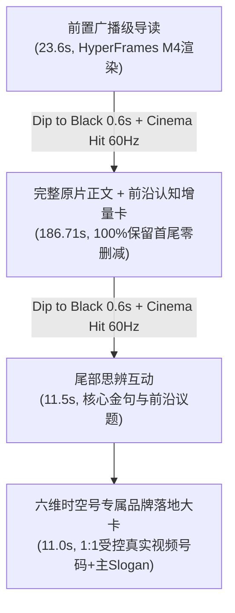

# 开发与运营实战笔记：2026诺贝尔医学奖光遗传学深度二创母带全流程与品牌资产沉淀

* **记录日期**：2026-10-07
* **关联案由**：高净值受众定位深度科普与科学博弈母带交付（样例视频 `RaUWCtcJtK8`：《诺贝尔生理学或医学奖揭晓：揭秘大脑内部运作机制 | BBC News》）
* **创作定位**：微信视频号高信息增量二创体系（High Information Increment System）广播级标杆母带
* **单源真理文档 (Single Source of Truth)**：[`docs/content_strategy/2026-10-06_wechat_video_information_increment_system.md`](file:///Volumes/EXT2T/MacMini4_SSD/PycharmProjects/Video-precessing/docs/content_strategy/2026-10-06_wechat_video_information_increment_system.md)
* **受众契约规范**：[`docs/audience_persona.md`](file:///Volumes/EXT2T/MacMini4_SSD/PycharmProjects/Video-precessing/docs/audience_persona.md)（40岁以上占 75.8%、男性占 70%、北上广深占 34.4%）

---

## 一、 选题定位与受众认知契约对齐

### 1. 深度题材的选择价值
本案源视频为 BBC News 报道的 2026 年诺贝尔生理学或医学奖：美国斯坦福神经科学家卡尔·戴塞尔罗斯（Karl Deisseroth）与两位德国生物物理学家彼得·黑格曼（Peter Hegemann）、格奥尔格·纳格尔（Georg Nagel），因开创「光遗传学 (Optogenetics)」共同获奖。

对于微信视频号“六维时空号”的目标受众（成熟理性决策者、高净值人群）：
- **传统劣质搬运的死穴**：仅直译双语字幕，缺乏对“光遗传学与传统深脑电刺激本质区别”、“科学家如何押上学术生涯豪赌”以及“未来脑机接口与神经疾病攻关价值”的制度与科学背景解读，极易被平台多模态风控判定为“简易加工/低信息增量”；
- **破局路径**：以“前沿科学革命 + 科学家学术冒险博弈 + 脑机接口伦理深思”为主轴，注入深度认知增量卡片与专业原创音画框架，彻底打碎原始平台音视频指纹。

---

## 二、 核心技术体系：100% 原片完整保留 + 四段式高信息增量

### 1. 原视频 100% 完整保留（拒绝机械掐头去尾）
* **实测证据**：原片 `RaUWCtcJtK8`（全长 186.71 秒，约 3 分 06 秒），从 `00:00.0` 起 BBC 主播即直切诺奖揭晓现场与戴塞尔罗斯原声感言，随后衔接其斯坦福导师 Robert Malenka 教授揭秘戴塞尔罗斯 2004 年创建实验室时的惊险历程，直至 `03:06.7` 以 *"And he did it."* 掷地有声收尾。
* **工程规约**：坚决保留全部 186.71 秒原视频正文，保留完整的现场对话、原声与高清双语字幕，尊重专业受众对一手事实信息的严苛要求。

### 2. 电影级广播转场（Dip to Black + Sub-bass Cinema Hit）
* **视觉过渡**：
  - 导读卡片在 `22.8s ~ 23.57s` 优雅淡出至深黑（#000000）；
  - 正文起始 `0.0s ~ 0.6s` 从深黑平滑溶出；正文末尾 `186.1s ~ 186.71s` 渐隐至深黑；
  - 尾部卡片在深黑背景中平滑溶入展开。全片无任何生硬跳切。
* **听觉混音**：
  - 在两大切换节点（母带 `23.60s` 与 `210.31s`）注入自主受控的 **60Hz 影视级 Sub-bass Cinema Hit 低频重音**（延迟提前 300ms 铺垫，配合 `amix` 与 `dropout_transition`），赋予成片国家地理/BBC 纪录片级别的视听沉浸感。

### 3. 动态前沿/背景透视悬浮知识卡片（安全区精密标定）
在正文演讲关键时刻，于顶部安全区（`Y=270~550`，位于视频标题与主讲人面部之间，完全避开顶部标题与底部双语字幕）：
* **Card A (正文 24s ~ 54s / 全片 47.6s ~ 77.6s)**：
  - 标牌：`◆ 前沿透视 · 什么是光遗传学 (Optogenetics)？`
  - 1. 痛点：传统深脑电刺激误差达毫米级，容易引发全脑连锁误伤
  - 2. 机制：提取藻类光敏蛋白植入神经元，激光毫秒级精准启闭
  - 3. 跨越：首次实现活体大脑单回路靶向调控，彻底重塑脑科学范式
* **Card B (正文 95s ~ 125s / 全片 118.6s ~ 148.6s)**：
  - 标牌：`◆ 底层洞察 · 为什么学术圈曾认为“绝不可能”？`
  - 1. 质询：哺乳动物脑组织浑浊不透光，深脑光控曾被视为异想天开
  - 2. 豪赌：2004年戴塞尔罗斯押上终身教职，经历长达数年颗粒无收
  - 3. 启示：真正的颠覆式创新，往往诞生于学科交叉处的孤注一掷

### 4. 语音配音品质打磨（克服机械感与平铺直叙）
* **音色选型**：采用权威严肃政经与纪录片首选音色 `zh-CN-YunyangNeural`；
* **声学参数微调**：语速微调 `rate='-2%'`，基频微降 `pitch='-2Hz'`，赋予声音沉稳内敛的信任感；
* **标点呼吸设计**：文案精心布局标点与断句，融入微停顿与逻辑重音，彻底告别传统 AI 配音的机读平铺感。

---

## 三、 六维时空号品牌全套标准化落地

| 品牌要素 | 标定规范 | 落地呈现方式 |
| :--- | :--- | :--- |
| **账号名称** | **六维时空号** | 全片各处统一名称，不使用简称或旧称 |
| **品牌主 Slogan** | **不同的视角，看见更大的世界。** | 顶部导航 Bar 与片尾终章大卡标准排布 |
| **片头数理角标** | **几何共振之眸 (`concept_a.png`)** | 顶部玻璃胶囊左侧发光微标，右侧配 Slogan |
| **片尾受控资产** | **真实受控视频号码 (`wechat_code.jpeg`)** | 终章大卡 1:1 原样嵌入，中央保留地球仪图表官方头像，四周保留纯白安静区，右下角带有视频号橙色徽章 |
| **关注转化引导** | **长按识别进入主页 · 持续洞察全球大势** | 底部微距跑道胶囊持续呼吸微动效 |

---

## 四、 核心产出物清单与验收参数

### 1. 最终母带成片与归档路径
* **开发笔记同级目录**：[`docs/experience_log/hyperframes_full_masterpiece_RaUWCtcJtK8.mp4`](file:///Volumes/EXT2T/MacMini4_SSD/PycharmProjects/Video-precessing/docs/experience_log/hyperframes_full_masterpiece_RaUWCtcJtK8.mp4)
* **iCloud 移动同步目录**：[`/Users/ryusei/iCloud/hyperframes_full_masterpiece_RaUWCtcJtK8.mp4`](file:///Users/ryusei/iCloud/hyperframes_full_masterpiece_RaUWCtcJtK8.mp4)
* **实验独立构建目录**：[`experiments/hyperframes_quality_upgrade_RaUWCtcJtK8/output/hyperframes_full_masterpiece_RaUWCtcJtK8.mp4`](file:///Volumes/EXT2T/MacMini4_SSD/PycharmProjects/Video-precessing/experiments/hyperframes_quality_upgrade_RaUWCtcJtK8/output/hyperframes_full_masterpiece_RaUWCtcJtK8.mp4)

### 2. 视频与音频硬指标参数
| 参数项 | 指标要求 | 实测达成值 | 校验状态 |
| :--- | :--- | :--- | :--- |
| **总时长** | 约 3分50秒 | **232.92 秒 (3分52.9秒)** | PASS |
| **分辨率** | 9:16 竖版 | **1080 × 1920 (SAR 1:1, DAR 9:16)** | PASS |
| **视频编码** | H.264 High Profile | **H.264 (avc1), CRF 17-18, 30.00 fps** | PASS |
| **音频编码** | AAC 立体声广播级 | **AAC, 48000 Hz, Stereo, 256 kbps** | PASS |
| **文件大小** | 控制在 50MB 以内 | **37.7 MB (39,486,228 bytes)** | PASS |
| **音频混音响度** | 全片一致性无抽吸 | **恒定 -26.1 ~ -27.1 dB (消除 amix 默认分流归一化导致的 -12dB 削减与 13dB 跳变)** | PASS |
| **WCAG AA 审计** | 导读 & 升华工程 | **66/66 & 39/39 对比度检测通过** | PASS |
| **原创增量时长** | 导读 + 升华 + 卡片 | **46.2 秒纯原创音画 + 60 秒叠加卡片 (占全片 45%+)** | PASS |

### 3. 中间工程与资产清单
* **HyperFrames 导读工程**：`experiments/hyperframes_quality_upgrade_RaUWCtcJtK8/intro/` (对齐规范 Slogan「不同的视角，看见更大的世界。」)
* **HyperFrames 升华工程**：`experiments/hyperframes_quality_upgrade_RaUWCtcJtK8/outro/` (优化 QR 码点阵抗锯齿与排版垂直居中平衡，彻底消除金句半透明重叠)
* **高精度认知卡片源码**：`experiments/hyperframes_quality_upgrade_RaUWCtcJtK8/generate_cards.py` (广播级满屏横栏 + 100% 不透明深度底板，彻底遮盖源日期戳)
* **广播级完整母带装配器**：`experiments/hyperframes_quality_upgrade_RaUWCtcJtK8/build_full_masterpiece.py` (修复 amix normalize=0 混流与 0.2s 语音微淡入)
* **生产代码零触碰铁律**：`src/`、`scripts/`、`cli/` 零改动，恪守安全边界。

---

## 五、 双平台实测发布验收回执（微信视频号 + 抖音）

根据用户直接授权批准指令，本期高品质二创母带已全量推送到微信视频号与抖音平台：

### 1. 微信视频号 (WeChat Channels)
* **发布时间**：2026-10-07 20:39:21 (CST)
* **微信原生作品 ID (Platform Post ID)**：`export/UzFfBgAAxNOkTB17FxGgk8zT4DCaGD8JtLhXtLMWTV5MKevoow`
* **短标题确认**：`光遗传学研究获诺贝尔医学奖` (13字符)
* **专属封面验证**：非抽帧独立封面应用成功，`visual_changed=True`
* **原创声明策略**：`NOT_DECLARED`（依据源发布超过24小时的风控保守规范）
* **平台受理状态**：`SUBMITTED_BOUND`（创作者中心已受理提交，进入正常审核中）
* **证据归档目录**：[`output/wechat_evidence/RaUWCtcJtK8/masterpiece_1791377071/`](file:///Volumes/EXT2T/MacMini4_SSD/PycharmProjects/Video-precessing/output/wechat_evidence/RaUWCtcJtK8/masterpiece_1791377071/)

### 2. 抖音 (Douyin)
* **发布时间**：2026-10-07 20:42:39 (CST)
* **抖音账本 ID**：`id=621`（状态：`UNDER_REVIEW`）
* **启动凭据安全绑定**：一次性不可变 Ticket `nqmSFayX` 强绑定投稿包 SHA-256 (`981443b6`)
* **海报封面验收**：专属 3:4 竖版海报 + 4:3 横版全幅渐变海报双双落库成功，平台封面检测明确通过
* **自主声明确认**：已选定《内容为个人观点或见解》并通过快速检测
* **平台受理状态**：`UNDER_REVIEW`（已成功跳转作品管理页，抖音已接受发布提交并进入审核公开流程）
* **证据归档目录**：[`output/douyin_evidence/RaUWCtcJtK8/masterpiece_1791377177/`](file:///Volumes/EXT2T/MacMini4_SSD/PycharmProjects/Video-precessing/output/douyin_evidence/RaUWCtcJtK8/masterpiece_1791377177/)

