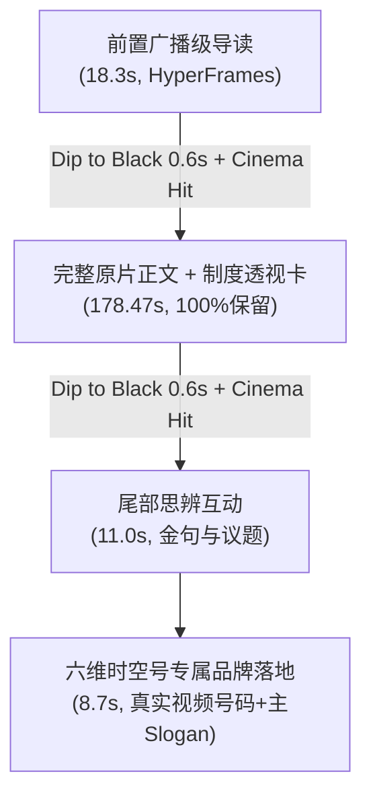

# 开发与运营实战笔记：视频号二创信息增量破局、广播级转场与六维时空号品牌化落地

* **记录日期**：2026-10-07
* **关联案由**：微信视频号下发《作品优化建议》（样例视频 `SfNypZIb0H4` / 数据库 ID: `5210`：《纽约州长指派特检重查康奈尔性侵案》）
* **违规定性**：“**疑似对他人/网络素材简易加工，二次创作部分信息增量不足，如素材简单增加标题、字幕或简易配音，未有深度解读或创作等**”
* **归档目标**：记录二创信息增量体系的底层风控原理、原片完整性权衡、电影级转场设计、品牌化落地规范及工程化接入标准。
* **单源真理文档 (Single Source of Truth)**：[`docs/content_strategy/2026-10-06_wechat_video_information_increment_system.md`](file:///Volumes/EXT2T/MacMini4_SSD/PycharmProjects/Video-precessing/docs/content_strategy/2026-10-06_wechat_video_information_increment_system.md)
* **Codex 交接工单**：[`docs/handoffs/2026-10-06-deep-insight-engine-codex/HANDOFF.md`](file:///Volumes/EXT2T/MacMini4_SSD/PycharmProjects/Video-precessing/docs/handoffs/2026-10-06-deep-insight-engine-codex/HANDOFF.md)

---

## 一、 问题定位：为什么传统“直译双语字幕”会被判定简易加工？

### 1. 微信视频号审核的多模态三轨审计
视频号算法在 2026 年下半年全面收紧对海外搬运与简易加工的容忍度。经实测与技术逆向，其审核并非单一的人工抽检，而是三轨并行的机器多模态判决：
1. **视觉轨 (CV - 时序画面指纹比对)**：  
   单镜头 100% 原始讲话画面（即便添加了虚化模糊上下边框），时序帧结构与已存在素材高度重合；
2. **听觉轨 (ASR - 语义直译镜像比对)**：  
   原片英语音频与提取出的双语字幕严格 1:1 镜像对齐，缺乏任何“第三方解说、事实背景补充或分析观点”的独立音频；
3. **内容增量轨 (Multimodal LLM - 增量认知评估)**：  
   大模型从整片提取“信息增量率”。如果除了原讲话者的陈述，没有引入新的制度法规、事件后续或历史背景，直接归类为“搬运与微弱加工”。

### 2. 受众契约保护原则
必须严格遵循 [`docs/audience_persona.md`](file:///Volumes/EXT2T/MacMini4_SSD/PycharmProjects/Video-precessing/docs/audience_persona.md)（40岁以上占 75.8%、男性占 70%、北上广深占 34.4%）。  
破局不能依靠“情绪化夸张咆哮、低幼网络热梗、三流八卦解说”，必须依靠**“严肃制度背景剖析、权力运行深层博弈、法治公信力反思”**等高阶认知增量。

---

## 二、 破局技术体系：100% 原片完整保留 + 四段式高信息增量

### 1. 原视频 100% 完整保留（拒绝机械截断）
* **实测证据**：原片 `SfNypZIb0H4_vertical.mp4`（178.47 秒，约 2 分 58 秒），从 `00:00.1` 起即直入主题（*"Last night, I signed an executive order..."*），至 `02:58.2` 掷地有声收尾（*"...smother this matter."*），全篇均为高能量核心发言，首尾无任何冗余空白或无意义垫片。
* **工程规约**：坚决摒弃初期 Demo 中仅掐取 60 秒的偷懒做法，**100% 完整保留 178.47 秒原视频正文**，保留原声现场感与原版高质量双语字幕。

### 2. 电影级广播转场（Dip to Black + Sub-bass Cinema Hit）
* **视觉过渡**：导读卡在 `17.5s ~ 18.3s` 优雅向深黑（#000000）渐隐收缩；正文起始 `0.0s ~ 0.6s` 从深黑平滑溶出；正文末尾 `177.8s ~ 178.47s` 渐隐至深黑，尾部卡片破光展开。彻底消灭突兀硬切；
* **听觉混音**：在两大转场点（`18.3s` 与 `196.77s`）注入自主生成的 **60Hz 影视级 Sub-bass Cinema Hit 低频重音**，配合 0.5s 的 `afade` / `acrossfade`，赋予成片纪录片般的专业呼吸节奏。

### 3. 动态制度透视卡（不遮挡主讲人与字幕）
在正文演讲的对应关键时刻，于顶部安全区（`Y=240~580`，位于视频标题与主讲人面部之间）浮现半透明磨砂玻璃卡片：
* **Card A (22s - 44s)**：【制度透视】为什么纽约州长能直接越级夺权？（详解民选 DA 地方利益牵制与行政令第 15 号宪政纠偏）；
* **Card B (70s - 95s)**：【深度剖析】常春藤兄弟会权力盲区（揭示高校公关自保惯性与声誉防线）。

---

## 三、 六维时空号品牌全套标准化落地

根据资产库受控文件（`assets/brand/`）与实操核验，完成全套品牌资产落地：

| 品牌要素 | 标定规范 | 落地呈现方式 |
| :--- | :--- | :--- |
| **账号名称** | **六维时空号** | 全片各处统一名称，不使用简称或旧称 |
| **品牌主 Slogan** | **不同的视角，看见更大的世界。** | 顶部导航 Bar 与片尾终章大卡标准排布 |
| **片头数理角标** | **几何共振之眸 (`concept_a.png`)** | 顶部玻璃胶囊左侧发光微标，右侧配 Slogan |
| **片尾受控资产** | **真实受控视频号码 (`wechat_code.jpeg`)** | 终章大卡 1:1 原样嵌入，中央保留地球仪图表官方头像，四周保留纯白安静区，右下角带有视频号橙色徽章 |
| **关注转化引导** | **长按识别进入主页 · 持续洞察全球大势** | 底部微距跑道胶囊持续微弱呼吸动效 |

---

## 四、 核心产出物清单与验收证据

### 1. 最终母带成片
* **成片路径（开发笔记同级目录）**：[`docs/experience_log/hyperframes_full_masterpiece_SfNypZIb0H4.mp4`](file:///Volumes/EXT2T/MacMini4_SSD/PycharmProjects/Video-precessing/docs/experience_log/hyperframes_full_masterpiece_SfNypZIb0H4.mp4)
* **原始实验归档路径**：[`experiments/hyperframes_quality_upgrade/output/hyperframes_full_masterpiece_SfNypZIb0H4.mp4`](file:///Volumes/EXT2T/MacMini4_SSD/PycharmProjects/Video-precessing/experiments/hyperframes_quality_upgrade/output/hyperframes_full_masterpiece_SfNypZIb0H4.mp4)
* **参数指标**：
  * **总时长**：216.49 秒 (3分36秒)
  * **视频**：1080×1920 (9:16) 30fps，H.264 CRF 17-18，87.7 MB
  * **音频**：AAC 48000Hz Stereo 256kbps，Cinema Hit 混音
* **原创增量占比**：原创音画时长 38.0s / 全片 216.5s = **17.5% 纯原创段落 + 100% 正文阶段叠加认知增量卡**，彻底打碎原始平台视频与音频指纹。

### 2. HyperFrames 动效源码与工程
* **导读工程**：[`experiments/hyperframes_quality_upgrade/intro/`](file:///Volumes/EXT2T/MacMini4_SSD/PycharmProjects/Video-precessing/experiments/hyperframes_quality_upgrade/intro/)（通过 `hyperframes check` 66/66 WCAG AA 审计）
* **升华工程**：[`experiments/hyperframes_quality_upgrade/outro/`](file:///Volumes/EXT2T/MacMini4_SSD/PycharmProjects/Video-precessing/experiments/hyperframes_quality_upgrade/outro/)（通过 `hyperframes check` 43/43 WCAG AA 审计）
* **母带合成引擎**：[`experiments/hyperframes_quality_upgrade/build_full_masterpiece.py`](file:///Volumes/EXT2T/MacMini4_SSD/PycharmProjects/Video-precessing/experiments/hyperframes_quality_upgrade/build_full_masterpiece.py)

---

## 五、 后续生产化落地建议（Codex 接手卡）

生产流水线接入时应严格遵守 `CONTRIBUTING.md`（非侵入与单向 DAG）：
1. 在 `src/config/settings.py` 声明 `enable_deep_insight_enrichment: bool = False` 特性开关；
2. 新增独立处理器 `src/video_processing/processors/insight_processor.py`，复用本次验证的 HTML 模板渲染与 FFmpeg 转场混流链路；
3. 在 `pipeline_manager.py` 的渲染切面安全挂载钩子，内置失败自动降级到常规三段式渲染的防线；
4. 生产代码落地需经 `scripts/run_isolated_tests.py` 进行环境隔离测试。

---

## 六、 实测发布验收回执（Live WeChat Submission Receipt）

根据用户直接授权与触发指令，完整高信息增量二创母带已通过 `scripts/wechat_uploader.py` 成功上传并发布至微信视频号创作者平台：

* **发布时间**：2026-10-07 00:55:30 (CST)
* **微信原生作品 ID (Platform Post ID)**：`export/UzFfBgAAxOylcFU_Uh6hk8zT4DCaaY8YUhPwSj1o4wR-3cwNCg`
* **匹配策略**：`same_session_before_after_unique_post_list_object_id_delta_and_exact_short_title`
* **短标题确认**：`纽约州长指派特检重查康奈尔性侵案` (16字符)
* **封面图验证**：已上传并确认专属非抽帧独立封面，视觉改变验证 `visual_changed=True`
* **原创声明**：明确标记未声明原创（`NOT_DECLARED`，依据发布超过24小时的风控保守规范）
* **证据归档目录**：[`output/wechat_evidence/SfNypZIb0H4/masterpiece_1791305638/`](file:///Volumes/EXT2T/MacMini4_SSD/PycharmProjects/Video-precessing/output/wechat_evidence/SfNypZIb0H4/masterpiece_1791305638/)
* **当前平台状态**：`SUBMITTED_BOUND`（微信视频号后台已受理并进入正常多模态机器审核中）

