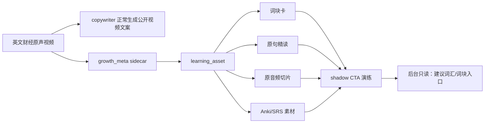

# 暗渡成仓 Demo：财经英文原声精读资料包

> 这个 demo 展示一条财经英文原声视频如何在“不公开引流、不自动销售、不改变发布文案”的前提下，被水下工程沉淀为可领取的词汇/词块资料。它是产品形态样张，不是代码实现。

## Demo 场景

假设系统抓到一条英文财经访谈视频：

| 字段 | 示例 |
| --- | --- |
| 原视频标题 | Why Markets Are Betting on Rate Cuts |
| 内容类型 | 美联储、通胀、就业市场、降息预期 |
| 目标受众 | 一线/沿海城市中关注全球经济和美股信息的中文用户 |
| 推荐入口 | 词汇/词块 |
| 风险判断 | 低风险，避免买卖点、收益承诺、荐股表达 |
| 音频原则 | 跟读/精听必须截取原视频音频，不使用 TTS 冒充原声 |

## 水下流转图



## 1. growth_meta 示例

```json
{
  "content_intent": ["英语学习", "财经词汇", "宏观经济"],
  "audience_hint": "一线/沿海城市中关注全球经济与美股信息的中文用户",
  "lead_magnet_hint": "词汇",
  "cta_allowed": false,
  "compliance_risk_level": "low",
  "future_product_hint": "财经英文原声精读资料包",
  "learning_asset": {
    "learning_format": ["word_chunk", "sentence_mining", "shadowing", "anki_card"],
    "source_type": "speech",
    "audio_source_policy": "original_audio_clip_only",
    "difficulty": "intermediate",
    "audience_profile_hint": ["finance_professional", "city_white_collar"],
    "recommended_output": ["词块表", "原句拆解", "原音频跟读句", "复习卡模板"],
    "key_phrases": [
      "sticky inflation",
      "rate cut expectations",
      "labor market cooling",
      "soft landing",
      "policy-sensitive sectors"
    ],
    "asset_priority": "high"
  }
}
```

要点：这里仍然 `cta_allowed=false`。系统只是判断“这条内容能沉淀什么”，不把 CTA 写进公开视频。

## 2. 前台资料包样张

### 标题

**5 个词块，看懂这期美联储降息预期**

### 副标题

原声句子 + 中文语境 + 原音频跟读练习 + 复习卡

### 音频原则

| 项目 | 要求 |
| --- | --- |
| 跟读/精听音频 | 从原视频音轨按句子时间戳截取 |
| TTS | 不用于冒充原声；只可作为未来自制旁白或无版权辅助说明 |
| 音频元数据 | 必须记录 `youtube_id`、`start`、`end`、`duration`、`source_url` |
| 公开视频 | 不因生成学习音频而改变 |

### 适合谁

| 人群 | 为什么适合 |
| --- | --- |
| 关注全球经济的人 | 能直接读懂海外媒体和财经访谈里的核心表达 |
| 美股/科技商业信息消费者 | 能把英文原句和市场语境对应起来 |
| 有一定英文基础的职场用户 | 不从语法启蒙开始，直接进入高频财经表达 |

### 不适合谁

| 人群 | 原因 |
| --- | --- |
| 零基础英语用户 | 资料默认有高中到大学基础词汇 |
| 只想要交易信号的人 | 本资料不提供买点、卖点、收益判断 |
| 想要考试词汇的人 | 本资料服务于全球经济信息理解，不服务考试 |

## 3. 词块卡 Demo

| 词块 | 原声语境 | 中文理解 | 复用句型 |
| --- | --- | --- | --- |
| sticky inflation | Inflation remains sticky in the services sector. | 通胀没有快速回落，尤其服务业价格仍然黏住。 | `X remains sticky in Y.` |
| rate cut expectations | Rate cut expectations have shifted after the jobs report. | 就业数据改变了市场对降息时间的预期。 | `Expectations have shifted after X.` |
| labor market cooling | A cooling labor market gives the Fed more room to wait. | 就业市场降温，让美联储有更多观察空间。 | `X gives Y more room to wait.` |
| soft landing | Investors are still pricing in a soft landing. | 投资者仍在押注经济可以温和降温而不衰退。 | `Markets are pricing in X.` |
| policy-sensitive sectors | Policy-sensitive sectors reacted first. | 对政策敏感的板块率先反应。 | `X reacted first.` |

## 4. 原句精读 Demo

### 原句 1

> Markets are pricing in a soft landing, but sticky inflation keeps the Fed cautious.

**拆解**

| 片段 | 含义 |
| --- | --- |
| Markets are pricing in... | 市场正在把某种预期计入价格 |
| a soft landing | 经济软着陆 |
| sticky inflation | 黏性通胀 |
| keeps the Fed cautious | 让美联储保持谨慎 |

**中文语境**

市场不是在“确认”软着陆，而是在“定价”软着陆。这个差别很重要：pricing in 表示预期已经反映到资产价格里，但不代表结果一定发生。

**跟读句**

Markets are pricing in a soft landing.

节奏：`Markets are pricing in / a soft landing`

**原音频切片**

```json
{
  "clip_id": "ratecuts_001",
  "youtube_id": "demo_ratecuts",
  "text": "Markets are pricing in a soft landing.",
  "start": "00:01:12.400",
  "end": "00:01:15.900",
  "duration_sec": 3.5,
  "audio_source": "original_video_audio",
  "tts_allowed": false,
  "usage": ["shadowing", "sentence_loop"]
}
```

### 原句 2

> A cooling labor market could give policymakers the cover they need to pause.

**拆解**

| 片段 | 含义 |
| --- | --- |
| a cooling labor market | 正在降温的就业市场 |
| give policymakers the cover | 给政策制定者一个理由或掩护 |
| they need to pause | 他们暂停行动所需要的 |

**中文语境**

这里的 cover 不是“覆盖”，而是“政策上的理由/缓冲”。这类词在财经访谈里经常不能直译。

**跟读句**

A cooling labor market could give policymakers the cover they need to pause.

节奏：`A cooling labor market / could give policymakers / the cover they need to pause`

**原音频切片**

```json
{
  "clip_id": "ratecuts_002",
  "youtube_id": "demo_ratecuts",
  "text": "A cooling labor market could give policymakers the cover they need to pause.",
  "start": "00:02:04.100",
  "end": "00:02:09.800",
  "duration_sec": 5.7,
  "audio_source": "original_video_audio",
  "tts_allowed": false,
  "usage": ["shadowing", "sentence_loop"]
}
```

## 5. Anki/SRS 卡片素材 Demo

| Front | Back |
| --- | --- |
| sticky inflation | 黏性通胀；价格不容易快速回落。例句：Inflation remains sticky in the services sector. |
| Markets are pricing in a soft landing. | 市场正在定价经济软着陆。注意：pricing in 是“把预期反映进价格”，不是确认事实。 |
| give policymakers the cover | 给政策制定者一个理由/缓冲/掩护。常见于政策转向语境。 |

## 6. Shadow CTA Demo

shadow CTA 只在后台演练，不写入公开视频。

| 类型 | 候选 CTA | 状态 | 原因 |
| --- | --- | --- | --- |
| 词汇 | 回复「词汇」，领取本期财经英语词块表。 | 可用 | 低风险，符合资料内容 |
| 词块 | 回复「词块」，领取这期英文原句和关键词拆解。 | 可用 | 与学习资产匹配 |
| 跟读 | 回复「跟读」，领取本期原声跟读句卡。 | 可用但暂缓 | 必须使用原音频切片；真实通车先不开 |
| 美股 | 回复「美股」，领取本期市场机会清单。 | 禁止 | 容易被理解为投资建议 |
| 复盘 | 回复「复盘」，领取买卖点分析。 | 禁止 | 触碰交易建议风险 |

## 7. 后台卡片 Demo

```text
Why Markets Are Betting on Rate Cuts
score: 82 | risk: low | source: AUTO

内容意图：英语学习 / 财经词汇 / 宏观经济
推荐入口：词汇/词块
学习资产：word_chunk, sentence_mining, shadowing, anki_card
音频策略：original_audio_clip_only，禁止 TTS 冒充原声
素材优先级：high
受众匹配：finance_professional, city_white_collar

shadow CTA:
  可用：词汇、词块
  暂缓：跟读、精听、卡片
  禁止：美股、复盘模板

公开发布文案：未改变
真实 CTA：未开启
```

## 8. 周报条目 Demo

| 视频 | 推荐资料 | 优先级 | 风险 | 通车建议 |
| --- | --- | --- | --- | --- |
| Why Markets Are Betting on Rate Cuts | 词块表 + 原句拆解 + 原音频跟读句 | high | low | 可进入词汇/词块素材池 |
| What CEOs Are Saying About AI Spending | 商业词块 + 演讲金句 | medium | low | 可做精读候选，不急通车 |
| Trading Strategy for Volatile Markets | 暂不建议 | low | medium | 避免交易策略导流 |

## 9. Demo 结论

这个 demo 说明“暗渡成仓”的前台产品不是泛英语学习，而是：

**面向一线/沿海财经效率型用户的英文原声精读资料。**

第一阶段只需要做到：

1. 系统能识别这种资料价值；
2. 后台能看到资料形态建议；
3. shadow CTA 能演练低风险入口；
4. 真实发布文案保持不变；
5. 通车时只开 `词汇/词块`。
6. 跟读/精听必须使用原音频切片，不能用 TTS 替代真实原声。

## Modification History

| Version | Date | Author | Description |
| --- | --- | --- | --- |
| 1.0.0 | 2026-07-04 | Codex | 初始创建：展示一条财经英文原声视频如何沉淀为词汇/词块学习资料包 |
| 1.1.0 | 2026-07-04 | Codex | 明确跟读/精听音频必须截取原视频音轨，禁止 TTS 冒充原声 |
