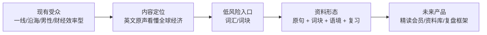
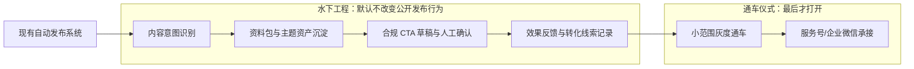
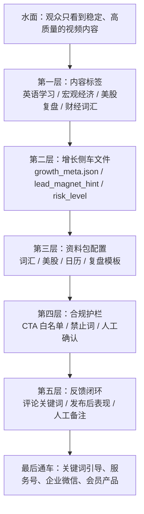
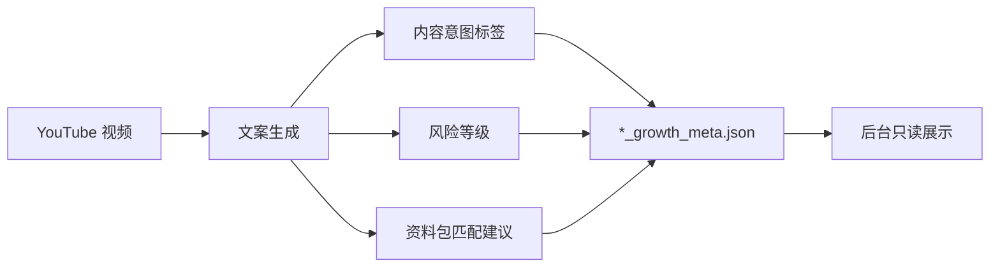
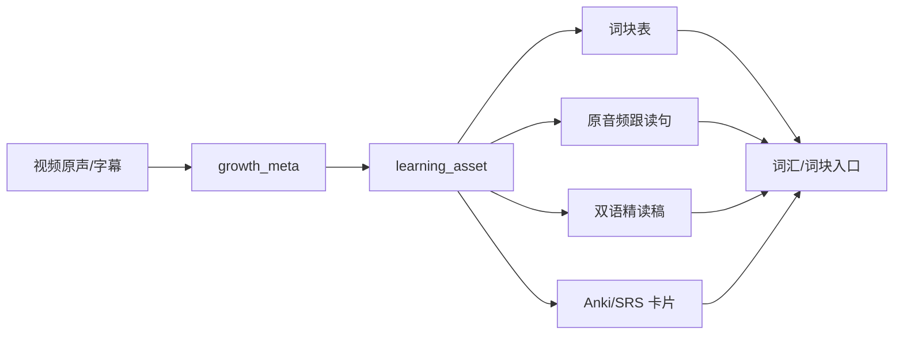
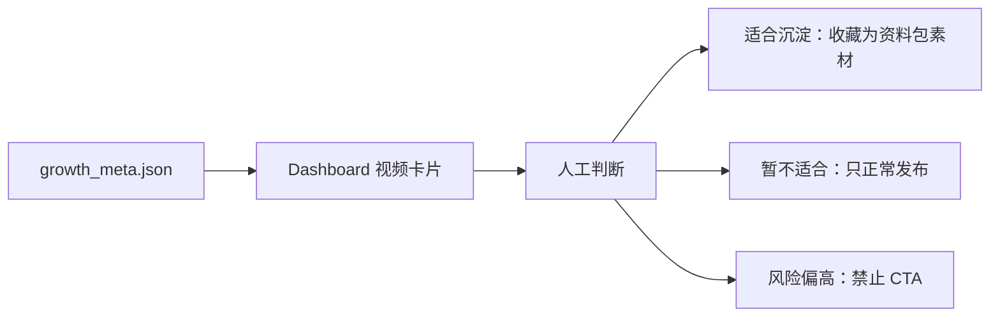
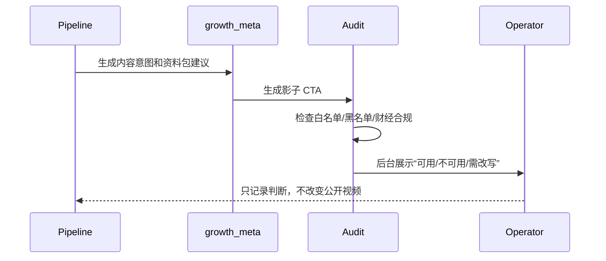
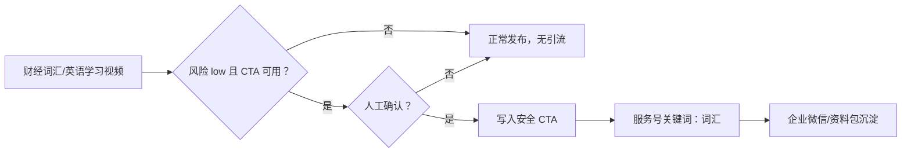
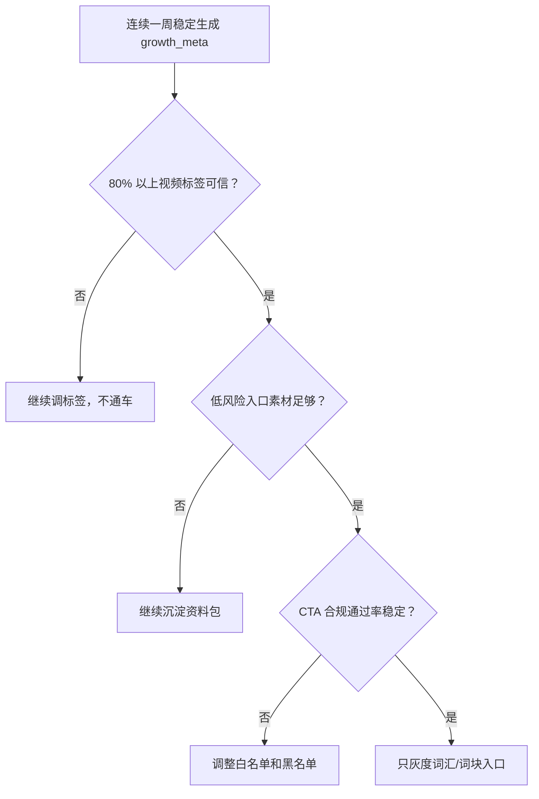

# 视频号私域变现：水下工程路线图

项目代号：**暗渡成仓**（alias: `anduchencang`）

后续沟通约定：用户说“暗渡成仓”或 `anduchencang`，即指本项目的私域变现水下工程路线图、工单流和相关实现工作。默认继续遵守“不先引流、先埋能力；不破坏现有发布流水线；所有改动测试先行或测试同步补齐”的工程纪律。

> 核心判断：最开始做的不是“引流”，而是暗度陈仓式的水下工程。引流只是最后一步“通车仪式”。在通车之前，项目要先把内容资产、合规边界、用户意图、资料包、运营反馈和灰度开关这些管线埋好。

## 一句话原则

**先让当前自动发布系统变得更懂内容、更懂风险、更会沉淀资产；最后才让它把合适的人带到合适的私域入口。**

这条路的关键，不是突然在每条视频末尾加“回复关键词”，而是让流水线逐步具备三种能力：

1. 知道每条内容适合谁；
2. 知道哪类内容能安全承接私域；
3. 知道某个资料包、会员权益或训练营主题，应该从哪些内容自然长出来。

## 受众画像校准

基于视频号后台截图，当前粉丝总量约 12,180，画像呈现出明显的“沿海一线/强二线、男性、成年人、财经效率型内容消费”特征。这会直接影响“暗渡成仓”的产品表达：不要把词汇入口做成学生背单词产品，而要做成“用英文原声看懂全球经济”的成人型资料产品。

| 维度 | 观察 | 对方案的影响 |
| --- | --- | --- |
| 性别 | 男性约 70.27%，女性约 27.51%，未知约 2.22% | 内容表达应偏理性、信息密度、框架化；避免过度情绪化或低幼化英语学习包装 |
| 地域 | 中国内地约 9,036 人，海外约 3,144 人 | 国内服务号/企业微信可作为主承接，但要保留海外用户可读的资料形态 |
| 城市 | 广东、上海、北京位居前三；广东内深圳、广州集中 | 用户更可能关注全球经济、美股、科技、商业判断，而不是泛泛英语启蒙 |
| 设备 | iOS 约 42.63%，安卓约 36.91%，未知约 20.46% | 付费能力和移动端阅读意愿不弱；资料包应适合手机端快速阅读和收藏 |

结论：第一入口仍应是低风险 `词汇/词块`，但定位要从“英语学习资料”收窄为 **财经英文原声精读资料**。推荐表达是“原句 + 词块 + 经济语境 + 原音频跟读/复习卡”，而不是“背单词”“英语入门”“考试词汇”。跟读和精听必须截取原视频音频，不能用 TTS 替代真实原声。



## 地上看见什么，地下建设什么

| 地上看见的事 | 地下真正要建设的能力 | 当前项目里的落点 | 最终呼应的变现目标 |
| --- | --- | --- | --- |
| 视频自动发布 | 内容意图识别、主题归档、风险分层 | `copywriter.py`、`PipelineDB`、dashboard | 找到可承接私域的内容 |
| 中英字幕和词汇高亮 | 词汇资产沉淀、资料包素材库 | subtitle/caption 产物、侧车文件 | 低价资料包、词汇会员 |
| 高赞发现和评分队列 | 选题价值判断、受众兴趣分层 | `monitor_channels.py`、高赞 tab | 判断哪些主题值得产品化 |
| 内容审查 | 财经合规边界、CTA 合规白名单 | `censorship_service.py`、规则热加载 | 防止引流前先踩平台红线 |
| Telegram/后台控制 | 人工运营确认、灰度开关、反馈记录 | `src/web/app.py`、bot 报告 | 低风险小步试运行 |

## 总体路线图



## 水下工程分层



## 阶段 0：先定规矩，不碰流量入口

这一阶段只做“地图”和“边界”，不改变任何公开视频文案。

| 任务 | 小改进 | 当前收益 | 未来价值 | 明确不做 |
| --- | --- | --- | --- | --- |
| 0.1 | 建立私域水下工程文档与术语表 | 团队认知统一，不把 CTA 当起点 | 后续每个功能都能对齐漏斗位置 | 不接服务号、不加引流 |
| 0.2 | 定义内容意图枚举 | 后台能看懂内容资产结构 | 企业微信标签、资料包分发的前置模型 | 不做复杂用户画像 |
| 0.3 | 定义合规 CTA 白名单与黑名单 | 文案生成更稳，减少财经风险 | 未来自动引流时有护栏 | 不写收益承诺、不荐股 |

建议输出：

- `docs/guides/private_domain_underwater_roadmap.md`
- `config/lead_magnets.example.json`
- `config/private_domain_compliance.example.json`

## 阶段 1：给每条视频贴“水下标签”

目标：让系统先知道“这条内容未来可能承接什么”，但不在公开视频里表现出来。



| 任务 | 小改进 | 当前收益 | 未来价值 | 明确不做 |
| --- | --- | --- | --- | --- |
| 1.1 | 文案生成后输出 `*_growth_meta.json` | 人工筛选视频更快 | 未来可转为 DB 字段和运营自动化 | 不影响上传文案 |
| 1.2 | 增加 `content_intent` | 区分英语、宏观、美股、演讲、词汇 | 对应服务号关键词和企业微信标签 | 不创建真实用户标签 |
| 1.3 | 增加 `lead_magnet_hint` | 知道适合“词汇/美股/日历/复盘”哪类资料 | 资料包选题从内容中长出来 | 不自动发送资料 |
| 1.4 | 增加 `compliance_risk_level` | 财经内容发布前多一层提醒 | 后续 CTA 灰度有风险阈值 | 不替代现有审查引擎 |
| 1.5 | 增加 `learning_asset` | 判断适合词块、原音频跟读、精听、Anki/SRS 哪种学习资产 | 让“词汇入口”变成真实可领取资料 | 不生成付费资料、不写公开视频 |

`growth_meta` 可以长这样：

```json
{
  "content_intent": "财经词汇",
  "audience_hint": "一线/沿海城市中关注全球经济与美股信息的中文用户",
  "lead_magnet_hint": "词汇",
  "cta_allowed": false,
  "compliance_risk_level": "low",
  "future_product_hint": "全球经济关键词精读包",
  "learning_asset": {
    "learning_format": ["shadowing", "word_chunk", "sentence_mining"],
    "source_type": "speech",
    "audio_source_policy": "original_audio_clip_only",
    "difficulty": "intermediate",
    "recommended_output": ["词块卡", "原音频跟读句", "Anki卡"],
    "key_phrases": ["sticky inflation", "rate cut expectations"],
    "asset_priority": "high"
  }
}
```

### 英语学习资产化

英语学习形式不是另一个项目，而是“暗渡成仓”的上游资产层。它回答的是：这条视频沉淀成什么资料，用户才愿意领取、复习，甚至未来付费。受众画像决定它不能走学生化英语路线，而应走“财经英文原声精读”路线。



学习形式枚举先保持轻量：

| learning_format | 用途 | 暂不做 |
| --- | --- | --- |
| `shadowing` | 财经原声跟读句卡，音频来自原视频切片 | 不用 TTS 冒充原声 |
| `sentence_loop` | 单句循环精听，音频来自原视频切片 | 不做播放器 |
| `word_chunk` | 全球经济/美股语境词块表 | 不自动售卖 |
| `sentence_mining` | 原句挖掘和商业语境拆解 | 不批量生成教材 |
| `bilingual_subtitle` | 双语精读稿 | 不替换公开视频字幕 |
| `anki_card` | Anki/SRS 复习卡素材 | 不自动生成卡包 |
| `speech_quote` | 演讲金句和框架句摘录 | 不做外部发布 |

受众校准后的反向边界：

| 不做 | 原因 |
| --- | --- |
| 不做学生考试词汇包 | 当前用户更像财经/商业信息消费者 |
| 不做泛英语启蒙课 | 与现有内容心智不匹配 |
| 不用 TTS 替代原声跟读 | 原声精读价值来自真实语速、停顿、重音和语境 |
| 不用“零基础”“速成”“躺赚英语”等表达 | 降低专业感，也容易损害财经信任 |
| 不把美股复盘直接包装为付费荐股 | 合规风险高 |

## 阶段 2：把“资料包”先做成配置，不做成交

目标：资料包先作为内容组织方式存在，不急着卖，也不急着引流。

| 任务 | 小改进 | 当前收益 | 未来价值 | 明确不做 |
| --- | --- | --- | --- | --- |
| 2.1 | 新增 `lead_magnets.json` | 统一资料包口径 | 服务号关键词自动回复可直接复用 | 不接微信接口 |
| 2.2 | 三个低风险入口先定稿：`词汇`、`美股`、`日历` | 后台建议更具体 | 后续可灰度测试关键词回复 | 不做训练营销售 |
| 2.3 | 每类资料包绑定内容意图 | 避免所有内容都硬塞 CTA | 只在合适视频上打开入口 | 不全量引流 |
| 2.4 | 输出资料包素材候选清单 | 复用字幕和文案资产 | 低价资料包内容自然沉淀 | 不承诺每日交付 |

资料包配置示意：

```json
{
  "词汇": {
    "title": "全球经济高频词汇整理",
    "match_intents": ["财经词汇", "英语学习", "人物演讲"],
    "learning_format": ["word_chunk", "sentence_mining", "anki_card"],
    "recommended_output": ["词块表", "原句拆解", "复习卡模板"],
    "safe_cta": "回复「词汇」领取本期关键词整理",
    "safe_cta_templates": [
      "回复「词汇」，领取本期财经英语词块表。",
      "回复「词块」，领取这期英文原句和关键词拆解。"
    ],
    "risk": "low"
  },
  "美股": {
    "title": "美股盘前信息源清单",
    "match_intents": ["宏观经济", "美股复盘"],
    "safe_cta": "回复「美股」领取信息源清单",
    "risk": "medium"
  },
  "日历": {
    "title": "本周全球经济日历",
    "match_intents": ["宏观经济"],
    "safe_cta": "回复「日历」领取本周事件清单",
    "risk": "low"
  }
}
```

## 阶段 3：后台可见，但公开视频不可见

目标：让运营者在后台看到建议，而不是让观众立刻看到引流。



| 任务 | 小改进 | 当前收益 | 未来价值 | 明确不做 |
| --- | --- | --- | --- | --- |
| 3.1 | 视频列表显示内容意图和资料包建议 | 决策更快 | 后续运营台雏形 | 不改变发布按钮 |
| 3.2 | 增加“私域准备度”只读角标 | 看出哪些内容可产品化 | 为灰度通车排序 | 不自动评分进队列 |
| 3.3 | Telegram 日报追加 3 条候选建议 | 手机端能快速判断今日素材 | 每日运营节奏形成 | 不发送真实引流消息 |
| 3.4 | 已发布视频补充运营备注 | 记录人工判断 | 后续归因分析 | 不爬评论、不自动营销 |

后台角标建议：

| 角标 | 含义 |
| --- | --- |
| `词汇入口` | 适合沉淀到英语/财经词汇资料 |
| `日历入口` | 适合沉淀到宏观事件清单 |
| `复盘入口` | 可作为会员复盘素材，但需合规谨慎 |
| `禁止 CTA` | 内容风险、政策风险或表达风险偏高 |

## 阶段 4：做“影子漏斗”，先演练不通车

目标：模拟如果这条视频要引流，会走向哪个入口、用哪句 CTA、风险在哪里，但仍然不发布 CTA。



| 任务 | 小改进 | 当前收益 | 未来价值 | 明确不做 |
| --- | --- | --- | --- | --- |
| 4.1 | 生成 shadow CTA | 提前发现文案问题 | 通车前完成压力测试 | 不写入 `*_copy.txt` |
| 4.2 | CTA 通过合规规则才可显示为“可用” | 避免把风险留到最后 | 形成可灰度的安全阀 | 不绕过现有审查 |
| 4.3 | 记录 shadow CTA 命中率 | 知道多少内容适合私域 | 判断是否值得通车 | 不看短期收入 |
| 4.4 | 输出周报：可通车内容比例 | 管理预期 | 帮助选择第一个灰度入口 | 不做商业承诺 |
| 4.5 | 增加英语学习 CTA 模板 | 词汇、词块、跟读、精听、卡片可做影子演练 | 给词汇入口补足产品感 | 不真实写入 copy |

## 阶段 5：真正通车，但只开一条窄车道

只有当前面几层稳定后，才打开引流。第一条车道应该选择风险最低、交付最轻的入口：**词汇/词块资料包**。



| 任务 | 小改进 | 当前收益 | 未来价值 | 明确不做 |
| --- | --- | --- | --- | --- |
| 5.1 | 增加 `enable_private_domain_cta=false` | 开关默认安全 | 可按需灰度 | 不默认开启 |
| 5.2 | 首批只允许 `词汇/词块` CTA | 风险低、交付轻 | 验证私域入口承接 | 不碰荐股/收益/带单 |
| 5.3 | 必须人工确认才写入发布文案 | 防止突兀商业化 | 训练运营判断 | 不全自动 |
| 5.4 | 只记录关键词响应，不急着卖 | 先验证需求 | 以后再设计产品价格 | 不做训练营转化 |

## 优先级排序

| 优先级 | 任务 | 理由 |
| --- | --- | --- |
| P0 | `growth_meta.json` 侧车文件 | 最小、无侵入、立刻让内容资产可见 |
| P0 | `lead_magnets.json` 配置 | 后续所有 CTA 和资料包都需要单一真相源 |
| P0 | `learning_asset` 资产建议 | 让词汇入口从“领取资料”升级为“可复习的英语学习资料” |
| P0 | 合规 CTA 白名单/黑名单 | 财经私域的第一道闸门 |
| P1 | dashboard 只读展示 | 让水下能力进入日常运营 |
| P1 | shadow CTA 演练 | 通车前压力测试 |
| P2 | Telegram 日报建议 | 提升日常使用便利性 |
| P2 | 评论/反馈手动导入 | 有了真实需求再接自动化 |
| P3 | 服务号/企业微信真实打通 | 最后一步，不是起点 |

## 反向清单：现在不要做什么

| 不做 | 原因 |
| --- | --- |
| 不立刻全量加引流话术 | 会破坏当前账号内容感，也容易触碰财经平台规则 |
| 不先做训练营销售页 | 高客单产品需要交付能力和信任证据，不应从页面开始 |
| 不自动把“美股复盘”导向付费群 | 合规风险高，且容易被平台识别为荐股/投顾导流 |
| 不接复杂 CRM | 当前最缺的不是工具，而是内容资产和合规入口定义 |
| 不做收益承诺型文案 | 与视频号财经内容边界冲突 |
| 不让 LLM 自由发挥 CTA | CTA 必须来自配置和白名单 |

## 最小可执行工单

如果从明天开始动手，建议按下面顺序拆：

1. 新增 `config/lead_magnets.example.json`，只定义 `词汇`、`美股`、`日历`。
2. 定义 `learning_format` 和 `difficulty` 枚举，只做 schema 和测试。
3. 在 `scripts/copywriter.py` 生成 `*_growth_meta.json`，默认 `cta_allowed=false`。
4. 在 `growth_meta` 内增加 `learning_asset` 子对象，fallback 为空资产。
5. 写单元测试，保证没有 feature flag 时不会改变 `*_copy.txt`。
6. 在后台视频列表只读显示 `content_intent`、`lead_magnet_hint`、`risk_level`、`learning_asset` 摘要。
7. 新增 shadow CTA 生成脚本，只输出报告，不写发布文案。
8. 运行一周后看报告，再决定是否打开 `词汇/词块` 入口灰度。

## 开发纪律与测试原则

“暗渡成仓”每一步都必须按生产流水线改动处理，不能因为它暂时是水下能力就降低工程标准。

| 纪律 | 要求 |
| --- | --- |
| TDD 优先 | 对纯函数、配置 schema、规则判断、sidecar 读写，先写失败测试再实现；对 UI 和脚本类改动，至少同步补齐回归测试和验收脚本 |
| 默认关闭 | 任何可能影响公开视频文案、上传流程、评分队列、自动发布候选的能力都必须默认关闭 |
| 可回滚 | 生成型改动必须保留原始文案或只写 sidecar；真实写入 copy 前必须有备份 |
| 不破坏 checkpoint | 不能让新增 sidecar 成为旧任务恢复的硬依赖，除非同时提供缺失时的安全降级 |
| 配置有 schema | `lead_magnets`、合规 CTA、shadow CTA 规则都必须校验结构，不能让坏配置静默生效 |
| 测试覆盖边界 | 至少覆盖缺配置、坏 JSON、未知标签、禁止词命中、feature flag 关闭、LLM fallback |
| 运行验证 | 涉及 pipeline、copywriter、dashboard 的改动，必须跑对应单测；涉及前端显示的改动必须浏览器截图验证 |

最低测试矩阵：

| 改动类型 | 必跑验证 |
| --- | --- |
| 配置/规则 | `pytest` 对应单测，覆盖合法/非法配置 |
| `copywriter.py` | `pytest tests/unit/test_copywriter.py` 或新增专项测试，确认原 copy 输出不变 |
| sidecar 读取 | 缺文件、空文件、损坏 JSON、字段缺失回归测试 |
| dashboard API | API 单测或本地请求验证，确认缺 sidecar 不 500 |
| 前端展示 | 本地 UI + 浏览器截图，确认角标不重叠 |
| CTA/通车 | 默认关闭测试 + 禁止词测试 + 人工确认路径测试 |

## 判断是否可以通车的标准



通车不是“开始变现”的第一天，而是水下工程已经证明自己稳定之后的一次开闸。

## Modification History

| Version | Date | Author | Description |
| --- | --- | --- | --- |
| 1.0.0 | 2026-07-04 | Codex | 初始创建：将视频号私域变现前置工作重构为“水下工程路线图”，明确引流是最后通车仪式 |
| 1.1.0 | 2026-07-04 | Codex | 确定项目代号“暗渡成仓”，补充 TDD、测试验证和默认关闭等开发纪律 |
| 1.2.0 | 2026-07-04 | Codex | 纳入英语学习资产化上游能力，补充 learning_asset、学习形式枚举、词汇/词块入口和影子 CTA 模板 |
| 1.3.0 | 2026-07-04 | Codex | 根据粉丝性别、地域、城市和设备画像校准产品假设：词汇/词块入口定位为财经英文原声精读 |
| 1.4.0 | 2026-07-04 | Codex | 明确跟读/精听素材必须截取原视频音频，禁止 TTS 冒充原声 |
