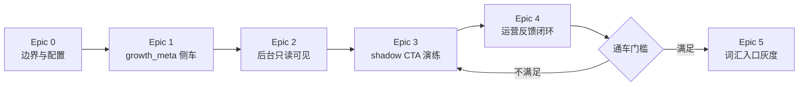
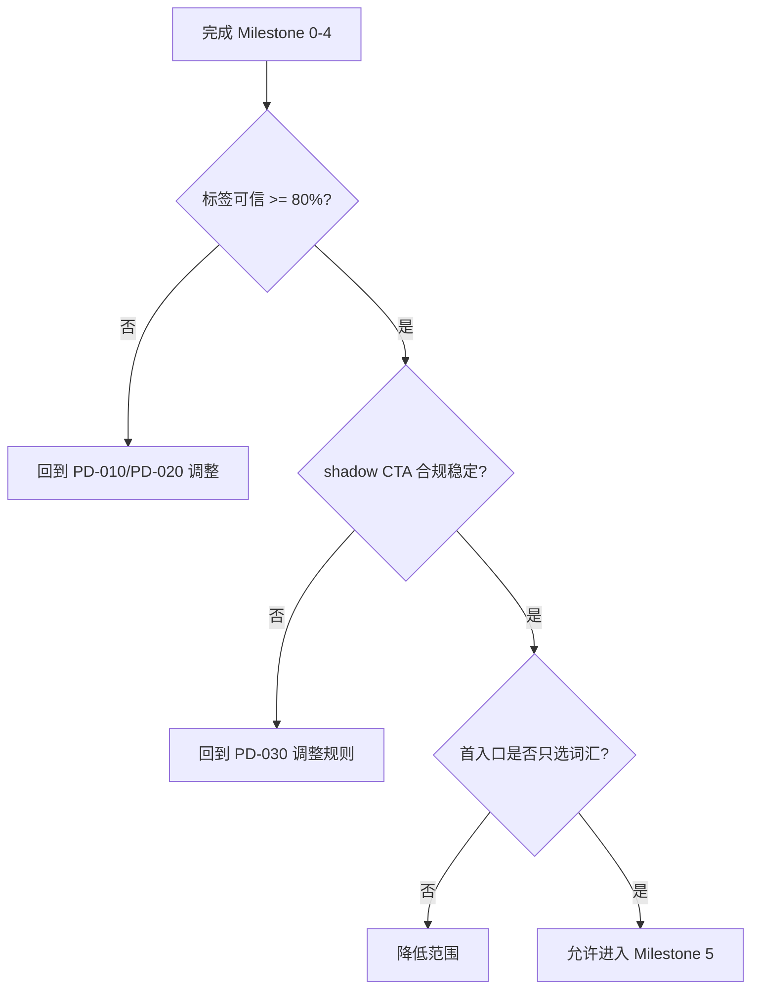
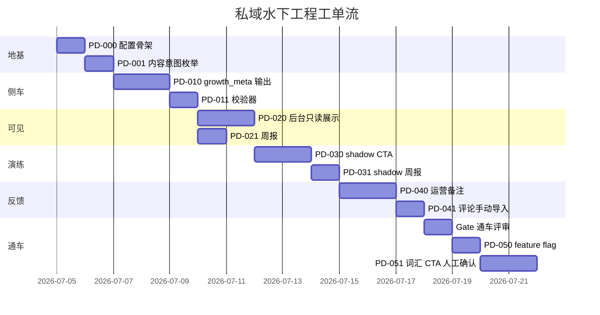

# 视频号私域变现水下工程：Review 与工单流

项目代号：**暗渡成仓**（alias: `anduchencang`）

后续沟通约定：用户说“暗渡成仓”或 `anduchencang`，即指本项目的私域变现水下工程路线图、工单流和相关实现工作。默认继续推进当前工单流，且每一步必须符合本文件的 TDD、测试验证、默认关闭和可回滚规范。

> 目标：把“水下工程路线图”拆成可执行、可验收、可灰度的 story/task。原则是先建设能力，不急于引流；引流只是最后的通车仪式。

## Review 结论

### 方向正确

当前路线图抓住了最关键的节奏：不把“回复关键词”“加企业微信”“卖训练营”放在第一阶段，而是先把内容资产、资料包映射、合规边界和后台运营判断埋进现有自动发布系统。

### 需要补强的点

| 问题 | 风险 | 工单化处理 |
| --- | --- | --- |
| `growth_meta` 如果只做侧车文件，后台和报告可能读不到 | 能力存在但不进入运营动作 | 先做侧车文件，再做只读读取层，暂不入库 |
| `lead_magnets.json` 容易变成另一个无人维护配置 | 配置漂移，CTA 与资料包不一致 | 加 schema 校验和单测，所有 CTA 从配置读 |
| 合规 CTA 白名单如果太宽，会提前变相引流 | 破坏“水下工程”边界 | 默认 `cta_allowed=false`，shadow CTA 不写入发布文案 |
| dashboard 展示若过早加入“确认 CTA”按钮 | 误触发通车 | 前两个 milestone 只读，不提供写入按钮 |
| 私域准备度如果被当成发布评分 | 干扰现有 75 分自动发布线 | 新指标只供运营参考，不进入 `score` |
| “美股/复盘”入口风险高 | 可能被平台理解为投顾导流 | 第一条真实通车只允许“词汇”入口 |

### 产品边界

| 现在要做 | 暂时不做 |
| --- | --- |
| 内容意图识别 | 自动引流 |
| 资料包配置 | 真实服务号接口 |
| shadow CTA 演练 | 付费转化 |
| 后台只读展示 | 训练营销售 |
| 人工运营备注 | CRM 自动化 |

## 工单流总览

## 工程规范：TDD 与验证门槛

“暗渡成仓”不是一次性运营文案工程，而是要嵌入现有自动发布流水线的长期能力。每个 story 都必须遵守以下规则：

| 规范 | 要求 |
| --- | --- |
| TDD 优先 | 配置 schema、枚举、sidecar 读写、CTA 审查、报表统计等纯逻辑先写失败测试；实现后再让测试通过 |
| 测试同步 | UI、脚本、LLM fallback 等不适合严格先写测试的部分，必须在同一工单内补齐回归测试或可重复验收脚本 |
| 默认关闭 | 任何可能改变公开视频文案、上传行为、发布候选、评分队列的能力默认关闭 |
| 不破坏 checkpoint | 新 sidecar 不能成为旧任务恢复的硬依赖；缺失/损坏必须安全降级 |
| 单一真相源 | CTA、资料包、风险规则只能来自配置和 schema，不能散落在多个业务模块 |
| DAL 约束 | 需要数据库时必须走 `PipelineDB` 方法，不在业务代码写裸 SQL |
| 配置约束 | 新环境变量必须声明在 `settings.py` 并同步 `.env.example`；配置文件必须有校验 |
| UI 验证 | dashboard 变更必须做浏览器验收截图，确认不遮挡、不误导、不提供未授权操作 |
| 回滚能力 | 任何真实写入 copy 的能力都必须保留原文备份和审计记录 |

每个 story 的 Definition of Done 必须包含：

1. 失败测试或回归测试已补齐；
2. 默认关闭路径测试通过；
3. 缺配置/坏配置路径测试通过；
4. 不影响现有 copy/upload/pipeline 行为；
5. 修改超过 10 行逻辑的文件已更新 Modification History；
6. 运行过该 story 声明的最小验证命令。

最小验证命令按改动类型选择：

| 改动类型 | 必跑验证 |
| --- | --- |
| 配置/规则/枚举 | `pytest` 对应新增单测 |
| `copywriter.py` | `pytest tests/unit/test_copywriter.py` 或新增专项测试 |
| sidecar 读取 | 缺文件、损坏 JSON、字段缺失专项测试 |
| DB/DAL | 相关 DAL 单测，不允许业务层裸 SQL |
| dashboard API | API 单测或本地请求验证 |
| dashboard UI | 本地 UI + 浏览器截图验收 |
| CTA 通车 | feature flag 关闭、禁止词命中、人工确认路径测试 |

## Milestone 0：水下工程地基

目标：定义配置、schema、合规边界。完成后系统行为不变。

### Story PD-000：建立私域水下工程配置骨架

**用户故事**：作为运营者，我希望资料包入口、合规 CTA 和内容意图有统一配置，避免未来每个模块各写一套规则。

| Task | 内容 | 验收标准 | 依赖 |
| --- | --- | --- | --- |
| PD-000-1 | 新增 `config/lead_magnets.example.json` | 包含 `词汇`、`美股`、`日历`、`复盘模板` 四类；每类有 `title`、`match_intents`、`safe_cta`、`risk` | 无 |
| PD-000-2 | 新增 `config/private_domain_compliance.example.json` | 包含 CTA 白名单、禁止词、风险等级说明 | PD-000-1 |
| PD-000-3 | 增加配置读取工具，放在 `src/video_processing/utils/` | 不反向导入 `scripts/` 或 `cli/`；缺配置时安全返回默认空能力 | PD-000-1 |
| PD-000-4 | 配置 schema 单测 | 错误配置会失败，缺真实配置不影响现有流水线 | PD-000-3 |

**不做**：不新增环境变量，不写入发布文案，不接微信接口。

### Story PD-001：定义内容意图枚举

**用户故事**：作为系统，我需要给内容贴轻量标签，方便未来把视频映射到资料包或会员权益。

| Task | 内容 | 验收标准 | 依赖 |
| --- | --- | --- | --- |
| PD-001-1 | 定义 `content_intent` 枚举 | 至少包含 `英语学习`、`财经词汇`、`宏观经济`、`美股复盘`、`人物演讲`、`其他` | PD-000 |
| PD-001-2 | 定义风险枚举 | `low`、`medium`、`high`、`blocked` | PD-000 |
| PD-001-3 | 写枚举映射文档 | 文档说明每个标签适用和不适用场景 | PD-001-1 |

**不做**：不创建用户画像，不进入 DB 迁移。

## Milestone 1：每条视频生成水下标签

目标：在文案生成阶段输出 `*_growth_meta.json`，但不改变 `*_copy.txt`。

### Story PD-010：copywriter 输出 growth_meta 侧车文件

**用户故事**：作为运营者，我希望每条视频生成一份增长侧车文件，告诉我它适合哪个资料包、风险如何、是否可引流。

| Task | 内容 | 验收标准 | 依赖 |
| --- | --- | --- | --- |
| PD-010-1 | 扩展 `WeChatContentSchema` 或后处理结果 | 生成 `content_intent`、`audience_hint`、`lead_magnet_hint`、`compliance_risk_level`、`cta_allowed=false` | PD-001 |
| PD-010-2 | CLI 写出 `{yid}_growth_meta.json` | 与 `{yid}_copy.txt`、`{yid}_title.txt` 同目录；失败不阻断现有文案 | PD-010-1 |
| PD-010-3 | fallback 路径也输出安全 meta | Gemini 不可用时仍输出 `其他`、`cta_allowed=false` | PD-010-2 |
| PD-010-4 | 单元测试锁定 copy 不变 | 新功能开启后，原有 `copy/title/category/label` 输出行为不变 | PD-010-2 |

**不做**：不把 CTA 写进 copy，不改上传器。

### Story PD-011：建立 growth_meta 校验器

**用户故事**：作为维护者，我希望侧车文件结构稳定，避免后续 dashboard 或报告读取时崩溃。

| Task | 内容 | 验收标准 | 依赖 |
| --- | --- | --- | --- |
| PD-011-1 | 新增 Pydantic 模型或轻量 dataclass | 字段缺失时能补默认值 | PD-010 |
| PD-011-2 | 新增读取函数 | 文件缺失/损坏返回安全默认，不抛到 API 层 | PD-011-1 |
| PD-011-3 | 增加损坏 JSON 回归测试 | 损坏文件不影响视频列表接口 | PD-011-2 |

**不做**：不做 DB schema 迁移。

## Milestone 2：后台只读可见

目标：让水下标签进入日常运营视野，但仍不提供“发布 CTA”能力。

### Story PD-020：dashboard 视频列表展示 growth_meta

**用户故事**：作为运营者，我希望在视频列表里看到内容意图、资料包建议和风险等级，决定哪些内容值得沉淀。

| Task | 内容 | 验收标准 | 依赖 |
| --- | --- | --- | --- |
| PD-020-1 | API 视频返回中附加 `growth_meta` | `/api/videos` 不因缺文件失败；分页性能可接受 | PD-011 |
| PD-020-2 | 前端视频卡展示三个只读角标 | `content_intent`、`lead_magnet_hint`、`risk_level` 可见 | PD-020-1 |
| PD-020-3 | 加“禁止 CTA”视觉状态 | `high/blocked` 风险明确提示，但不提供操作按钮 | PD-020-2 |
| PD-020-4 | 浏览器验收截图 | 列表在桌面宽度不重叠、不破坏原操作区 | PD-020-2 |

**不做**：不新增 CTA 写入按钮，不改变发布流程。

### Story PD-021：生成私域准备度只读报表

**用户故事**：作为运营者，我希望每周看到哪些内容适合词汇、日历、美股或复盘入口，以便判断资料包方向。

| Task | 内容 | 验收标准 | 依赖 |
| --- | --- | --- | --- |
| PD-021-1 | 新增只读脚本 `scripts/private_domain_report.py` | 统计最近 7/30 天 growth_meta 分布 | PD-011 |
| PD-021-2 | 输出 Markdown 报告 | 包含主题分布、低风险候选、禁止 CTA 列表 | PD-021-1 |
| PD-021-3 | 不读裸 SQL | 通过 DAL 或文件侧车读取，遵守项目约束 | PD-021-1 |

**不做**：不抓评论，不计算收入。

## Milestone 3：影子漏斗演练

目标：演练“如果通车会怎么说”，但不改变公开视频。

### Story PD-030：shadow CTA 生成与审查

**用户故事**：作为运营者，我希望系统生成候选 CTA，并告诉我它是否合规，先在后台演练而不是公开发布。

| Task | 内容 | 验收标准 | 依赖 |
| --- | --- | --- | --- |
| PD-030-1 | 根据 `lead_magnet_hint` 读取 `safe_cta` | CTA 只能来自配置，不允许 LLM 自由发挥 | PD-000 |
| PD-030-2 | 新增 CTA 审查函数 | 命中禁止词则 `shadow_cta_status=blocked` | PD-000 |
| PD-030-3 | 写入 `{yid}_shadow_cta.json` | 只输出候选，不触碰 `{yid}_copy.txt` | PD-030-2 |
| PD-030-4 | 单测覆盖高风险财经表达 | “荐股”“收益”“带单”等表达必须 blocked | PD-030-2 |

**不做**：不在文案中展示 CTA。

### Story PD-031：shadow CTA 周报

**用户故事**：作为决策者，我希望知道一周内有多少内容理论上可通车，避免凭感觉开入口。

| Task | 内容 | 验收标准 | 依赖 |
| --- | --- | --- | --- |
| PD-031-1 | 报表统计 CTA 可用率 | 按 `词汇/美股/日历/复盘模板` 分组 | PD-030 |
| PD-031-2 | 输出通车建议 | 只允许建议，不自动开关 | PD-031-1 |
| PD-031-3 | 明确“不通车原因” | 展示标签不可信、风险高、资料不足等原因 | PD-031-1 |

**不做**：不评价收入，不推送用户。

## Milestone 4：运营反馈闭环

目标：把人工判断沉淀下来，为未来是否通车提供证据。

### Story PD-040：人工运营备注

**用户故事**：作为运营者，我希望给视频记录私域相关备注，例如是否适合资料包、是否不适合引流。

| Task | 内容 | 验收标准 | 依赖 |
| --- | --- | --- | --- |
| PD-040-1 | 新增运营备注侧车文件 | `{yid}_ops_note.json`，包含 `private_domain_note`、`operator_decision` | PD-020 |
| PD-040-2 | 后台支持保存备注 | 保存失败不影响视频状态 | PD-040-1 |
| PD-040-3 | 报表读取备注 | 周报区分系统建议和人工判断 | PD-040-2 |

**不做**：不把备注写入公开视频。

### Story PD-041：评论关键词手动导入

**用户故事**：作为运营者，我希望手动导入评论关键词数据，判断观众是否真的对资料包有需求。

| Task | 内容 | 验收标准 | 依赖 |
| --- | --- | --- | --- |
| PD-041-1 | 定义 CSV 格式 | `youtube_id, keyword, count, note, observed_at` | PD-021 |
| PD-041-2 | 新增只读导入脚本 | 生成本地报告，不写发布队列 | PD-041-1 |
| PD-041-3 | 报表合并评论关键词 | 可看到“系统建议”和“评论反馈”是否一致 | PD-041-2 |

**不做**：不自动爬评论，不接 CRM。

## Gate：通车门槛

进入真实引流前必须同时满足：

| 门槛 | 标准 |
| --- | --- |
| 标签可信 | 连续 7 天 `growth_meta` 生成稳定，人工抽检 80% 以上可信 |
| 入口聚焦 | 至少一个低风险入口有足够素材，优先 `词汇` |
| 合规稳定 | shadow CTA blocked 原因清晰，无明显漏放 |
| 行为隔离 | 现有发布成功率、登录状态、上传流程未被影响 |
| 人工可控 | 必须有人确认才能写入公开视频 |

## Milestone 5：词汇入口灰度通车

目标：只为低风险词汇入口打开一条窄车道，并且必须人工确认。

### Story PD-050：私域 CTA feature flag

**用户故事**：作为维护者，我需要一个默认关闭的开关，确保真实引流不会误开启。

| Task | 内容 | 验收标准 | 依赖 |
| --- | --- | --- | --- |
| PD-050-1 | 在 `settings.py` 增加 `enable_private_domain_cta=false` | 默认关闭；`.env.example` 同步 | Gate |
| PD-050-2 | 增加 `private_domain_allowed_keywords` | 默认只允许 `词汇` | PD-050-1 |
| PD-050-3 | 单测验证默认不写 CTA | 不设置 flag 时发布文案完全不变 | PD-050-1 |

**不做**：不默认打开，不允许美股/复盘入口。

### Story PD-051：人工确认后写入词汇 CTA

**用户故事**：作为运营者，我希望只在人工确认后，把低风险词汇 CTA 写入发布文案。

| Task | 内容 | 验收标准 | 依赖 |
| --- | --- | --- | --- |
| PD-051-1 | 后台增加“确认词汇 CTA”按钮 | 只在 `risk=low`、`lead_magnet_hint=词汇`、flag 开启时出现 | PD-050 |
| PD-051-2 | 写入 copy 前保留原文备份 | 可回滚，避免误污染文案 | PD-051-1 |
| PD-051-3 | 上传前再次审查 CTA | 审查失败则拒绝写入 | PD-030 |
| PD-051-4 | 审计日志记录确认人和时间 | 可复盘谁打开了通车 | PD-051-1 |

**不做**：不自动批量写入，不做付费承接。

## 推荐执行顺序

## 第一批建议开工单

第一批只开 6 个，避免把工程面铺太大：

1. `PD-000`：配置骨架。
2. `PD-001`：内容意图与风险枚举。
3. `PD-010`：`growth_meta` 侧车输出。
4. `PD-011`：`growth_meta` 安全读取与校验。
5. `PD-020`：后台只读展示。
6. `PD-030`：shadow CTA 演练。

这些做完后，项目仍然没有公开引流，但已经拥有“看见内容资产、看见风险、看见可通车入口”的能力。

## Definition of Done

任意工单完成都必须满足：

| 类型 | 要求 |
| --- | --- |
| 行为安全 | 默认不改变公开视频文案和上传流程 |
| 流水线安全 | `PipelineManager` checkpoint 不被破坏 |
| 配置安全 | 新配置缺失时安全降级 |
| 合规安全 | CTA 只能来自配置，不能由 LLM 自由生成 |
| TDD/测试 | 纯逻辑先写失败测试；至少覆盖默认关闭、缺文件、损坏文件、禁止词命中、LLM fallback |
| 验证 | 在工单记录中写明实际运行过的测试命令或浏览器验收方式 |
| 文档 | 修改超过 10 行逻辑时更新文件 Modification History |

## Modification History

| Version | Date | Author | Description |
| --- | --- | --- | --- |
| 1.0.0 | 2026-07-04 | Codex | 初始创建：对水下工程路线图进行 review，并拆分为 story/task 工单流 |
| 1.1.0 | 2026-07-04 | Codex | 确定项目代号“暗渡成仓”，补充 TDD、测试验证、默认关闭和可回滚工程规范 |
