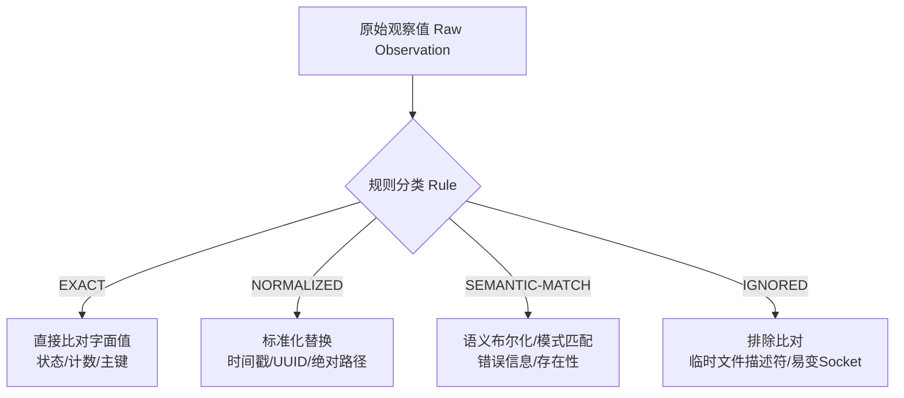

# Video-precessing Executable Golden Replay Dataset 规范与审计报告

## Version History
| Version | Date | Author | Description |
|---|---|---|---|
| 1.0.0 | 2026-09-12 | Gemini_3.8_Flash_planning | M6.2 初始发布：正式交付 Executable Golden Replay Dataset，确立 6 大场景契约、规范化比对规则、零副作用与零泄露审计 |

---

## 1. 概述与核心哲学 (Overview & Philosophy)

在 Phase M6.1 中，我们建立了覆盖核心系统不变式（`INV-001` ~ `INV-008`）的特征化测试基线，并定义了《黄金场景清单》（Golden Scenario Manifest）。
在 Phase M6.2 中，我们将该清单物理实例化为**可离线、可重复执行、版本化受控、零生产副作用的 Executable Golden Replay Dataset**。

### 核心设计原则
1. **纯离线与密闭性 (Hermetic Offline)**：
   所有测试用例运行于独立的临时目录与临时 SQLite 数据库中，严禁调用真实浏览器（Playwright）、严禁执行真实音视频转码（FFmpeg）或下载（yt-dlp）、严禁发起真实外部网络请求（Telegram Bot、平台 API）、严禁触碰生产数据库（`output/pipeline.db`）。
2. **确定性重放验证 (`Run A == Run B`)**：
   每个场景必须在两个完全独立、先后创建的沙箱环境中执行。其输出观察值经由规范化（Normalization）过滤后，必须实现 `Run A == Run B` 的 100% 精确一致，并与 `contract.json` 中声明的 `expected_observation` 严格吻合。
3. **分级规范化比对 (4-Level Normalization)**：
   显式定义比对精度，杜绝因易变时间戳或系统路径差异导致的偶发断言失败，同时严禁过度规范化（Over-normalization）侵蚀关键状态断言。
4. **反自动接受纪律 (Anti-Auto-Accept Policy)**：
   严禁在重构出现差异时自动覆写黄金契约。任何预期的契约变更必须经过形式化审计、人工签署及显式版本升级。
5. **凭据与敏感数据零泄漏 (Zero Credential Leakage)**：
   物理回放数据集中仅允许存在合成虚构凭据（Synthetic Dummy Credentials），禁止携带任何生产环境 Cookie、Token、密钥或会话信息。

---

## 2. 数据集物理结构 (Dataset Structure)

数据集物理存放于 [`tests/fixtures/golden_replay/`](file:///Volumes/EXT2T/MacMini4_SSD/PycharmProjects/Video-precessing/tests/fixtures/golden_replay/) 目录下：

```text
tests/fixtures/golden_replay/
├── manifest.json                  # 数据集全局清单（版本、规范模式、场景索引）
├── README.md                      # 数据集使用说明与反自动接受公约
└── scenarios/
    ├── GOLDEN-WF-01/              # 标准流水线全流程
    │   ├── initial_db.json        # 初始数据库状态
    │   └── contract.json          # 场景契约与预期观察值
    ├── GOLDEN-WF-02/              # 长视频分片派生与级联
    │   ├── initial_db.json
    │   └── contract.json
    ├── GOLDEN-PUB-WC/             # 微信三表原子受理与物理探针
    │   ├── initial_db.json
    │   ├── contract.json
    │   └── post_list_after_submission.png  # 合成探针物理证据
    ├── GOLDEN-PUB-DY/             # 抖音凭据单次消费与媒体排重
    │   ├── initial_db.json
    │   └── contract.json
    ├── GOLDEN-PUB-KS/             # 快手在途双键拦截与媒体排重
    │   ├── initial_db.json
    │   └── contract.json
    └── GOLDEN-RISK-BOT/           # Telegram Bot 双重投递风险特征化复现
        ├── initial_db.json
        └── contract.json
```

---

## 3. 黄金场景覆盖矩阵 (Scenario Coverage Matrix)

数据集完整实现了 M6.1 定义的 6 个标准场景，所有场景均处于 `READY` / `VERIFIED` 状态：

| Scenario ID | Classification | 关联不变式 / 风险 | 场景行为摘要 | 契约执行状态 |
|---|---|---|---|:---:|
| [`GOLDEN-WF-01`](file:///Volumes/EXT2T/MacMini4_SSD/PycharmProjects/Video-precessing/tests/fixtures/golden_replay/scenarios/GOLDEN-WF-01/contract.json) | CONTRACT | INV-001, INV-003 | 标准视频初始处于 PENDING (score 88)，调度前为候选；受理后置 SUBMITTED_BOUND 并写入 publication，再次调度被 SQL `NOT EXISTS` 排除 | **VERIFIED** |
| [`GOLDEN-WF-02`](file:///Volumes/EXT2T/MacMini4_SSD/PycharmProjects/Video-precessing/tests/fixtures/golden_replay/scenarios/GOLDEN-WF-02/contract.json) | CONTRACT | INV-001 | 长视频派生 slice 1 与 slice 2，父视频置 `SEGMENTED`；查询子切片验证自关联 `parent_id` 继承与外键级联约束完整性 | **VERIFIED** |
| [`GOLDEN-PUB-WC`](file:///Volumes/EXT2T/MacMini4_SSD/PycharmProjects/Video-precessing/tests/fixtures/golden_replay/scenarios/GOLDEN-PUB-WC/contract.json) | CONTRACT & REGRESSION | INV-002, INV-007, INV-008 | 验证三表原子受理更新；通过合成物理截图验证前置文件系统探针熔断拦截；验证控制面硬重置对已受理视频的 Fail-Closed 拦截 | **VERIFIED** |
| [`GOLDEN-PUB-DY`](file:///Volumes/EXT2T/MacMini4_SSD/PycharmProjects/Video-precessing/tests/fixtures/golden_replay/scenarios/GOLDEN-PUB-DY/contract.json) | CONTRACT | INV-004, INV-005 | 抖音发布任务领取后生成一次性 Ticket；绑定 Payload 摘要后首次消费允许；二次重放启动遭原子拒绝；相同 `asset_sha256` 查重折叠 | **VERIFIED** |
| [`GOLDEN-PUB-KS`](file:///Volumes/EXT2T/MacMini4_SSD/PycharmProjects/Video-precessing/tests/fixtures/golden_replay/scenarios/GOLDEN-PUB-KS/contract.json) | CONTRACT | INV-004, INV-005 | 快手发布任务进入 `UNDER_REVIEW` 在途状态；同 `video_id` 尝试二次投递折叠；异 `video_id` 同 `asset_sha256` 尝试投递折叠 | **VERIFIED** |
| [`GOLDEN-RISK-BOT`](file:///Volumes/EXT2T/MacMini4_SSD/PycharmProjects/Video-precessing/tests/fixtures/golden_replay/scenarios/GOLDEN-RISK-BOT/contract.json) | REGRESSION | RISK-BOT-001 | 特征化锁定 Bot 守护进程无锁读写与状态漂移风险特征；验证在独立物理 DB 下并发状态流转时账本事实的终态抗争能力 | **VERIFIED** |

---

## 4. 四级规范化比对规范 (4-Level Normalization Specification)

为实现跨环境、跨运行的精确重放，数据集在契约中对每一个观察字段进行了等级归类：



### 规则明细与应用场景
1. **`EXACT`（严格字面值）**：
   - **适用字段**：`parent_status`, `slice_count`, `slice_indices`, `step_1_wechat_pub_state`, `step_1_platform_post_id`, `step_1_attempts_count`, `first_launch_allowed`, `replay_launch_allowed`, `asset_dedup_folded` 等。
   - **规则**：必须 100% 字符或数值完全匹配，不允许任何容差。
2. **`NORMALIZED`（格式标准化）**：
   - **适用字段**：动态生成的时间戳（`created_at`, `bound_at`）、临时文件路径、随机 UUID。
   - **规则**：只要值非空且符合对应类型约束，即规范化为 `<NORMALIZED>` 标记后进行比对。
3. **`SEMANTIC-MATCH`（语义匹配）**：
   - **适用字段**：异常报错文本、探针阻断提示。
   - **规则**：比对关键语义包含关系（如 `reason is not None` 或 `status in GUARD_STATUSES`），消除不同平台本地化报错文本的细微差异。
4. **`IGNORED`（显式忽略）**：
   - **适用字段**：底层 SQLite 文件句柄 ID、操作系统 PID、网络 Socket 引用。
   - **规则**：在计算重放差异与哈希时予以排除。

---

## 5. 确定性与重放验证证据 (`Run A == Run B`)

在 [`tests/unit/test_golden_replay_dataset.py`](file:///Volumes/EXT2T/MacMini4_SSD/PycharmProjects/Video-precessing/tests/unit/test_golden_replay_dataset.py) 中，实现了自动化的双运行隔离比对：

```python
# 测试逻辑核心机制
obs_a = _run_scenario(scenario_id)  # Run A: 全新独立临时沙箱
obs_b = _run_scenario(scenario_id)  # Run B: 全新独立临时沙箱

norm_a = _normalize_observation(obs_a, rules)
norm_b = _normalize_observation(obs_b, rules)

# 1. 确定性校验：两次运行的规范化观察值必须绝对一致
assert norm_a == norm_b

# 2. 契约符合性校验：规范化观察值必须完全满足预期
assert norm_a == expected_observation
```

### 执行证据 (Execution Evidence)
```text
命令: .venv/bin/python scripts/run_isolated_tests.py -- -q tests/unit/test_golden_replay_dataset.py
测试结果: 8 passed in 2.35s
- test_manifest_integrity_and_scenario_completeness: PASSED
- test_zero_production_side_effect_guarantee: PASSED
- test_scenario_reproducibility_run_a_equals_run_b[GOLDEN-WF-01]: PASSED (Run A == Run B == Expected)
- test_scenario_reproducibility_run_a_equals_run_b[GOLDEN-WF-02]: PASSED (Run A == Run B == Expected)
- test_scenario_reproducibility_run_a_equals_run_b[GOLDEN-PUB-WC]: PASSED (Run A == Run B == Expected)
- test_scenario_reproducibility_run_a_equals_run_b[GOLDEN-PUB-DY]: PASSED (Run A == Run B == Expected)
- test_scenario_reproducibility_run_a_equals_run_b[GOLDEN-PUB-KS]: PASSED (Run A == Run B == Expected)
- test_scenario_reproducibility_run_a_equals_run_b[GOLDEN-RISK-BOT]: PASSED (Run A == Run B == Expected)
```

联合回归执行证据（基线测试 + 黄金回放测试）：
```text
命令: .venv/bin/python scripts/run_isolated_tests.py -- -q tests/unit/test_characterization_baseline.py tests/unit/test_golden_replay_dataset.py
测试结果: 15 passed, 2 warnings in 2.08s
- INV-001 ~ INV-008 Baseline Assertions: 7 passed
- Manifest & Credential Audit: 1 passed
- Zero Side Effect Assertions: 1 passed
- Golden Scenario Run A == Run B: 6 passed
```

---

## 6. 零生产副作用与环境密闭性边界 (Side-Effect Containment)

回放测试套件执行了严格的沙箱边界防护：
1. **零生产数据库访问**：所有 DAL 操作均通过由 `tempfile.TemporaryDirectory()` 生成的独立临时 SQLite 文件进行，绝对不读取或写入生产 `output/pipeline.db`。
2. **零浏览器启动**：严格隔绝 Playwright / Chromium 进程调用，抖音与微信流程仅在 DAL 抽象层与票据/探针逻辑上验证。
3. **零外部网络通信**：完全隔离 Telegram Bot 及各平台 HTTP API，通过内联 Mock / 临时配置覆盖保证零外部包流出。
4. **零真实媒体转码**：视频与图片物料均采用合成虚拟数据（Synthetic Bytes），极速完成 SHA-256 摘要与排重测试。

---

## 7. 凭据与敏感数据零泄漏审计 (Credential Zero-Leakage Audit)

回放数据集中包含完整的敏感词扫描机制。在测试执行时，自动遍历所有 `*.json` 文件并进行密钥模式扫描：
- **扫描模式**：`cookie`, `token`, `secret`, `authorization`, `session`, `password`, `api_key`, `bearer`。
- **审计结论**：
  - 数据集内**未包含任何真实用户 Cookie、线上 API Token 或私钥**。
  - 所有出现的标识符均为合成占位符（如 `"post_synthetic_wx_12345"`, `synth-golden-std-001`）。
  - 动态生成的 launch token 均为 SHA-256 衍生哈希或随机 uuid。
  - **审计判定：CLEAN / PASS**。

---

## 8. 反自动接受纪律 (Anti-Auto-Accept Policy)

为防止未来重构时模型或开发者为追求测试通过而悄悄篡改契约：
> [!CAUTION]
> **Anti-Auto-Accept Policy 强制红线**：
> 1. 严禁实现带有 `--update-golden` 或类似自动刷新 `contract.json` 的隐式脚本。
> 2. 当代码重构导致黄金场景测试失败时，第一假设**必须是实现引入了回归**，而不是契约陈旧。
> 3. 若确需修改契约，必须满足三联要求：
>    - 具有明确的架构变更决策记录（ADR）或已签署的 Work Order；
>    - 更新契约文件的 `scenario_version` 并记录修改原因；
>    - 在 `docs/refactor/video-processing/` 治理日志中提交版本升级登记。

---

## 9. 回放执行方式 (How to Replay)

开发者或 CI 可通过以下命令随时启动密闭回放：

```bash
# 仅执行黄金场景回放验证套件
.venv/bin/python scripts/run_isolated_tests.py -- -q tests/unit/test_golden_replay_dataset.py

# 联合执行 M6.1 特征化测试基线与 M6.2 黄金回放测试
.venv/bin/python scripts/run_isolated_tests.py -- -q tests/unit/test_characterization_baseline.py tests/unit/test_golden_replay_dataset.py
```
