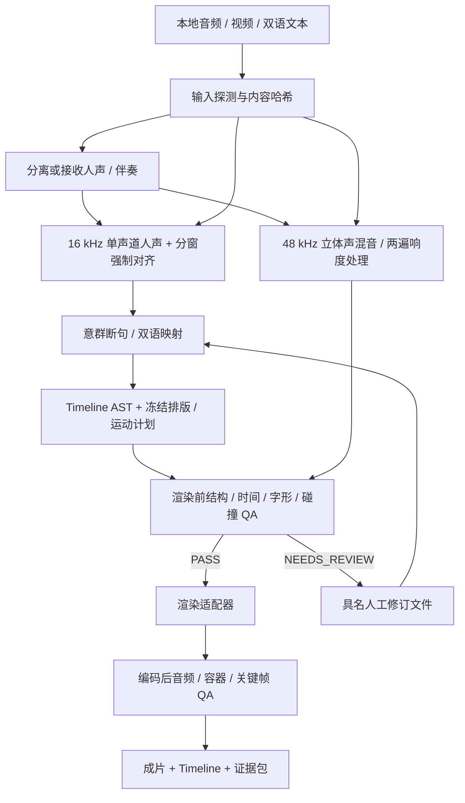
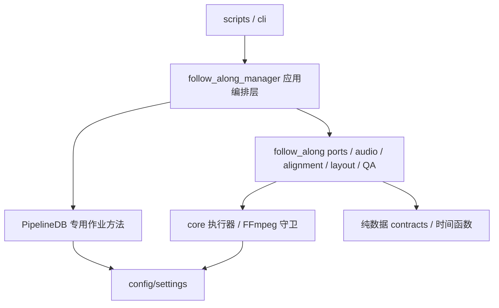

# 架构与选型建议

日期：2026-10-07。作者：Codex；精确模型标识未知。状态：已确认；所有性能数字与质量目标均为候选验收标准，没有实测通过声明。

## 1. 制作路径与模块依赖



混音不依赖字幕坐标；改字体只重算排版与渲染。修改音量只重算混音、音频 QA、渲染与成片 QA。修订英文会使对齐及其下游失效；只改中文不应重跑分离或英文对齐。渲染器只读取冻结计划和本地素材，不能临时请求翻译、对齐或模型。

依赖方向建议：



编排器与现有 `pipeline_manager.py` 同层，不把歌唱制作塞进其新闻 FSM。领域模块不导入 `scripts`、`cli` 或管理器。`PipelineDB` 通过专用方法封装可选的 `follow_along_jobs`、`follow_along_stage_attempts`；不借用已有发布状态／队列。首版可用文件缓存和现有 DAL 作业台账，分布式接口以后替换实现。

## 2. 建议目录

以下保留逻辑分层蓝图；首版将小职责合并为独立 flat modules，实际目录与未实现项见 [implementation.md](implementation.md)。本图包含未来扩展，不代表所有文件已创建。

```text
src/video_processing/
  follow_along_manager.py       # DAG 顺序、错误边界与恢复
  follow_along/
    contracts.py               # Timeline / Artifact / StageResult 类型
    ports.py                   # Separator / Aligner / Renderer / ArtifactStore
    timebase.py                # 有理数时间映射、帧与采样换算
    audio/
      preprocessing.py         # 探测、截取、声道与采样率
      separation.py            # 接收 stems / 子进程适配器
      mastering.py             # 母带 / stems 混音、ducking、响度
    alignment/
      text_mapping.py          # 原文到可对齐词形的可逆映射
      anchors.py               # ASR 粗锚点、重复段定位
      whisperx_adapter.py      # 独立运行环境，结构化结果
      chunking.py              # 像素与语义感知的分段
    layout/
      shaping.py               # 字体、glyph、advance、ink bounds
      compiler.py              # 内容 AST -> 冻结坐标/字形图集
      motion.py                # 纯函数 evaluate(t)，可随机定位
    renderers/
      ffmpeg_atlas.py           # 首发；一个 FFmpeg 消费 RGBA 帧
      remotion_bridge.py        # 以后按需添加，首版不实现
    qa/
      structural.py            # Schema + 引用/阶段语义
      timing.py                # 时间、缺词、素材映射
      visual.py                # 全帧解析验证 + 稀疏真实截图
      acoustic.py              # 响度、真峰值、源损坏与听感记录
    artifacts.py               # 哈希、manifest、原子产物与缓存
src/cli/commands/follow_along.py # 显式本地入口；不触发发布
tests/unit/test_follow_along_*.py
tests/fixtures/follow_along/     # 有许可的短语音/歌声与人工标注
docs/specs/bilingual-follow-along/
output/follow_along/<job_id>/    # 素材引用、阶段结果、QA、成片
```

配置从 `settings` 注入；每个新环境变量都要在 settings 与 `.env.example` 声明。作业本身的布局／音频参数是版本化 JSON，不靠散落的环境变量。生产 venv 不承担互相冲突的深度学习依赖；模型适配器使用经确认的专用解释器路径和锁定依赖，输入输出为文件协议。

## 3. 声学模块

保留三条链：`source_master`（完整原声证据）、`alignment_vocals`（机器对齐）、`render_master`（观众听到的声音）。原始字节不覆盖。按选段附带上下文分离，再精确裁切可减轻边缘伪影；上下文时长进入缓存键。

- 源探测记录实际解码时长、sample rate、channels、PTS、声道布局与是否已削顶。
- 分离前保持模型要求的立体声与采样率；分离后另产 16 kHz mono 浮点/PCM 人声供对齐。绝不拿 16 kHz mono 当最终母带。
- `provided_stems` 优先：验证 vocals/instrumental 与源曲长度、偏移和版本；`demucs`／`audio_separator` 为可替换适配器。设备选择明确记录实际 CPU/MPS/CUDA，不把请求的 MPS 当采用证据。
- 检查输出 stem 全集、非空、可解码、有限采样、采样数及偏移；验证已知合成样本的延迟。分离器未必重建原曲，不能用重建残差独立判定听感。
- `original` 模式只做可审阅的响度处理，避免分离伪影；`stem_mix` 用独立 gains 与伴奏 ducking。不能把 vocals 再叠加到原曲来声称获得独立人声增益，否则会叠加已有 vocals 并产生相位问题。
- ducking 侧链只控制伴奏，建议教学样本从 2–4 dB 衰减、约 20 ms attack、200–350 ms release 开始试听。默认不强降噪、不门限切断轻声与拖腔。
- 若配置为严格 `max_reduction_db`，需编译并限幅 gain envelope 后应用；FFmpeg `sidechaincompress` 的 threshold/ratio 并不直接保证某个最大衰减。选择 compressor 模式时记录实际 envelope/衰减并检查，不能把配置值当测量。
- 混音的全部增益、侧链与淡入淡出先冻结，生成 48 kHz stereo 浮点/无损中间母带。两遍 `loudnorm` 使用相同母带，记录 measured_I/LRA/TP/threshold/offset 及实际 linear/dynamic 模式。编码后重新测量，而非复制 WAV 的测量值。
- 建议综合响度 -16 LUFS ±1、处理目标真峰值 -1.5 dBTP、最终 AAC 解码真峰值 ≤ -1 dBTP；这些是本项目建议值，不是平台官方要求。短/静音片段无法得到有限有效响度时应报不可测，不填 0。

FFmpeg 官方支持 `loudnorm` 的两遍处理以及基于第二输入的 `sidechaincompress`。[音频滤镜文档](https://ffmpeg.org/ffmpeg-filters.html#loudnorm)、[侧链压缩文档](https://ffmpeg.org/ffmpeg-filters.html#sidechaincompress)。“Pristine” 仍需 AB 试听，不能由 LUFS 或分离模型名证明。

## 4. 对齐与双语断句

英文原文是内容真相；ASR 是证据。先核对歌曲/对话录音版本，再用粗分段把全篇定位到有限窗口，在窗口内对齐人工给定原文。整首歌词塞进一个强制对齐窗口尤其容易在副歌、长前奏和遗漏词处走错。

WhisperX 提供 wav2vec2 等模型的强制对齐，并给出 Mac 的 CPU 路径；其文档明确有不可对齐字符和重叠语音限制。**现有 API 可能插值缺失时间戳，适配器必须保存原始对齐证据并识别插值。** 插值不是观测到的词界，不能让其默认通过逐词高亮闸门。[WhisperX](https://github.com/m-bain/whisperX)、[alignment.py](https://github.com/m-bain/whisperX/blob/main/whisperx/alignment.py)。

歌声不能沿用普通 speech VAD 的强硬切片：低能量拖腔可能被误判静音。使用人声能量、候选 VAD、对齐间隙、文本结构共同建议边界；`min_silence_duration` 建议 180–350 ms，依样本调整。静音只提供断句加分，不自动删除音频。

断句以**实际字形宽度**为容量，语法/标点/停顿为偏好，动态规划选择总代价最低的分段；不按固定字符数裁切。词、短语、中文翻译映射都保留稳定 ID。中文不是英文演唱的声学时间轴：跟随对应英文意群显示；没有另一个中文音轨时不生成“中文逐词强制对齐”。长中文通过明确的双语意群映射重新排版；无法对应就要求修订映射，不机械按比例切译文。

首版歌唱场景不承诺音素精度、自动处理多人和重叠和声。持续音的高亮依据其已验证词尾，可长亮/按进度扫过；不要把自然拖腔误判成异常长词。

## 5. Timeline 与排版／运动

[timeline.schema.json](timeline.schema.json) 是业务 AST，独立于 ASS、React 和剪映内部结构。作者文本、声学词界、排版坐标和运动决策有独立字段与哈希，不让坐标变更成为重新对齐的理由。`draft → aligned → resolved` 是制作阶段，只有 resolved 且 QA PASS 才能渲染。

- 整数 `ticks`（默认 48000 ticks/s），帧率保留分子/分母；区分源素材时间和输出时间。输入 44.1 kHz 采样与 VFR 视频经有理数映射，避免累加浮点漂移。
- 区间统一为 `[start,end)`；一个边界帧不能同时激活前后两个词。空档有明确间奏/休止行为，不臆造单词。
- 中文和英文共享 cue，但原文字符范围、词 ID、时间状态、alignment score 与 provenance 分开保存。`score` 不是校准后的正确率。
- 屏幕坐标与字幕文档坐标明确分开，完整双语 cue 是滚动基本单元。词绑定一组 glyph box，可跨视觉行；不以一个英文长度估算全部框。
- motion keyframes 用全局时间，记录属性、目标、插值和 cubic bezier/exponential 参数；字体/缩放等不兼容属性拒绝混用。

建议初始画面（均可调整）：1080×1920，30 fps；内容安全矩形约 x=60、y=80、w=864、h=1600。顶部表演窗口 y≈90、h≈520（27%）；静态标题／标签／练习目标 y≈650；阅读窗 y≈850–1660。右侧至少留约 156 px，底部留约 240 px。平台 UI 会变，安全区是版本化 profile，**这些坐标未经真实平台设备覆盖验证**。

表演窗口按用户目标采用 `cover` 居中裁切，圆角与内边距独立遮罩；构图关注点可手工配置。切到人脸边缘或多人被裁时提示人工审阅。这个策略仅针对新类型；不改现有英语世界的 `contain` 契约。

滚动以完整双语块中心为目标，考虑阅读窗上下限及首尾缓冲；短句用 deadband 减少抖动。在句间或句首附近插入约 240–420 ms 的平滑移动，快速歌词可缩短并保持位置连续。没有停顿时用有限时长过渡，不删音、不加静音。当前位置由绝对时间纯函数求出，随机定位与顺序渲染相同；不靠逐帧累加状态。历史和预读行按距离淡出，在真实静音段把活动状态置为休止，避免误示正在唱下一句。

## 6. 渲染取舍

| 后端 | 优势 | 真实代价／限制 | 本次结论 |
| --- | --- | --- | --- |
| FFmpeg + 冻结字形图集 + Pillow | 复用本地工具和单名额守卫；可离线；文字只 shaping 一次；画面/音频裁切与合成同一时钟 | 要实现掩码、透明度与运动；Python 每帧内存拷贝可能瓶颈；不承诺比浏览器更快 | **首发**，先测 30–60 秒真实样本 |
| Remotion / React | JSX 布局、预览、复杂动效维护方便；天然按帧取时间 | 新增 Node/Chromium；视频解码与浏览器并发占内存；需适配本机 FFmpeg 资源策略；源可见许可有条件 | 可替换适配器；视觉迭代成本上升或基准显示收益后接入 |
| Canvas / Skia | 可共享 glyph 几何、离线图形、减少 DOM 成本 | 原生绑定、字体 shaping、视频/音频处理和编辑预览需维护 | 若图集合成测得瓶颈，再替换画图实现 |
| 纯 FFmpeg / libass | 简单字幕与 karaoke 的成本低，部署紧凑 | 长滚动、多级 opacity 与词 mask 的表达难维护；字体测量必须与 libass 一致 | 可支持简版导出，不作为完整效果的领域模型 |
| CapCut / 剪映 draft bridge | 人工可以继续剪辑、修改构图 | 内部 schema/version 和本机素材路径兼容需验证；不能保证完整往返或无人值守导出 | 后续单向交付适配器；不作为 canonical AST |

首发实际路径：对每个双语块一次 shaping，生成基础／高亮图集与 glyph masks；Python 在限定阅读窗 RGBA 画布上做滚动、渐变和 mask。一个 FFmpeg 同时读取该 rawvideo pipe、源视频和已冻结母带，处理视频 crop/scale/圆角遮罩、overlay、编码。最多保留两个未消费图形帧，管道背压；独立 drain stderr，BrokenPipe 读取真实退出码。禁止同时启动“解码 FFmpeg + 编码 FFmpeg”导致单名额死锁，也不落盘整段 PNG 序列。解码与合成是否能达吞吐目标必须测，首版不写为已解决。

Remotion 动画必须由 `useCurrentFrame()` 驱动，不能依赖浏览器 CSS transition 的墙钟状态；其官方建议通过 benchmark 选并发。Remotion 当前许可允许个人和不超过 3 名员工的营利组织等条件下免费使用，规模扩大需重新评估，不能归为无条件开源。[动画文档](https://www.remotion.dev/docs/animating-properties)、[性能文档](https://www.remotion.dev/docs/performance)、[项目许可](https://github.com/remotion-dev/remotion/blob/main/LICENSE.md)。

## 7. 分离与对齐取舍

| 能力／方案 | 优势 | 代价与选择依据 |
| --- | --- | --- |
| 用户提供 vocals/instrumental | 可避免机器分离伪影与开销 | 必须验证相同版本、时长、偏移；优先支持 |
| audio-separator / UVR 模型适配器 | 多个模型统一 CLI/API；可选择 Demucs 或 MDX/RoFormer | 引擎许可与权重使用条件分开记录；当前上游 Apple Silicon 文档要求的 torch 与本机 2.9.1 不一致，锁定兼容组合，独立 venv 验证 |
| Demucs v4 | 可作公开可复现基线，适配器相对清楚 | 作者说明不再主动开发新功能；维护与 torch 兼容性风险，不能成为不可替换核心 |
| 分离 API | 可把重型推理移出 16 GiB 主机 | 成本、上传隐私、网络、结果版本与授权；本次不默认调用 |
| WhisperX / CTC 强制对齐 | 给定文本与字形/音素模型解耦；CPU 起步、以后 GPU worker | 英文先测；歌唱域差异、OOV/数字、重复段；插值必须标记并复核 |
| Montreal Forced Aligner | 词典/音素路线明确，适合可控制的讲话语料 | Kaldi/模型/词典运维成本；歌声仍需评估，不作为首版同时安装项 |
| Whisper 的 ASR 词时间 / attention-DTW | 已有 Whisper 可给粗锚点与独立核验 | 不应替代给定原文；唱歌识别错词时不能静默放行 |
| 直接 CTC segmentation | 可控制字母词表、窗口和失败行为 | 接口更低层，需要维护 token 映射；WhisperX 不能保留足够证据时的替代实现 |

上述为当前上游资料基础上的工程判断，未进行模型质量比较。[audio-separator](https://github.com/nomadkaraoke/python-audio-separator)、[Demucs 作者仓库](https://github.com/adefossez/demucs)、[WhisperX](https://github.com/m-bain/whisperX)、[MFA](https://github.com/MontrealCorpusTools/Montreal-Forced-Aligner)。audio-separator 当前主分支说明 Apple Silicon 基线要求 torch ≥2.13，不能直接对现有环境执行升级安装。

## 8. QA 闸门

QA 返回 `PASS / NEEDS_REVIEW / FAIL`，附 `code、stage、asset/cue/word ID、observed、expected、evidence`。技术合法性错误 FAIL；没有可信词界、音画版本对应未知、主观分离伪影为 NEEDS_REVIEW；仅 PASS 才开放最终渲染。复核针对具名输入哈希，不能全局关掉检查。可先生成具名诊断截图/极短预览，不标为正式成片。

| 检查 | 渲染前 | 渲染后 |
| --- | --- | --- |
| 结构 | Schema、ID 唯一、引用存在、阶段条件、素材哈希／字体存在 | 产物与冻结 timeline/render plan 的哈希绑定 |
| 时间 | 单调正时长、词属于 cue、显式合法的跨轨重叠、source range 覆盖、空档、长音/尾部差异 | 解码时长/PTS/帧数、音视频偏差、末词完整与无多余语句 |
| 文字 | 双语原文覆盖、缩写/数字规范化映射、逐词状态、glyph 缺字 | 开头/结尾、每次滚动边界与高亮切换的实际截图 |
| 画面 | shaping 后 ink/advance bounds、每帧运动后与 clip/safe zones/静态层碰撞；拒绝缩至不可读字号 | 实际帧检查抗锯齿、圆角、crop、人脸和中文字形；手机试听/观看 |
| 声音 | 母带响度/真峰值、空音轨、NaN、stem delay、源削顶、增益/侧链证据 | 最终 AAC 解码后再测 LUFS/真峰值；人声清晰度与伪影 AB 试听 |

逐帧检查的是轻量几何与状态求值，截图为稀疏抽样，两者不能混为“全帧视觉检测”。正常相邻词接触和基底／高亮叠加由明确 collision group 许可，不是碰撞。跨轨声音/视频区间可以重叠；同一 lead voice 内不允许未经批准的时间倒退。

尾部漂移不能简单用“最后一个词结束 ≠ 媒体结束”判错，歌曲可有合法器乐尾奏。区分期望内容结束与显式 outro；检查源映射后的末词及尾奏是否符合编辑决定。

## 9. 编排、缓存与规模化

stage 状态：`PENDING → RUNNING → SUCCEEDED / NEEDS_REVIEW / FAILED / CANCELLED`；等待资源为 `WAITING_RESOURCE`。作业状态聚合独立于单 stage，不能用进程 exit 0 替代阶段验证。推理、媒体加工与发布分别有资源预算；本任务无发布 stage。

缓存键为阶段版本 + 实际输入哈希 + 参数规范化哈希 + 模型/权重哈希 + 工具版本 + 相应平台/字体配置。`created_at`、运行 UUID、日志路径不进入计算。对齐 key 不包括字体/中文，排版 key 不包括混音 gain；避免整份作业 JSON 一改就重跑所有 stage。

每阶段先写同卷临时目录，验证**全部预期产物**，写 manifest 后原子 rename；manifest 本身也绑定哈希。暂存残片、丢失 stem、旧版本或半写文件不能命中缓存。每 key/作业租约避免重复 worker 争抢；租约过期只可回收所有权，旧 worker 的迟到提交需 fencing token 拒绝。OS 本地资源锁比仅检查 PID 更可靠。

原子替换控制可见性；如要求断电持久性，还需文件与目录 fsync。缓存不自动删除源或人工修订，不在本轮设计全局清理器。删除/配额是独立保留策略。

重试只用于已分类的短暂进程/IO 故障，推荐最多 2 次并退避；OOM、缺字、素材错版本、缺词、对齐低信度不盲重试。取消仅终止本任务所属进程组；保留已验证阶段与失败回执。结构化日志包含 job/stage/attempt/cache_key/耗时/等待/RSS/actual_device，不打印密钥或整份输入文本。

单机先限制一个重型推理任务，FFmpeg 沿用现有一个名额；这是首版新作业预算建议，不修改其他现有推理策略。48 kHz 母带约 8 字节×采样数的 float32 双声道数据，不整曲重复载入内存；模型按阶段释放，缓存保留文件。

隔离模型进程优先只读已准备的 WAV，禁止借第三方内部启动路径绕过 FFmpeg 守卫；确需由模型库调用 FFmpeg 时，先在该隔离环境接入同一全局守卫并验证子进程边界。没有此证据的模型适配器不能进入受管批量执行。资源准入发生在 stage 运行预算前，等待时间与执行超时分开计账。

规模扩展按**作业**分片到隔离 worker，ArtifactStore 从文件系统换成对象存储，StageLedger 从 PipelineDB 换服务适配器。worker 返回版本化文件 manifest；协调器按验证后的产物推进。不要在单 SQLite 上部署无限机器并发，也不把同一歌曲每句话拆成无锚点的独立机器作业。必要时再引入专用队列／服务端事务台账，不在首版预装 Celery/Kubernetes。

## 10. 可观察验收与实施顺序

1. **契约与纯函数**：Schema、token 映射、时间换算、断句与 motion；业务异常 fixtures。构造数据只能证明这些逻辑。
2. **适配器兼容性**：隔离环境完成小片段分离／真实文本强制对齐；记录冷/热时间、峰值 RSS、实际 device、模型 hash、原始结果。兼容性失败先更换适配器，不能升级线上环境试错。
3. **真实闭环**：已获素材使用授权的一段讲话和一段歌唱（各约 30–60 秒），保持原文、双语映射、音画对应；给出成片、关键帧、试听和 QA 报告。
4. **恢复／资源**：中断后复跑、删一个依赖产物、改变中文/字体/gain/英文分别测失效范围；两个相同作业争抢，证明资源守卫与 fencing 行为。
5. **以后接入运营**：只有真实样本/资源报告获审阅后，再确认内容类型、发布契约与调度规格。

建议验收门槛（首次基准后可有依据调整）：

| 任务 | 证据与候选通过标准 |
| --- | --- |
| 观众跟读/跟唱 | 人工参考标注词界；讲话 onset MAE ≤80 ms、p95 ≤150 ms；歌唱 onset MAE ≤120 ms、p95 ≤250 ms；end 单独报告，拖腔完整；全体有效词均参与，未对齐词不得从分母移除 |
| 真实时间对应 | 1080×1920 CFR 30 fps；成片音视频时长差 ≤1 帧；有效期内口型/源曲映射审阅通过；末词与收尾清楚 |
| 文字可读 | 所有播放帧的活动双语块不溢出／被 UI 安全区遮挡；字体 fallback 可解释；推荐英文≥44 px、中文≥34 px，无法容纳就重新分句而非无限缩小 |
| 声音 | 编码后达到选择的响度/峰值 profile；没有新增削顶；AB 审阅人声、音乐平衡和分离伪影；源已有损坏要明示 |
| 可复用 | 仅改字体不调用分离/对齐；仅改 gain 不调用对齐/排版；结果解释能回查模型与源字节 |
| 韧性 | 中断不产生 SUCCEEDED 假记录，复跑保留已验证阶段；缓存依赖缺一项即 miss；重复并发只接受一个成功提交 |
| 资源 | 记录端到端、各阶段冷/热耗时、峰值 RSS/swap 与资源等待。初始目标渲染≤6倍片长、渲染 worker RSS≤3 GiB；达不到时输出基准与优化决定，不能宣称可规模化吞吐达标 |

歌声指标是项目目标，不是所选模型的精度承诺。当前没有真实素材、人工标注、推理、渲染或手机检查证据。缓存可能让重复运行更快，但不代表冷启动产能。最后必须分别报告文件生成、QA、Git 提交、运行采用与平台状态。
