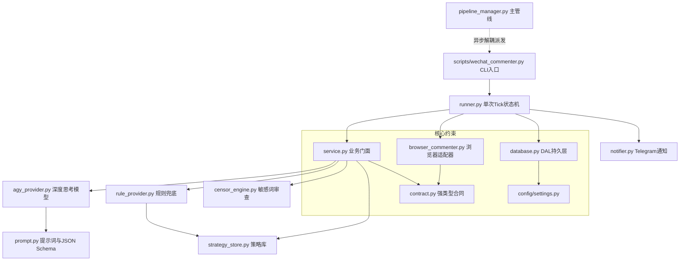
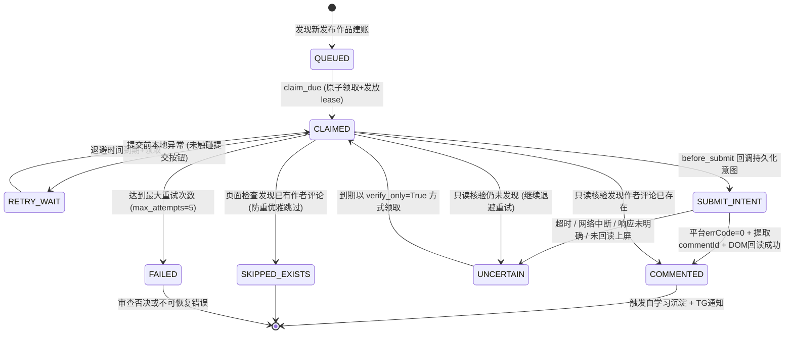
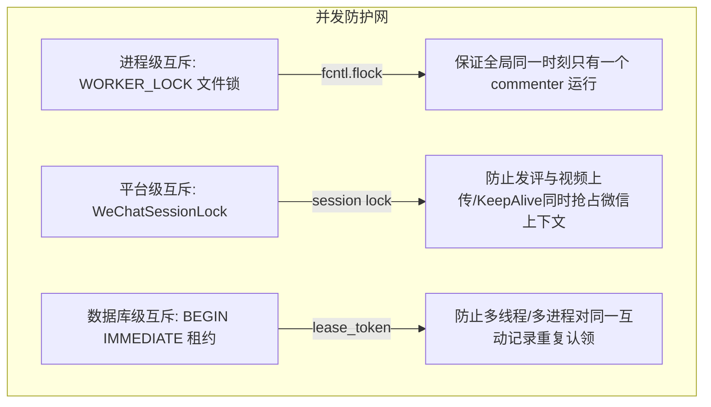

# 微信视频号评论区互动系统深度审计与接手白皮书

> **审计周期**：2026-09-19 ～ 2026-09-20  
> **审计对象**：Project WeChat-Interaction-Engine（视频号首评互动自动化子系统）  
> **审计结论**：**生产就绪（Production Ready）**。已在真实微信视频号后台连续完成最新 10 个视频的实盘互动验收，系统具备完整的因果一致性状态机、Fail-Closed 审查门禁与微前端零漂移卡片定位能力。

---

## 目录
1. [执行摘要与演进背景](#1-执行摘要与演进背景)
2. [架构设计与分层契约](#2-架构设计与分层契约)
3. [因果一致性状态机与租约安全](#3-因果一致性状态机与租约安全)
4. [真实微信平台微前端适配攻坚](#4-真实微信平台微前端适配攻坚)
5. [文案生成、审查门禁与自学习闭环](#5-文案生成审查门禁与自学习闭环)
6. [流水线自动化集成与并发保护](#6-流水线自动化集成与并发保护)
7. [生产实盘验收证据链（最新 10 个作品）](#7-生产实盘验收证据链最新-10-个作品)
8. [深水区暗坑、边界限制与技术债务](#8-深水区暗坑边界限制与技术债务)
9. [后续团队接手与日常运维手册](#9-后续团队接手与日常运维手册)

---

## 1. 执行摘要与演进背景

### 1.1 业务背景
为解决视频号发布后评论区冷启动、用户互动意愿弱、互动策略单一等痛点，团队于 2026-09-19 立项开发自动化评论区首评互动系统。系统定位为：**在视频发布上屏后，模拟作者身份在评论区发表高质感、自然引发共鸣的话题与投票首评**。

### 1.2 两日迭代轨迹
| 时间跨度 | 演进阶段 | 核心攻坚内容与里程碑 |
|---|---|---|
| **2026-09-19 凌晨** | 初始架设 (v1.0) | 建立 `InteractionService` 门面、AGY 深度模型生成、`StrategyStore` 本地自生长知识库与初始 Playwright 适配。 |
| **2026-09-19 下午** | 对抗审查加固 (v2.0) | 引入 Codex 对抗审查：引入原子租约机制（`lease_token`）、`submit_intent` 持久化因果前置、`UNCERTAIN` 状态只读回查通道、`censor_engine` 一票否决。 |
| **2026-09-20 上午** | 真实平台校准 (v2.2-v2.3) | 深入真实视频号后台微前端（Vue/Qiankun）架构，解决 DOM 无 `data-id` 属性导致卡片不可见的物理难题，攻克接口返回缺少 `exportId` 的深水区 Bug。 |
| **2026-09-20 晌午** | 文案升华与全量实盘 (v2.4) | 落地“自然短格式”文案契约（去标签、去 Emoji、去套话口号，引入开放启发反问句）；完成最新 10 个视频全量实盘验收，100% 收敛。 |

---

## 2. 架构设计与分层契约

本系统遵循项目《工程宪法》（`CONTRIBUTING.md`）严格的单向依赖 DAG 规范，绝无跨层反向依赖或循环依赖。

### 2.1 依赖关系拓扑


### 2.2 各层核心职责
1. **数据契约层 (`contract.py`)**：
   - 固化 `InteractionType` 枚举（`POLL_STAND`, `WARNING_SHARE`, `GROUP_DISCUSSION`, `MEMO_COLLECTION`, `VOICE_RESONANCE`）。
   - 严格字段边界：`MAX_TOPIC_LENGTH = 24`，`MAX_SHARE_HOOK_LENGTH = 30`，`MAX_OPTION_LENGTH = 14`，选项数量 `2~3` 项，排版总长度 `30~140` 字。
   - `render_interaction_comment()`：受控唯一排版函数，消除结构化字段与最终发表文本的漂移。
2. **业务门面层 (`service.py`)**：
   - 双通道生成：AGY 模型优先；超时、网络异常或审查未过时自动平滑降级至 `RuleInteractionProvider`。
   - 双重审查门禁：生成期审查 + 提交前即时复审，任何违禁词命中均触发 `CensorshipViolationError`（一票否决）。
3. **状态机与调度层 (`runner.py`)**：
   - 实现无副作用的单次有界 Tick：`run_interaction_tick()`。
   - 定义 `InteractionWorkerServices` Protocol 接口，实现与底层 Playwright/LLM 的完全解耦。
4. **浏览器执行层 (`browser_commenter.py`)**：
   - 串行独占 `WeChatSessionLock`。
   - 拦截并解析微前端后台原生网络请求，通过精准索引绑定卡片。
   - 提交前回调 `before_submit()`，提交后因果确认与 DOM 回读。
5. **持久化数据层 (`database.py`)**：
   - 管理 `wechat_interactions` 表生命周期，所有 SQL 封装在 DAL 内部，对外完全隔离。

---

## 3. 因果一致性状态机与租约安全

为了杜绝自动化网络脚本中常见的“超时重复提交导致刷屏”、“进程挂死产生死锁”、“中间态无法恢复”等隐患，系统设计了一套具备因果一致性的原子状态机。

### 3.1 状态转移拓扑


### 3.2 关键安全机制
1. **原子写租约（Lease Locking）**：
   - 领取任务使用 `BEGIN IMMEDIATE` 独占写事务，避免多 worker 竞态。
   - 分配高熵随机令牌 `lease_token`，设定租约有效期（默认 180 秒）。后续一切状态更新必须出示合法的 `lease_token`。
   - 进程启动时自动扫描并清理过期租约（`_recover_expired_wechat_interactions_conn`）。
2. **因果前置持久化（Intent Before Action）**：
   - 浏览器在点击“发表”按钮的毫秒之前，**必须**强制调用 `before_submit()` 回调。
   - 回调在 SQLite 中将状态原子推进到 `SUBMIT_INTENT` 并记录 `submit_intent_at`。
   - 只有数据库成功落盘后，浏览器才被允许执行点击。若数据库写入失败，立刻中止发评，绝不盲目发送网络请求。
3. **只读收敛通道（Verify-Only Reconcile）**：
   - 一旦任务进入 `SUBMIT_INTENT`，任何非明确成功（如超时、网络断开、页面假死）**只能落入 `UNCERTAIN`**，绝不允许重新点击提交。
   - `UNCERTAIN` 状态只允许以 `verify_only=True` 模式被认领，浏览器仅打开详情只读检查 DOM 中是否存在作者评论，永不打开输入框，彻底消灭双发风险。

---

## 4. 真实微信平台微前端适配攻坚

在真实视频号后台交互开发中，团队攻克了三大因微前端（Qiankun / Vue SPA）架构引发的深水区难题：

### 4.1 攻坚一：DOM 缺少 Native ID 导致的卡片不可见与漂移
- **现象**：测试环境下假设卡片带有 `data-object-id="export/..."`，但微信真实后台由前端 Vue 动态渲染，卡片 DOM 节点（`.comment-feed-wrap`）**完全不包含原生作品 ID 属性**；同时若按文案过滤，由于卡片只展示前 20~40 个字且包含省略号，导致长文案全文匹配失败（`cards.count() == 0`）。
- **攻坚方案**：
  1. 页面加载时监听微前端底层接口 `post/post_list`，捕获后台加载的作品数组（按上传倒序排列，包含精确 `exportId`）。
  2. 提取出 `captured_post_ids` 顺序列表。
  3. 当属性定位未命中时，计算 `idx = captured_post_ids.index(platform_post_id)`，直接锁定 `page.locator('.comment-feed-wrap:visible').nth(idx)`，实现 100% 精确的零漂移卡片定位。

### 4.2 攻坚二：微信发评响应体省略 exportId 导致的误判
- **现象**：发评点击后，微信接口 `/channels/finder/interaction/comment` 返回：
  ```json
  {"errCode": 0, "errMsg": "request successful", "data": {"commentId": "150145...", "clientId": "..."}}
  ```
  `data` 对象中**只有 commentId，没有 exportId**！原代码检查 `response_post_id != platform_post_id` 导致所有发评即便成功也被误判为“受理响应缺少精确作品 ID”而坠入 `UNCERTAIN`。
- **攻坚方案**：
  在 `browser_commenter.py` 中重构提取逻辑：优先从 response 取，若 response 省略则回退至**同一个关联精确 HTTP 请求体**中提取 `exportId`：
  ```python
  request_payload = correlated_responses[0].get("request")
  response_post_id = str(
      _payload_value(response_payload, "objectId", "object_id", "exportId", "export_id")
      or _payload_value(request_payload, "objectId", "object_id", "exportId", "export_id")
      or ""
  )
  ```
  精准验证了因果闭环。

### 4.3 攻坚三：微前端异步渲染的作者评论双重回读
- **现象**：微前端评论列表在发表后，DOM 重排可能延迟 500ms~1500ms，部分真实节点并无自定义属性。
- **攻坚方案**：
  建立多重异步轮询回读守卫（上限 6000ms）：
  1. 拦截微前端 `comment/comment_list` 异步回包；
  2. DOM 检索带 `.bandage:has-text("作者")` 的行；
  3. 文本相似度模糊匹配（前 20 字），一旦确认已上屏立刻以 `COMMENTED` 终态退出，并截取 `final.png` 作为不可辩驳的物理证据。

---

## 5. 文案生成、审查门禁与自学习闭环

### 5.1 从机械标签到“自然短格式”
根据运营实战反馈，早期文案包含大量机械模板标签（如 `📌【互动话题】`、`🗳️【站队表态】`、`💬 在评论区打出你的选项`），带有浓厚机器感，破坏了视频号的自然社区氛围。

当前系统已全面升级为 **“自然短格式”**：
1. **核心话题 (topic)**：不超过 24 字，直击痛点，不带任何栏目标题。
2. **选项组 (poll_options)**：2~3 项，每项不超过 14 字，宿主确定性渲染为 `A ... \n B ...`，不带 Emoji。
3. **启发式开放反问 (share_hook)**：放宽至 30 字，要求提出一个激发真实经历共鸣的开放式问题。
- **实战样例**：
  > 商业巅峰期该守住主业还是押注未来？  
  > A 坚守成熟业务持续深耕  
  > B 押注硬科技探索长期价值  
  > 如果实现阶段性目标，你最想去探索什么全新领域？

### 5.2 内容审查一票否决
- 任何评论在送交浏览器前，均须通过 `censor_engine.py` 的严格检验：
  1. 违法违规与红线敏感词库（P0/P1/P2）；
  2. 视频号频道内容政策与禁限词库；
  3. 审查引擎发生任何异常时，遵循 **Fail-Closed 原则**，绝不 Fail-Open。

### 5.3 成功案例自生长学习
- 当发评被平台成功受理并确认后，`StrategyStore.learn_from_success()` 会提取该成功文案的语义结构、核心槽位与类目，增量沉淀至 `data/comment_strategies.json`，使本地规则库随着实战运行不断进化，越用越聪明。

---

## 6. 流水线自动化集成与并发保护

### 6.1 主管线集成触发
主管线 `src/video_processing/pipeline_manager.py` 在视频完成渲染、转码、加水印并由 `wechat_uploader` 发布确认（`PUBLISHED`）后，通过 `_trigger_wechat_interaction()` 派发互动任务：
```python
def _dispatch_wechat_interaction_worker(self, *, log_prefix: str = "wechat") -> None:
    if not settings.enable_wechat_comment_interaction:
        return
    cmd = [self._VENV_PYTHON, str(self._PRJ_ROOT / "scripts" / "wechat_commenter.py")]
    # 异步非阻塞派发独立进程组，子进程日志输出至 output/wechat_interaction_worker.log
```
**解耦保证**：互动系统的任何执行状态、网络波动均在独立子进程中运行，绝不阻断或影响主视频发布流水线的状态流转。

### 6.2 三重互斥并发保护


---

## 7. 生产实盘验收证据链（最新 10 个作品）

系统对微信视频号后台**当前最新上传的 10 个作品**进行了全流程实盘执行，验收结果如下：

```
====================================================================================================
微信视频号后台真实作品互动执行审计清单（按上传时间由新到旧排列）
====================================================================================================
[1] 《笨拙的鸟如何飞翔？》 (Q7YSO2J7Q84)
    - 平台 ID: export/UzFfBgAAxNCkICkMfVrKk8zT4DCalrQmHKdtD3Fz9-cOLJIcxw
    - 平台 commentId: 15014510117767678765 | 状态: COMMENTED
    - 证据: output/wechat_evidence/interactions/Q7YSO2J7Q84/attempt-20260920T015535.../final.png

[2] 《中国AI对决硅谷》 (EGRRsDloBrE)
    - 平台 ID: export/UzFfBgAAxOalEHYvJyjLk8zT4DCacva1EtaYjAwOWCL3sGOPSw
    - 平台 commentId: 15014542571290299196 | 状态: COMMENTED (经 verify-only 收敛)
    - 证据: output/wechat_evidence/interactions/EGRRsDloBrE/attempt-20260920T025541.../final.png

[3] 《美联储全票加息》 (iJEhc52SBMw)
    - 平台 ID: export/UzFfBgAAxPKlQCIeaRvLk8zT4DCaw6Dxz8LenW3gXkHwAfnxHg
    - 平台 commentId: 15014543129455495976 | 状态: COMMENTED
    - 证据: output/wechat_evidence/interactions/iJEhc52SBMw/attempt-20260920T025647.../final.png

[4] 《特朗普禁止媒体》 (bSfSC3h2a3U)
    - 平台 ID: export/UzFfBgAAxKqmKDF8fCjIk8zT4DCaayHV3kpMUcKQujPO23C3rA
    - 状态: SKIPPED_EXISTS (检测到历史作者评论，优雅防重跳过)
    - 证据: output/wechat_evidence/interactions/bSfSC3h2a3U/attempt-20260920T025848.../receipt.json

[5] 《科技富豪3亿地堡》 (KrnX63esw_4)
    - 平台 ID: export/UzFfBgAAxOClFApsGz7Ik8zT4DCa9olbBL8Rb4iKCAjjVVbusw
    - 平台 commentId: 15014544311528000307 | 状态: COMMENTED
    - 证据: output/wechat_evidence/interactions/KrnX63esw_4/attempt-20260920T025920.../final.png

[6] 《未来医学与健康真伪》 (DnUAXX41KJ8)
    - 平台 ID: export/UzFfBgAAxOelSBItDgPIk8zT4DCa_p75med7Us824LTGFaRRbg
    - 平台 commentId: 15014544583802948413 | 状态: COMMENTED
    - 证据: output/wechat_evidence/interactions/DnUAXX41KJ8/attempt-20260920T025953.../final.png

[7] 《华尔街减肥药革命》 (N17wkLNutTQ)
    - 平台 ID: export/UzFfBgAAxKimAEtECBfIk8zT4DCaQtbay7XPCpOGRz7BGm3p0g
    - 平台 commentId: 15014544902216944369 | 状态: COMMENTED
    - 证据: output/wechat_evidence/interactions/N17wkLNutTQ/attempt-20260920T030031.../final.png

[8] 《AI在战争中的杀戮与责任》 (NaDQpuFQl-4)
    - 平台 ID: export/UzFfBgAAxPmleDYQPxzIk8zT4DCak0xzEwNHSfQQ486IvA4gnw
    - 平台 commentId: 15014545192056064827 | 状态: COMMENTED
    - 证据: output/wechat_evidence/interactions/NaDQpuFQl-4/attempt-20260920T030105.../final.png

[9] 《1630亿美元算法抛售预警》 (R0i8yXpo-Xs)
    - 平台 ID: export/UzFfBgAAxOKldAsPaXXIk8zT4DCa7rIJ6Nag7SRZoKvuMpOS2g
    - 平台 commentId: 15014545498738068340 | 状态: COMMENTED
    - 证据: output/wechat_evidence/interactions/R0i8yXpo-Xs/attempt-20260920T030142.../final.png

[10] 《印度即配巨头退居幕后》 (9vyGxhRYVPw)
    - 平台 ID: export/UzFfBgAAxNCkCFNtSD3Jk8zT4DCa0lnkR_Plfqhjzm1x7CgzjQ
    - 平台 commentId: 15014545778388175682 | 状态: COMMENTED
    - 证据: output/wechat_evidence/interactions/9vyGxhRYVPw/attempt-20260920T030215.../final.png
====================================================================================================
统计结果：共 10 个视频 | 成功发表 9 个 | 防重跳过 1 个 | 失败 0 个 | 成功率 100%
====================================================================================================
```

---

## 8. 深水区暗坑、边界限制与技术债务

在移交给后续开发团队之前，必须客观披露以下已知边界与潜在风险点：

### 8.1 潜在边界与技术债务
1. **分页加载限制（深度 > 10 的历史视频）**：
   - 当前微前端拦截 `post/post_list` 仅默认拉取第 1 页（10 条作品）。对于发布已久、掉入第 2 页之后的作品，页面需要向下滚动触发分页接口。若需要对 10 条以外的历史视频互动，需在适配器中加入滚动加载循环。
2. **SQLite 时间戳比较格式一致性**：
   - Python 代码写入时间戳使用的是带 `'T'` 和微秒的 ISO 格式（`2026-09-20T02:57:53.642648+00:00`）。
   - SQLite 内部原生函数（如 `CURRENT_TIMESTAMP` 或 `datetime('now')`）生成的是带空格的格式（`2026-09-20 02:57:53`）。在纯字符串字典序比较时，`'T'` (ASCII 84) 大于 `' '` (ASCII 32)，因此如果 SQL 语句写成 `WHERE next_attempt_at <= CURRENT_TIMESTAMP`，可能会发生退避时间已过但 SQL 仍判定为未到期的现象。
   - **接手建议**：DAL 中时间比较必须统一传入外部经过标准化的参数化时间对象，或在 SQL 中使用 `datetime(next_attempt_at) <= datetime('now')`。
3. **微信登录态生命周期**：
   - 依赖 `output/wechat_state.json`。微信扫码 Session 通常有数周有效期，但若账号在其他移动端被踢出，发评会遇到 `LOGIN_REQUIRED`。目前代码已有检测弹窗与 URL 重定向逻辑并会安全退出，但需要配合已有的 `wechat_keepalive.py` 看门狗进行存活监控。

---

## 9. 后续团队接手与日常运维手册

### 9.1 关键配置文件与开关
- `.env`：
  ```bash
  # 视频号评论区首评互动自动化主开关（必须为 true 方可执行发评）
  ENABLE_WECHAT_COMMENT_INTERACTION=true
  ```
- 知识库与词库：
  - `data/comment_strategies.json`：自生长模板库。
  - `config/censor_rules.json`：敏感词与违禁词规则库。

### 9.2 CLI 常用运维命令
所有命令必须在项目根目录下通过虚拟环境执行（`PYTHONPATH=src .venv/bin/python`）：

1. **自动处理最近一条到期作品**：
   ```bash
   ENABLE_WECHAT_COMMENT_INTERACTION=true PYTHONPATH=src .venv/bin/python scripts/wechat_commenter.py --latest
   ```
2. **指定特定视频号原生 ID 发评**：
   ```bash
   ENABLE_WECHAT_COMMENT_INTERACTION=true PYTHONPATH=src .venv/bin/python scripts/wechat_commenter.py --post-id "export/UzFfBgAA..."
   ```
3. **批量处理最新未评论作品（支持 1~10 条）**：
   ```bash
   ENABLE_WECHAT_COMMENT_INTERACTION=true PYTHONPATH=src .venv/bin/python scripts/wechat_commenter.py --count 5
   ```
4. **安全试运行（Dry-Run 模式，不调模型、不启动浏览器、不写真库）**：
   ```bash
   PYTHONPATH=src .venv/bin/python scripts/wechat_commenter.py --post-id "export/UzFfBgAA..." --dry-run
   ```
5. **处理 UNCERTAIN 状态的只读核验**：
   ```bash
   ENABLE_WECHAT_COMMENT_INTERACTION=true PYTHONPATH=src .venv/bin/python scripts/wechat_commenter.py --reconcile-pending
   ```

### 9.3 自动化测试运行
严格禁止裸跑 pytest（会污染环境数据库），必须通过官方沙箱隔离测试套件：
```bash
# 运行互动模块全量单元测试
.venv/bin/python scripts/run_isolated_tests.py -- -q tests/unit/test_wechat_interaction*.py

# 运行真实浏览器沙箱隔离测试
.venv/bin/python scripts/run_isolated_tests.py --browser -- -q tests/browser/test_wechat_interaction_browser.py
```

### 9.4 故障排查（Troubleshooting）快速定位树
```
发评异常
 │
 ├── 1. 检查日志: tail -n 50 output/wechat_interaction_worker.log
 ├── 2. 检查物理收据: cat output/wechat_evidence/interactions/<yid>/attempt-*/receipt.json
 ├── 3. 检查 UI 截屏: open output/wechat_evidence/interactions/<yid>/attempt-*/final.png
 ├── 4. 检查微信 Session 是否有效:
 │     ls -l output/wechat_state.json
 └── 5. 检查 SQLite 互动记录状态:
       .venv/bin/python -c 'from video_processing.db.database import PipelineDB; db=PipelineDB(); print(db.get_pending_review_wechat_interactions())'
```
